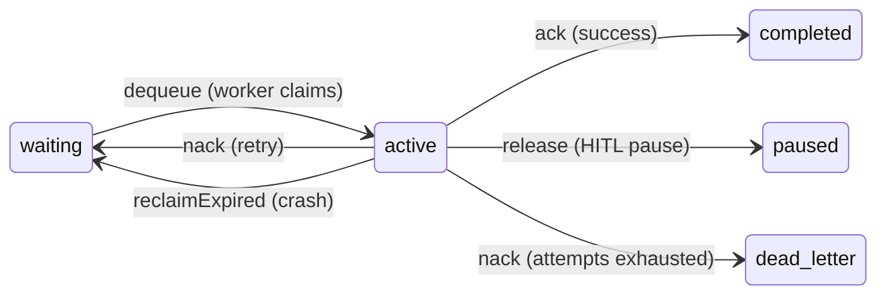
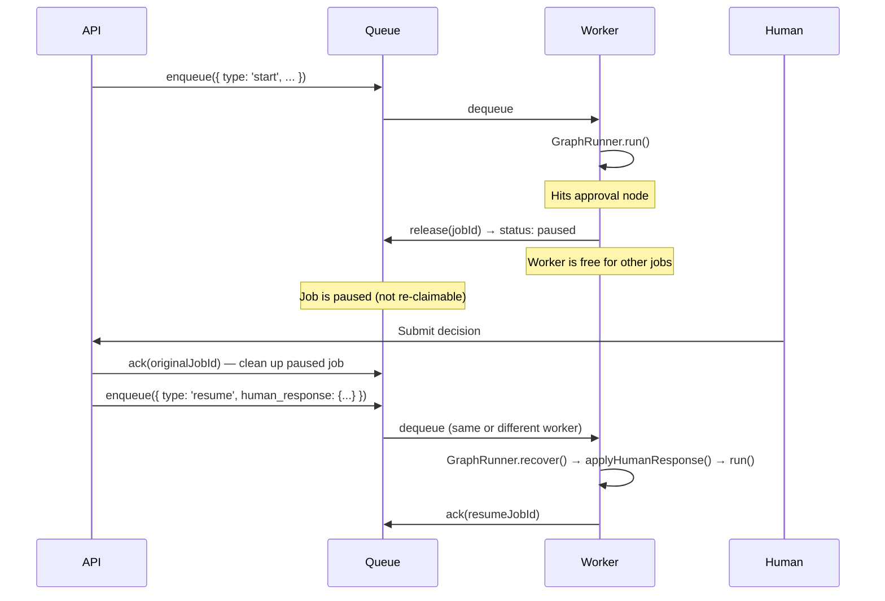

cycgraph's `GraphRunner` runs entirely within a single Node.js process. For production deployments with concurrent workflows, the **WorkflowWorker** distributes execution across multiple processes — each workflow runs on one worker for its entire lifetime, using the existing `GraphRunner` unmodified.

Workers poll the queue, claim jobs atomically, and execute workflows. Crashed workers are detected via **visibility timeouts** — if a worker stops heartbeating, the job is reclaimed and re-executed on another worker using event log replay.

## WorkflowQueue

The `WorkflowQueue` interface is the core abstraction. It provides SQS-style semantics with visibility timeouts, priority ordering, and dead-lettering.

```typescript
import { InMemoryWorkflowQueue } from '@cycgraph/orchestrator';

const queue = new InMemoryWorkflowQueue();

// Enqueue a new workflow
const jobId = await queue.enqueue({
  type: 'start',
  run_id: crypto.randomUUID(),
  graph_id: 'my-graph-id',
  initial_state: { goal: 'Research AI trends' },
  priority: 0,         // Lower = higher priority
  max_attempts: 3,     // Before dead-lettering
});
```

### Job lifecycle



### Queue methods

| Method | Description |
|--------|-------------|
| `enqueue(input)` | Add a job. Returns the auto-generated job ID. |
| `dequeue(workerId)` | Atomically claim the highest-priority waiting job. Returns `null` if empty. |
| `ack(jobId)` | Mark a job as completed (terminal success). |
| `nack(jobId, error)` | Report failure. Retries if attempts remain, otherwise dead-letters. |
| `heartbeat(jobId, extendMs?)` | Extend the visibility timeout during long execution. |
| `release(jobId)` | Transition to `paused` status **without** incrementing attempt count (for HITL pauses). Paused jobs are not re-claimable by `dequeue`. |
| `reclaimExpired()` | Reclaim jobs with expired visibility timeouts (crash recovery). |
| `getJob(jobId)` | Load a job by ID (diagnostics). |
| `getQueueDepth()` | Count jobs by status: `{ waiting, active, paused, dead_letter }`. |

### Key design: release vs nack

`release` is distinct from `nack` — HITL pauses call `release` to transition the job to `paused` status without penalizing the attempt count. Paused jobs are **not** re-claimable by `dequeue` — this prevents the worker from re-claiming and re-executing the approval gate in a tight loop while awaiting a human response. A separate `resume` job must be enqueued to continue the workflow.

## WorkflowWorker

The `WorkflowWorker` polls the queue and runs workflows using the existing `GraphRunner`:

```typescript
import {
  WorkflowWorker,
  InMemoryWorkflowQueue,
  InMemoryPersistenceProvider,
  InMemoryEventLogWriter,
} from '@cycgraph/orchestrator';

const worker = new WorkflowWorker({
  queue,
  persistence: new InMemoryPersistenceProvider(),
  eventLog: new InMemoryEventLogWriter(),
  concurrency: 2,           // Run up to 2 workflows simultaneously
  pollIntervalMs: 1000,     // Check for new jobs every second
  heartbeatIntervalMs: 60_000,  // Heartbeat every minute
  reclaimIntervalMs: 30_000,    // Check for crashed jobs every 30s
  shutdownGracePeriodMs: 30_000, // Wait 30s for in-flight work on stop
});

await worker.start();

// Later...
await worker.stop();  // Graceful shutdown
```

### Configuration

| Option | Default | Description |
|--------|---------|-------------|
| `workerId` | `crypto.randomUUID()` | Unique worker identifier. |
| `queue` | *(required)* | `WorkflowQueue` to poll for jobs. |
| `persistence` | *(required)* | `PersistenceProvider` for loading graphs and saving state. |
| `eventLog` | *(required)* | `EventLogWriter` for durable execution and crash recovery. |
| `runnerOptionsFactory` | — | Factory for per-job `GraphRunnerOptions` (toolResolver, modelResolver, etc.). Factory-provided options **override** the worker defaults — this is how per-job fenced `persistStateFn`/`eventLog` writers are wired in (see [Run fencing](#run-fencing)). |
| `concurrency` | `1` | Maximum concurrent jobs per worker. |
| `pollIntervalMs` | `1000` | Polling interval in milliseconds. |
| `heartbeatIntervalMs` | `60000` | Heartbeat interval in milliseconds. |
| `reclaimIntervalMs` | `30000` | Interval for reclaiming expired jobs. |
| `shutdownGracePeriodMs` | `30000` | Grace period for in-flight work during shutdown. |

### Events

The worker extends `EventEmitter` and emits:

| Event | Payload | Description |
|-------|---------|-------------|
| `job:claimed` | `{ jobId, runId }` | Worker has claimed a job from the queue. |
| `job:completed` | `{ jobId, runId }` | Job finished successfully (acked). |
| `job:failed` | `{ jobId, runId, error }` | Job failed (nacked, will retry). |
| `job:released` | `{ jobId, runId }` | Job released for HITL pause. |
| `job:dead_letter` | `{ jobId, runId, error }` | Job exhausted all retries. |
| `job:claim_lost` | `{ jobId, runId }` | This worker's claim was fenced off — another worker owns the run now. The job's queue state is left untouched. |
| `worker:started` | `{ workerId }` | Worker poll loop has started. |
| `worker:stopped` | `{ workerId }` | Worker has shut down. |

## Crash recovery

When a worker crashes (or its process is killed), its in-flight jobs eventually expire via the visibility timeout. The reclaim timer on any running worker detects these expired jobs and returns them to `waiting`.

When another worker picks up the job, it reconciles **both** recovery artifacts — the event log and the latest state snapshot — since either can be ahead of the other (an event append can fail while the snapshot commits, and vice versa):

1. If events exist for the run → `GraphRunner.recover()` replays them to reconstruct state
2. If the latest snapshot reflects **more progress** than the replayed state (lost appends) → the worker resumes from the snapshot instead, avoiding re-execution of nodes whose side effects already happened
3. If no events but a snapshot exists → resume from the snapshot
4. If neither → fresh start with the job's `initial_state`

Replay also validates that the event log is **gap-free** (contiguous sequence ids); a gap means an append was lost, and recovery refuses with `EventLogCorruptionError` rather than silently dropping a state transition. Resumed runs use the unified idempotency keys (`node_id:iteration`, anchored by the snapshot's event-log high-water mark) to skip re-executing a node whose action was already applied before the crash.

This means even `start` jobs are safely recoverable — if a worker crashes mid-execution, the next worker seamlessly continues from the most advanced consistent state.

## Run fencing

A visibility timeout alone cannot stop a *paused-but-alive* worker: a long GC pause or network partition can cause missed heartbeats, the job gets reclaimed, and the original worker wakes up and keeps writing — interleaving with the new claimant (split-brain).

Fencing closes this hole with a **claim epoch**:

1. Every `dequeue()` bumps the run's claim epoch and stamps it on the returned job (`job.claim_epoch`)
2. Per-job **fenced** persistence/event-log writers carry the epoch on every write
3. The storage adapter rejects writes whose epoch is older than the run's current epoch with `StaleClaimError`
4. The runner treats `StaleClaimError` as immediately fatal (no retry, no strike-counting) and the worker emits `job:claim_lost` without touching the job — it no longer owns it

With `@cycgraph/orchestrator-postgres`, wire fencing via `createFencedRunnerOptions`:

```typescript
import {
  DrizzleWorkflowQueue,
  DrizzlePersistenceProvider,
  DrizzleEventLogWriter,
  createFencedRunnerOptions,
} from '@cycgraph/orchestrator-postgres';

const worker = new WorkflowWorker({
  queue: new DrizzleWorkflowQueue(),
  persistence: new DrizzlePersistenceProvider(),
  eventLog: new DrizzleEventLogWriter(),
  // Per-job fenced writers — factory results override the worker defaults.
  runnerOptionsFactory: (job) => createFencedRunnerOptions(job),
});
```

`InMemoryWorkflowQueue` stamps claim epochs with the same semantics, so fenced behavior is testable without a database.

## Graceful shutdown

`worker.stop()`:

1. Requests `shutdown()` on all active runners (finish the current node, persist, pause)
2. Waits up to `shutdownGracePeriodMs` for in-flight work
3. **Hard-cancels** runners that outlive the grace period (`cancel()` aborts in-flight LLM calls) — the worker never lets go of a job while its runner is still writing
4. Leaves unfinished jobs `active` in the queue: their visibility timeout expires and `reclaimExpired()` returns them to `waiting` for another worker — the same path as crash recovery

Jobs interrupted by shutdown are **not** released to `paused` (that status is reserved for HITL and requires an explicit `resume` job) and **not** acked — only terminal workflow statuses (`completed`, `failed`, `cancelled`, `timeout`) ack a job.

## Human-in-the-Loop with workers

The worker handles HITL workflows without blocking:



1. API enqueues a `start` job
2. Worker runs the workflow until it hits an approval node → `status: 'waiting'`
3. Worker calls `queue.release()` — transitions the job to `paused` status, freeing the worker slot
4. The paused job is not re-claimable — the worker continues polling for other jobs without re-executing the approval gate
5. Later, the API acks the original job (cleanup) and enqueues a `resume` job with the human's response
6. A worker picks up the resume job, recovers via event log, applies the response, and continues

## Dead-lettering

When a job fails more times than `max_attempts`, it transitions to `dead_letter` status. Dead-lettered jobs are not retried — they require manual intervention.

Monitor dead-lettered jobs via `getQueueDepth()`:

```typescript
const depth = await queue.getQueueDepth();
if (depth.dead_letter > 0) {
  console.warn(`${depth.dead_letter} jobs in dead letter queue`);
}
```

## Metrics integration

The existing `setQueueDepthProvider()` works with the queue:

```typescript
import { setQueueDepthProvider } from '@cycgraph/orchestrator';

setQueueDepthProvider(async () => {
  const depth = await queue.getQueueDepth();
  return depth.waiting + depth.active;
});
```

## Implementations

| Implementation | Package | Use Case |
|---------------|---------|----------|
| `InMemoryWorkflowQueue` | `@cycgraph/orchestrator` | Testing, single-process deployments |
| `DrizzleWorkflowQueue` | `@cycgraph/orchestrator-postgres` | Production multi-process / multi-host deployments. Atomic claims via `FOR UPDATE SKIP LOCKED`, fencing epochs on every claim, backed by the `workflow_jobs` table. |

Both implementations stamp `claim_epoch` on dequeued jobs, so fencing-aware code behaves identically against either. You can also implement the `WorkflowQueue` interface against another backend (Redis Streams, SQS, etc.) — the interface is intentionally narrow so backend choice stays a project decision.

## Next steps

- [Persistence](/docs/concepts/persistence/) — storage interfaces consumed by the worker
- [Error Handling](/docs/concepts/error-handling/) — how errors propagate through workers
- [Human-in-the-Loop](/docs/patterns/human-in-the-loop/) — HITL pattern details
- [Streaming](/docs/concepts/streaming/) — real-time event consumption within a worker
