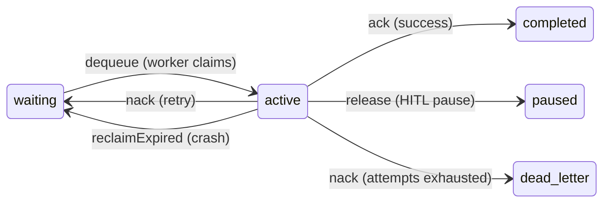
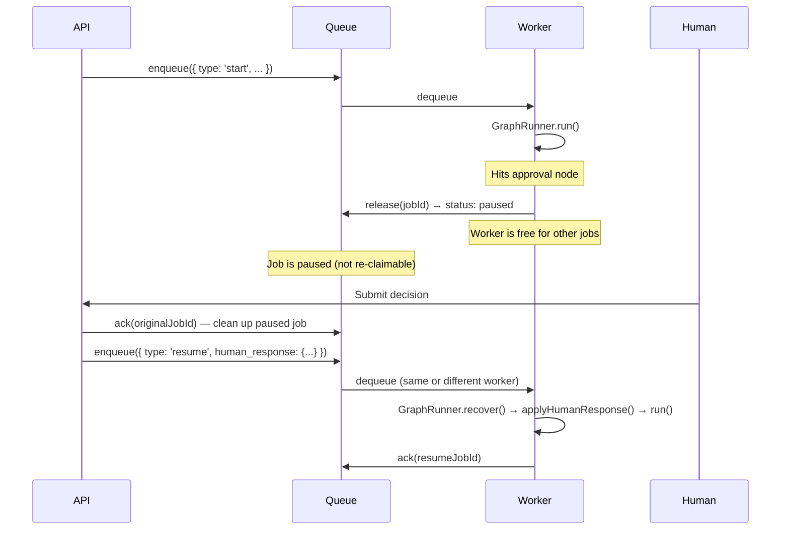

cycgraph's `GraphRunner` runs entirely within a single Node.js process. For production deployments with concurrent workflows, the **WorkflowWorker** distributes execution across multiple processes. Each workflow runs on one worker for its entire lifetime, using the existing `GraphRunner` unmodified.

Workers poll the queue, claim jobs atomically, and execute workflows. Crashed workers are detected via **visibility timeouts**: if a worker stops heartbeating, the job is reclaimed and re-executed on another worker using event log replay.

## Enqueuing work

The `WorkflowQueue` is the core abstraction workers poll. It provides SQS-style semantics with visibility timeouts, priority ordering, and dead-lettering. The full interface lives on the [Persistence](/docs/concepts/persistence/#workflowqueue) page. To start a run, enqueue a `start` job:

```typescript
import { InMemoryWorkflowQueue } from '@cycgraph/orchestrator';

const queue = new InMemoryWorkflowQueue();

// Enqueue a new workflow
const jobId = await queue.enqueue({
  type: 'start',
  run_id: crypto.randomUUID(),
  graph_id: 'my-graph-id',
  initial_state: { goal: 'Research AI trends' },
  priority: 0,         // Lower = higher priority
  max_attempts: 3,     // Before dead-lettering
});
```

Enqueue takes the smaller `EnqueueJobInput` shape (`type`, `run_id`, `graph_id`, plus optional `priority`, `max_attempts`, and `visibility_timeout_ms`); the queue fills the rest of the [`WorkflowJob`](#workflowjob).

**Refs:**
- [WorkflowQueue](#workflowqueue): the job queue interface workers poll.
- [WorkflowJob](#workflowjob): a queued unit of work, and its `EnqueueJobInput` input shape.

## Job lifecycle


```mermaid
stateDiagram-v2
  direction LR
  waiting --> active : dequeue (worker claims)
  active --> completed : ack (success)
  active --> waiting : nack (retry)
  active --> paused : release (HITL pause)
  active --> waiting : reclaimExpired (crash)
  active --> dead_letter : nack (attempts exhausted)
```

**Refs:**
- [WorkflowJob](#workflowjob): the `status` field tracks a job's position in this lifecycle.

## Release vs nack

`release` is distinct from `nack`. HITL pauses call `release` to transition the job to `paused` status without penalizing the attempt count. Paused jobs are **not** re-claimable by `dequeue`, which prevents the worker from re-claiming and re-executing the approval gate in a tight loop while awaiting a human response. A separate `resume` job must be enqueued to continue the workflow.

**Refs:**
- [WorkflowQueue](#workflowqueue): `release` and `nack` semantics.

## Running a worker

The `WorkflowWorker` polls the queue and runs workflows using the existing `GraphRunner`:

```typescript
import {
  WorkflowWorker,
  InMemoryWorkflowQueue,
  InMemoryPersistenceProvider,
  InMemoryEventLogWriter,
} from '@cycgraph/orchestrator';

const worker = new WorkflowWorker({
  queue,
  persistence: new InMemoryPersistenceProvider(),
  eventLog: new InMemoryEventLogWriter(),
  concurrency: 2,           // Run up to 2 workflows simultaneously
  pollIntervalMs: 1000,     // Check for new jobs every second
  heartbeatIntervalMs: 60_000,  // Heartbeat every minute
  reclaimIntervalMs: 30_000,    // Check for crashed jobs every 30s
  shutdownGracePeriodMs: 30_000, // Wait 30s for in-flight work on stop
});

await worker.start();

// Later...
await worker.stop();  // Graceful shutdown
```

**Refs:**
- [WorkflowWorker](#workflowworker): constructor, methods, and events.
- [WorkflowWorkerOptions](#workflowworkeroptions): every constructor option and its default.
- [WorkflowWorkerEvents](#workflowworkerevents): the events the worker emits.

## Crash recovery

When a worker crashes (or its process is killed), its in-flight jobs eventually expire via the visibility timeout. The reclaim timer on any running worker detects these expired jobs and returns them to `waiting`.

When another worker picks up the job, it reconciles **both** recovery artifacts, the event log and the latest state snapshot. Either can be ahead of the other, because an event append can fail while the snapshot commits, and vice versa:

1. If events exist for the run → `GraphRunner.recover()` replays them to reconstruct state
2. If the latest snapshot reflects **more progress** than the replayed state (lost appends) → the worker resumes from the snapshot instead, avoiding re-execution of nodes whose side effects already happened
3. If no events but a snapshot exists → resume from the snapshot
4. If neither → fresh start with the job's `initial_state`

Replay also validates that the event log is **gap-free** (contiguous sequence ids); a gap means an append was lost, and recovery refuses with `EventLogCorruptionError` rather than silently dropping a state transition. Resumed runs use the unified idempotency keys (`node_id:iteration`, anchored by the snapshot's event-log high-water mark) to skip re-executing a node whose action was already applied before the crash.

This means even `start` jobs are safely recoverable. If a worker crashes mid-execution, the next worker seamlessly continues from the most advanced consistent state.

**Refs:**
- [WorkflowWorker](#workflowworker): the worker that performs recovery on claim.

## Run fencing

A visibility timeout alone cannot stop a *paused-but-alive* worker: a long GC pause or network partition can cause missed heartbeats, the job gets reclaimed, and the original worker wakes up and keeps writing, interleaving with the new claimant. That split-brain is the hole fencing closes, using a **claim epoch**:

1. Every `dequeue()` bumps the run's claim epoch and stamps it on the returned job (`job.claim_epoch`)
2. Per-job **fenced** persistence/event-log writers carry the epoch on every write
3. The storage adapter rejects writes whose epoch is older than the run's current epoch with `StaleClaimError`
4. The runner treats `StaleClaimError` as immediately fatal (no retry, no strike-counting) and the worker emits `job:claim_lost` without touching the job, which it no longer owns

With `@cycgraph/orchestrator-postgres`, wire fencing via `createFencedRunnerOptions`:

```typescript
import {
  DrizzleWorkflowQueue,
  DrizzlePersistenceProvider,
  DrizzleEventLogWriter,
  createFencedRunnerOptions,
} from '@cycgraph/orchestrator-postgres';

const worker = new WorkflowWorker({
  queue: new DrizzleWorkflowQueue(),
  persistence: new DrizzlePersistenceProvider(),
  eventLog: new DrizzleEventLogWriter(),
  // Per-job fenced writers. Factory results override the worker defaults.
  runnerOptionsFactory: (job) => createFencedRunnerOptions(job),
});
```

`InMemoryWorkflowQueue` stamps claim epochs with the same semantics, so fenced behavior is testable without a database.

**Refs:**
- [WorkflowJob](#workflowjob): carries the `claim_epoch` fencing token.
- [WorkflowWorkerOptions](#workflowworkeroptions): `runnerOptionsFactory` wires per-job fenced writers.

## Graceful shutdown

`worker.stop()`:

1. Requests `shutdown()` on all active runners (finish the current node, persist, pause)
2. Waits up to `shutdownGracePeriodMs` for in-flight work
3. **Hard-cancels** runners that outlive the grace period. `cancel()` aborts in-flight LLM calls, and the worker never lets go of a job while its runner is still writing
4. Leaves unfinished jobs `active` in the queue: their visibility timeout expires and `reclaimExpired()` returns them to `waiting` for another worker, the same path as crash recovery

Jobs interrupted by shutdown are **not** released to `paused`, because that status is reserved for HITL and requires an explicit `resume` job, and they are **not** acked. Only terminal workflow statuses (`completed`, `failed`, `cancelled`, `timeout`) ack a job.

**Refs:**
- [WorkflowWorker](#workflowworker): `stop()` performs the drain-and-cancel sequence.
- [WorkflowWorkerOptions](#workflowworkeroptions): `shutdownGracePeriodMs` bounds the drain window.

## Human-in-the-Loop with workers

The worker handles HITL workflows without blocking:


```mermaid
sequenceDiagram
    participant API
    participant Queue
    participant Worker
    participant Human

    API->>Queue: enqueue({ type: 'start', ... })
    Queue->>Worker: dequeue
    Worker->>Worker: GraphRunner.run()
    Note over Worker: Hits approval node
    Worker->>Queue: release(jobId) → status: paused
    Note over Worker: Worker is free for other jobs
    Note over Queue: Job is paused (not re-claimable)

    Human->>API: Submit decision
    API->>Queue: ack(originalJobId) — clean up paused job
    API->>Queue: enqueue({ type: 'resume', human_response: {...} })
    Queue->>Worker: dequeue (same or different worker)
    Worker->>Worker: GraphRunner.recover() → applyHumanResponse() → run()
    Worker->>Queue: ack(resumeJobId)
```

1. API enqueues a `start` job
2. Worker runs the workflow until it hits an approval node → `status: 'waiting'`
3. Worker calls `queue.release()`, transitioning the job to `paused` status and freeing the worker slot
4. The paused job is not re-claimable, so the worker continues polling for other jobs without re-executing the approval gate
5. Later, the API acks the original job (cleanup) and enqueues a `resume` job with the human's response
6. A worker picks up the resume job, recovers via event log, applies the response, and continues

**Refs:**
- [WorkflowQueue](#workflowqueue): `release` parks the job without penalizing its attempt count.

## Dead-lettering

When a job fails more times than `max_attempts`, it transitions to `dead_letter` status. Dead-lettered jobs are not retried; they require manual intervention.

Monitor dead-lettered jobs via `getQueueDepth()`:

```typescript
const depth = await queue.getQueueDepth();
if (depth.dead_letter > 0) {
  console.warn(`${depth.dead_letter} jobs in dead letter queue`);
}
```

**Refs:**
- [WorkflowJob](#workflowjob): `attempt` and `max_attempts` drive the transition to `dead_letter`.

## Metrics integration

The existing `setQueueDepthProvider()` works with the queue:

```typescript
import { setQueueDepthProvider } from '@cycgraph/orchestrator';

setQueueDepthProvider(async () => {
  const depth = await queue.getQueueDepth();
  return depth.waiting + depth.active;
});
```

## API

### `WorkflowWorker`

Polls a [`WorkflowQueue`](#workflowqueue) and runs each claimed job through the existing `GraphRunner`. One worker owns a run for its entire lifetime. The class extends `EventEmitter`.

```typescript
new WorkflowWorker(options: WorkflowWorkerOptions)
```

| Method | Description |
|--------|-------------|
| `start()` | Start the poll loop and the periodic reclaim timer. Emits `worker:started`. |
| `stop()` | Graceful shutdown. Drains in-flight work up to `shutdownGracePeriodMs`, hard-cancels runners that outlive it, and leaves unfinished jobs `active` for reclaim by another worker. Emits `worker:stopped`. |
| `activeJobCount` | Read-only getter: number of jobs currently in flight on this worker. |
| `workerId` | Read-only property: this worker's unique identifier. |

##### Options

Constructor options are [`WorkflowWorkerOptions`](#workflowworkeroptions). It emits the events described in [`WorkflowWorkerEvents`](#workflowworkerevents).

### Queue implementations

Both queue backends live with the persistence layer, so choose one there and pass it to the worker.

| Implementation | Package | Use case |
|---------------|---------|----------|
| `InMemoryWorkflowQueue` | `@cycgraph/orchestrator` | Testing, single-process deployments. |
| `DrizzleWorkflowQueue` | `@cycgraph/orchestrator-postgres` | Production multi-process / multi-host. Atomic claims via `FOR UPDATE SKIP LOCKED`, fencing epochs on every claim, backed by the `workflow_jobs` table. |

Both stamp `claim_epoch` on dequeued jobs, so fencing-aware code behaves identically against either. You can also implement [`WorkflowQueue`](#workflowqueue) against another backend such as Redis Streams or SQS. The interface is intentionally narrow, so backend choice stays a project decision. See [Persistence](/docs/concepts/persistence/#api) for both implementations' full method surface.

## Interfaces

### WorkflowWorkerOptions

Constructor options for [`WorkflowWorker`](#workflowworker).

| Field | Type | Default | Description |
|-------|------|---------|-------------|
| `queue` | `WorkflowQueue` | required | Queue to poll for jobs. |
| `persistence` | `PersistenceProvider` | required | Loads graphs and saves state snapshots. |
| `eventLog` | `EventLogWriter` | required | Durable event log for replay-based crash recovery. |
| `workerId` | `string` | `crypto.randomUUID()` | Unique worker identifier. |
| `runnerOptionsFactory` | `(job: WorkflowJob) => Partial<GraphRunnerOptions>` | — | Per-job `GraphRunnerOptions` such as `toolResolver`, `modelResolver`, and middleware. Factory results **override** the worker defaults, which is how per-job fenced `persistStateFn`/`eventLog` writers are wired in. See [Run fencing](#run-fencing). |
| `concurrency` | `number` | `1` | Maximum concurrent jobs per worker. |
| `pollIntervalMs` | `number` | `1000` | Polling interval in milliseconds. |
| `heartbeatIntervalMs` | `number` | `60000` | Heartbeat interval in milliseconds. |
| `reclaimIntervalMs` | `number` | `30000` | Interval for reclaiming expired jobs. |
| `shutdownGracePeriodMs` | `number` | `30000` | Grace period for in-flight work during shutdown. |

### WorkflowWorkerEvents

The event map the worker emits. It extends `EventEmitter`. Payload fields are camelCase.

| Event | Payload | Description |
|-------|---------|-------------|
| `job:claimed` | `{ jobId, runId }` | Worker has claimed a job from the queue. |
| `job:completed` | `{ jobId, runId }` | Job finished successfully (acked). |
| `job:failed` | `{ jobId, runId, error }` | Job failed (nacked, will retry). |
| `job:released` | `{ jobId, runId }` | Job released for a HITL pause. |
| `job:dead_letter` | `{ jobId, runId, error }` | Job exhausted all retries. |
| `job:claim_lost` | `{ jobId, runId }` | This worker's claim was fenced off; another worker owns the run now. The job's queue state is left untouched. |
| `worker:started` | `{ workerId }` | Worker poll loop has started. |
| `worker:stopped` | `{ workerId }` | Worker has shut down. |

### WorkflowQueue

The job queue interface workers poll. Fully documented on [Persistence](/docs/concepts/persistence/#workflowqueue): `enqueue`, `dequeue`, `ack`, `nack`, `heartbeat`, `release`, `reclaimExpired`, `getJob`, and `getQueueDepth`. Enqueue with the smaller `EnqueueJobInput` shape. `InMemoryWorkflowQueue` and `DrizzleWorkflowQueue` implement it.

### WorkflowJob

A queued unit of work a worker claims and runs, keyed by `run_id` and `graph_id`. Its `status` field tracks the [job lifecycle](#job-lifecycle), and its `claim_epoch` field is the fencing token that rejects stale-worker writes. Full field table on [Persistence](/docs/concepts/persistence/#workflowjob).

## Next steps

- [Persistence](/docs/concepts/persistence/): storage interfaces consumed by the worker, and the full `WorkflowQueue` / `WorkflowJob` reference
- [Error Handling](/docs/concepts/error-handling/): how errors propagate through workers
- [Human-in-the-Loop](/docs/patterns/human-in-the-loop/): HITL pattern details
- [Streaming](/docs/concepts/streaming/): real-time event consumption within a worker
