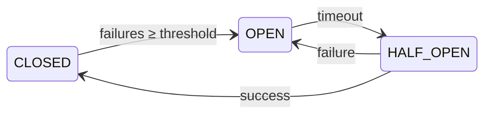
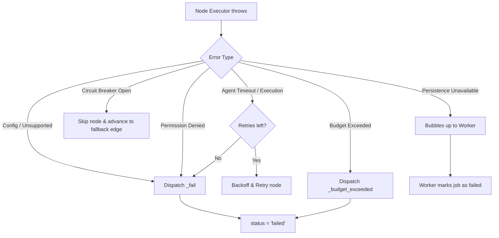

The orchestrator has a structured error hierarchy so that every failure mode has a clear type, category, and recovery path. Errors are never swallowed — they either trigger a retry, trip a circuit breaker, or terminate the run with a precise reason.

## Error class hierarchy

| Class | Module | Key Properties | When Thrown |
|-------|--------|---------------|------------|
| `BudgetExceededError` | `runner/errors` | `tokensUsed`, `budget` | Token budget exceeded during workflow |
| `WorkflowTimeoutError` | `runner/errors` | `workflowId`, `runId`, `elapsedMs` | Wall-clock time exceeded |
| `NodeConfigError` | `runner/errors` | `nodeId`, `nodeType`, `missingField` | Required config missing from a node |
| `CircuitBreakerOpenError` | `runner/errors` | `nodeId` | Node circuit breaker is open |
| `EventLogCorruptionError` | `runner/errors` | `runId` | Missing/corrupt events during recovery |
| `UnsupportedNodeTypeError` | `runner/errors` | `nodeType` | Unknown node type encountered |
| `NoMatchingEdgeError` | `runner/errors` | `nodeId` | A non-end node has no matching outgoing edge — a routing dead-end |
| `PermissionDeniedError` | `agent-executor/errors` | — | Agent writes to unauthorized keys |
| `AgentTimeoutError` | `agent-executor/errors` | `partialUsage` | Agent LLM call exceeds timeout |
| `AgentExecutionError` | `agent-executor/errors` | `cause`, `retryable`, `partialUsage` | Agent LLM call fails (non-timeout) |
| `AgentNotFoundError` | `agent-factory/errors` | — | Agent ID not found in a configured registry (fail closed) |
| `AgentLoadError` | `agent-factory/errors` | `cause` | Registry lookup fails (transient) |
| `SupervisorConfigError` | `supervisor-executor/errors` | `supervisorId` | Supervisor missing config |
| `SupervisorRoutingError` | `supervisor-executor/errors` | `chosenNode`, `allowedNodes` | Supervisor routes to invalid node |
| `ArchitectError` | `architect/errors` | — | Graph generation fails after retries |
| `MCPServerNotFoundError` | `mcp/errors` | `serverId` | MCP server registry has no entry for the requested ID |
| `MCPAccessDeniedError` | `mcp/errors` | `serverId`, `agentId` | Agent does not have permission to access the MCP server |
| `PersistenceUnavailableError` | `db/persistence-health` | — | Consecutive persistence failures exceed threshold |
| `EventSequenceConflictError` | `db/event-log` | `runId`, `sequenceId` | An event append collided with an existing `(run_id, sequence_id)` — two writers on one run |
| `StaleClaimError` | `persistence/errors` | `runId`, `staleEpoch`, `currentEpoch` | A fenced write carried an outdated claim epoch — another worker owns the run |

All errors extend `Error` and set `this.name` to their class name, enabling reliable `switch(error.name)` handling across module boundaries.

## Categories

### Config / wiring errors — fix graph definition or runner options

These fail **before any node runs** (a pre-flight check at the start of `run()`), so a misconfiguration surfaces immediately instead of mid-run after upstream nodes already spent tokens:

- `NodeConfigError` — A node is missing required configuration (e.g. `agent_id`, `tool_id`, `approval_config`).
- `SupervisorConfigError` — Supervisor node is missing its `supervisor_config`.
- `UnsupportedNodeTypeError` — The graph references a node type the runner doesn't support.
- **Missing `memoryWriter`** — the graph has a `reflection` node but no `memoryWriter` was injected. (A node with `memory_query` but no `memoryRetriever` is a warning, not a failure.)
- **Missing `toolResolver`** — a node declares MCP tool sources but no `toolResolver` was injected (otherwise it would silently run tool-less and "succeed").
- `AgentNotFoundError` — A node references an `agent_id` not found in the configured registry. **Fails closed** by default — a typo'd or deleted agent surfaces here rather than silently running a generic deny-all assistant. Opt into the legacy fallback with `configureAgentFactory(registry, { allowDefaultFallback: true })` for tests/dev.

### Routing errors — dead-end detection

- `NoMatchingEdgeError` — Execution reached a node that is **not** a declared end node, yet no outgoing edge's condition matched (e.g. a typo'd filtrex condition that evaluates to `false`). Previously this silently completed the workflow having executed only part of the graph; it now fails loud. Set `allowImplicitCompletion: true` on `GraphRunnerOptions` for the legacy silent-completion behavior.

### Runtime errors — retry or degrade

- `BudgetExceededError` — Token budget exhausted. Non-retryable within the same run.
- `WorkflowTimeoutError` — Execution exceeded wall-clock limit.
- `CircuitBreakerOpenError` — Node failures tripped the breaker. Automatically retries after timeout.
- `AgentTimeoutError` — Individual LLM call timed out. Retryable per `failure_policy`.
- `AgentExecutionError` — LLM call failed. Carries a `retryable` flag derived from the provider's `APICallError.isRetryable`: transient failures (429 rate-limit, 5xx, 529 overloaded) retry per `failure_policy`, while **definitively non-retryable** failures (400 invalid-request, context-length-exceeded, 401/403/404) short-circuit the retry loop instead of re-issuing an identical request `max_retries` times. Both `AgentExecutionError` and `AgentTimeoutError` also carry best-effort `partialUsage` so a failed attempt's tokens are still counted toward budgets.
- `MCPServerNotFoundError` — Registry has no entry for the requested MCP server ID. Non-retryable; fix the agent's tool sources or register the server.
- `MCPAccessDeniedError` — Agent does not have permission to access the MCP server (RBAC denial). Non-retryable; adjust the server's `allowed_agents` or the agent permissions.

### Data integrity errors — halt execution

- `EventLogCorruptionError` — Event log is missing, corrupt, or has a sequence gap (a lost append). Replay refuses rather than silently dropping a state transition; the worker falls back to the latest snapshot when it reflects more progress.
- `PersistenceUnavailableError` — Database unreachable after consecutive failures (3-strike rule, applied to both state snapshots and event-log flushes). Halts to prevent data loss.

### Split-brain errors — abort the local runner immediately

Both mean another worker is executing the same run. They bypass retries and the 3-strike budget — continuing only burns tokens on writes that will never land:

- `EventSequenceConflictError` — An append hit an existing `(run_id, sequence_id)`. The event-log `append()` contract rejects duplicates instead of silently dropping them.
- `StaleClaimError` — A fenced write (see [Run fencing](/docs/concepts/distributed-execution/#run-fencing)) carried a claim epoch older than the run's current one. The worker emits `job:claim_lost` and leaves the job's queue state untouched — it no longer owns it.

### Agent permission errors — security boundary

- `PermissionDeniedError` — Agent attempted to write to unauthorized memory keys.
- `SupervisorRoutingError` — Supervisor routed to a node outside its `managed_nodes`.

## Retryable vs fatal

| Error | Retryable? | Notes |
|-------|-----------|-------|
| `AgentTimeoutError` | Yes | Retried per `failure_policy.max_retries` |
| `AgentExecutionError` | Yes | With exponential backoff |
| `MCPServerNotFoundError` | No | Fix tool sources or register the server |
| `MCPAccessDeniedError` | No | Security violation — fix agent permissions |
| `CircuitBreakerOpenError` | Auto | Transitions to half-open after timeout |
| `NodeConfigError` | No | Fix the graph definition |
| `UnsupportedNodeTypeError` | No | Fix the graph definition |
| `BudgetExceededError` | No | Budget is exhausted for the run |
| `WorkflowTimeoutError` | No | Max execution time reached |
| `EventLogCorruptionError` | No | Manual intervention required |
| `PersistenceUnavailableError` | No | Halts to prevent data loss |
| `PermissionDeniedError` | No | Security violation — fix agent permissions |
| `SupervisorRoutingError` | No | Supervisor bug — fix agent prompt or managed_nodes |

## Recovery patterns

### Node execution — retry with backoff

`GraphRunner.executeNodeWithRetry()` handles this automatically:
1. Catch error from node executor
2. Check retry count against `failure_policy.max_retries`
3. If retryable: backoff → retry
4. If exhausted or fatal: dispatch `_fail` action

### Circuit breaker — automatic recovery

`CircuitBreakerManager` handles the state machine:



`CircuitBreakerOpenError` is thrown when the breaker is `OPEN` and timeout hasn't elapsed. After timeout, one probe attempt is allowed (`HALF-OPEN` state).

### Persistence degradation — progressive failure

`persistWorkflow()` tracks consecutive failures:
1. 1st failure: log warning, continue
2. 2nd failure: log warning, continue
3. 3rd failure (threshold): throw `PersistenceUnavailableError` → halt workflow

Any success resets the counter to 0.

### Compensation / Saga rollback

For workflows with side effects (e.g. API calls, database writes), nodes can declare compensating actions that undo their work on failure.

Nodes with `requires_compensation: true` push an entry onto the `compensation_stack` in state after successful execution. On failure, if `autoRollback: true` is set on the `GraphRunner` options, the engine executes compensation entries in LIFO order and transitions the workflow to `cancelled` status.

```typescript
const graph = createGraph({
  name: 'Saga Example',
  nodes: [
    {
      id: 'charge_payment',
      type: 'tool',
      tool_id: 'stripe_charge',
      read_keys: ['order'],
      write_keys: ['payment_result'],
      requires_compensation: true,
    },
    {
      id: 'reserve_inventory',
      type: 'tool',
      tool_id: 'inventory_reserve',
      read_keys: ['order'],
      write_keys: ['reservation'],
      requires_compensation: true,
    },
    // ... more nodes ...
  ],
  edges: [
    { source: 'charge_payment', target: 'reserve_inventory' },
  ],
  start_node: 'charge_payment',
  end_nodes: ['confirm_order'],
});

const runner = new GraphRunner(graph, state, {
  autoRollback: true, // execute compensation stack on failure
});
```

A node with `requires_compensation: true` pushes a compensation entry onto the `compensation_stack` after successful execution. The host application is responsible for registering the compensating tool calls — the orchestrator does not infer them from the forward action. If `reserve_inventory` fails and `autoRollback: true` is set, the engine drains the stack in LIFO order (calling each registered compensator) and transitions the workflow to `cancelled`.

When `autoRollback` is `false` (the default), the compensation stack is preserved in state but not executed — the host application decides how to handle rollback.

### Graceful shutdown

`runner.shutdown()` signals the engine to stop after the current node completes. The workflow remains in `running` status (resumable from the last persisted state) and emits a `workflow:paused` event:

```typescript
const runner = new GraphRunner(graph, state, {
  persistStateFn: async (s) => persistence.saveWorkflowSnapshot(s),
});

// Start the workflow
const resultPromise = runner.run();

// Later, signal graceful stop
runner.shutdown();

// run() resolves after the current node finishes
const pausedState = await resultPromise;
// pausedState.status === 'running' — resumable
```

This is useful for deployments, scaling down, or pausing long-running workflows without losing progress.

### Event log recovery

`GraphRunner.recover(graph, runId, eventLog, options?)` rebuilds a ready-to-continue runner:
1. Load the latest checkpoint (fast path); replay only events after it. Otherwise load all events.
2. If no events and no checkpoint: throw `EventLogCorruptionError`
3. Without a checkpoint, require an `_init` event in the log (else `EventLogCorruptionError`)
4. Verify the events are **gap-free** — contiguous `sequence_id`s from the checkpoint anchor; any gap (a lost append) throws `EventLogCorruptionError`
5. Check the `workflow_started` event's `REPLAY_VERSION` and warn on a mismatch (reducer-semantics drift)
6. Replay events through the same pure reducers to reconstruct state — deterministically, since reducers take time from each action's metadata

At the worker level, recovery also reconciles this replayed state against the latest snapshot and resumes from whichever reflects more progress (see [Distributed Execution → Crash recovery](/docs/concepts/distributed-execution/#crash-recovery)).

## Error propagation flow



### Dead-lettering (distributed execution)

When using the [WorkflowWorker](/docs/concepts/distributed-execution/), jobs that fail more times than `max_attempts` are moved to a **dead letter** queue. Dead-lettered jobs are not retried automatically — they require manual investigation.

The worker emits a `job:dead_letter` event when this happens:

```typescript
worker.on('job:dead_letter', ({ jobId, runId, error }) => {
  alertOps(`Job ${jobId} (run ${runId}) dead-lettered: ${error}`);
});
```

Monitor queue health via `getQueueDepth()`:

```typescript
const { waiting, active, paused, dead_letter } = await queue.getQueueDepth();
```

## Next steps

- [Workflow State](/docs/concepts/workflow-state/) — the shared state that errors affect
- [Distributed Execution](/docs/concepts/distributed-execution/) — worker crash recovery and dead-lettering
- [Security](/docs/security/) — how write_keys and taint tracking enforce zero trust
- [Tracing](/docs/observability/tracing/) — correlating errors with distributed traces
