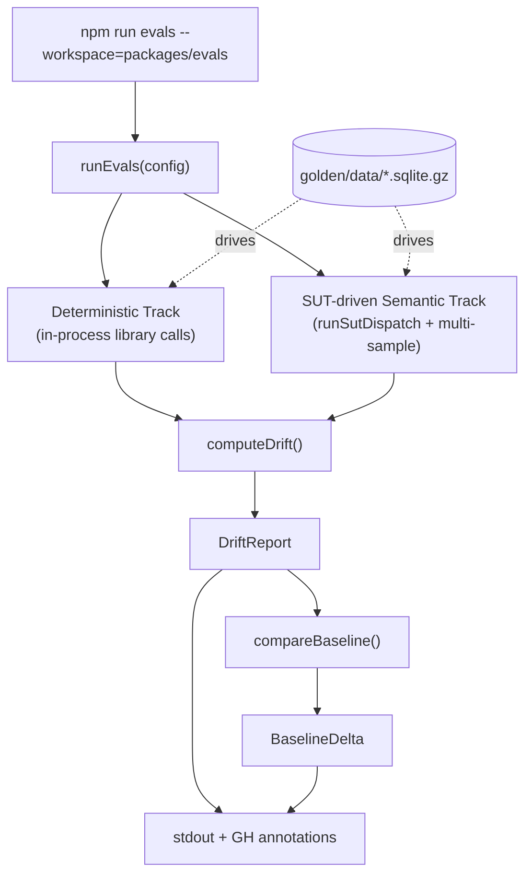

The **Eval Harness** (`@cycgraph/evals`) is the regression-detection layer for the project. It runs golden trajectories through the real `@cycgraph/orchestrator`, `@cycgraph/memory`, and `@cycgraph/context-engine` packages, captures observable behavior, and tells you whether a change in one package silently broke another.

The unit of truth is a **golden trajectory**: a recorded input/output pair captured from a real run at a known-good commit and stored in SQLite datasets under `golden/data/`. The harness replays those inputs through the current code and measures **drift**, the fraction of tests whose observed behavior no longer matches the golden. Drift above a ceiling fails the run.

## Which eval tool do I want?

cycgraph has two things called "evals", and they answer different questions.

| You want to... | Use |
|---|---|
| Assert on a single graph run in your own application tests, e.g. "the writer node produced a summary and stayed under budget" | [`runEval` graph assertions](/docs/observability/evals/), built into `@cycgraph/orchestrator` |
| Gate whole-package behavior across commits, e.g. "did my context-engine change alter what the memory pipeline produces?" | `@cycgraph/evals`, this harness |

`runEval` is a per-graph assertion framework you call from application code. The harness operates one level up: it owns its own datasets, runs as a CLI, and gates releases in CI. If you are building workflows *with* cycgraph, you probably want `runEval`. If you are changing cycgraph package code, you want the harness.

## The development loop

This is how the harness earns its keep day to day.

**1. Make your change** in any of the covered packages.

**2. Run the deterministic gate.** It replays library-level goldens in-process with no LLM and no network, and finishes in about a second:

```bash
npm run evals --workspace=packages/evals -- --deterministic-only
```

```
═══════════════════════════════════════════════
  EVAL HARNESS — DRIFT REPORT
═══════════════════════════════════════════════

  PASS  context-engine — 24 tests — drift 0.0%
  PASS  memory — 11 tests — drift 0.0%

───────────────────────────────────────────────
  PASS  Aggregate Drift: 0.0%
───────────────────────────────────────────────
```

The orchestrator suite has no deterministic track because its behavior is LLM-bound; it only appears in semantic runs.

**3. Read the result and decide.**

| You see | It means | What to do |
|---|---|---|
| `PASS`, drift 0.0% | Observable behavior is unchanged | Carry on |
| Drift on a suite you didn't touch | A cross-package regression, exactly what the harness exists to catch | Find the coupling before shipping |
| Drift on the suite you changed, unintentionally | You broke behavior you meant to preserve | Fix the code |
| Drift on the suite you changed, intentionally | The goldens describe the old behavior | Re-record them, next step |
| A test marked **flaky** in a semantic run | Samples disagreed with each other, not with the golden | Investigate the non-determinism; this is not counted as drift |

**4. Re-record goldens when a behavior change is intentional.** Recording replays each trajectory through the real code, samples it for stability, writes a diff report for review, and only overwrites the dataset when you pass `--commit`. See [Recording Goldens](/docs/guides/recording-goldens/).

**5. Let CI enforce the same gate.** CI runs the deterministic gate on every push, and the full two-track run with a frontier judge and baseline comparison on the release path. The [baseline](/docs/concepts/drift-and-baselines/) catches slow creep: a suite drifting from 0% to 4% passes a 5% ceiling every time, but the baseline comparison flags the movement.

## Architecture



### Two tracks, one gate

- **Deterministic track.** Pure library calls in-process, no LLM. Fast, free, and produces sharp signal: segmentation, dedup, budget allocation, subgraph extraction, conflict detection, and so on.
- **Semantic track.** SUT-driven: each trajectory is dispatched through the real package code via `runSutDispatch`, and an LLM judge grades the observed output against the recorded golden. The judge is configurable: Ollama locally, GPT-4o in CI, or Anthropic via `--provider anthropic`.

Both tracks feed into a single `DriftReport` aggregated by `computeDrift()`. The gate triggers when aggregate drift exceeds the configured ceiling.

### Multi-sample stability

LLM judges are non-deterministic. A single low-scoring run can tank the gate; a single high-scoring run can mask a real regression. The semantic track defaults to **3 samples per metric in CI**, using a majority-vote outcome and surfacing tests with inconsistent results as **flaky**, which is distinct from a drift failure.

See [Drift & Baselines](/docs/concepts/drift-and-baselines/) for how flaky-vs-regressed is distinguished in the report.

## Beyond the regression gate

The package carries two additional runners that measure quality rather than regressions:

- **Efficacy matrix** (`npm run evals:efficacy --workspace=packages/evals`): measures how well the memory extraction and context-compression pipelines actually perform against labeled corpora, including an LLM-tier extraction track.
- **Compression bench** (`npm run bench --workspace=packages/evals`, or `bench:smoke` for a quick pass): benchmarks the context engine against reference compressors on public datasets.

For a runnable, adversarially-tested demonstration of eval-gated learning, where poisoned lessons are evicted on outcome evidence, see `packages/evals/examples/eval-gated-learning/`.

## Related

- [Running Evals](/docs/guides/running-eval-harness/): CLI usage end to end
- [Recording Goldens](/docs/guides/recording-goldens/): re-record from real SUT runs
- [Eval Assertions](/docs/concepts/eval-assertions/): the four assertion families and when to use each
- [Drift & Baselines](/docs/concepts/drift-and-baselines/): what the drift metric means and how baselines extend it
- [Adding an Eval Suite](/docs/guides/adding-eval-suite/): build a new suite from scratch
- [Adding a SUT Handler](/docs/guides/adding-sut-handler/): extend the SUT to cover a new tag family
