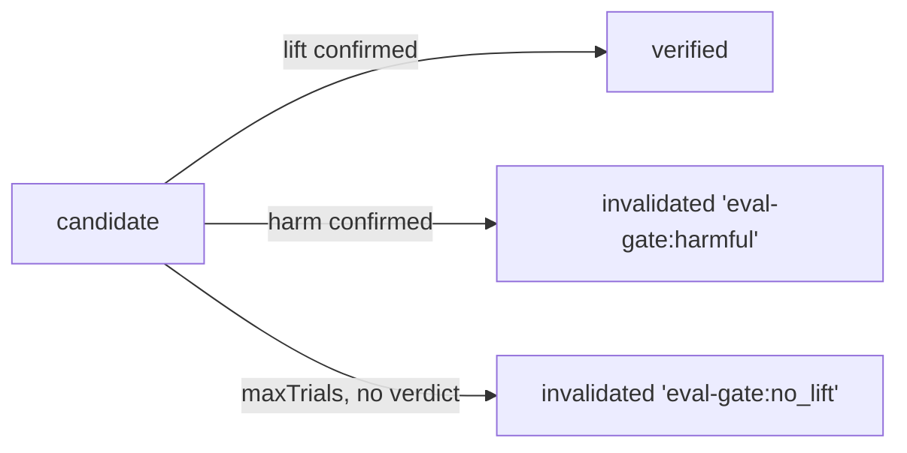

The memory system gives agents durable recall across workflow runs. It is a temporal knowledge graph with xMemory-inspired hierarchical retrieval. A flat similarity search returns loose matches and nothing more. This gives you provenance on every record, time-bounded validity, entity relationships, and a hierarchy that lets prompts drill down only when they need to.

It works standalone with any TypeScript stack, or drops into `@cycgraph/orchestrator` for cross-run agent learning.

```bash
npm install @cycgraph/memory
```

## How it works

Memory is organized as a hierarchy of increasingly abstract containers. Parallel to the hierarchy, a knowledge graph stores entities (nodes) and relationships (edges) with temporal validity windows. Retrieval combines both paths: top-down hierarchical search from themes, and BFS subgraph extraction from entities.

| Level | Type | Description |
|-------|------|-------------|
| 0 | Messages | Raw conversation turns |
| 1 | Episodes | Groups of messages about one topic |
| 2 | SemanticFacts | Atomic facts distilled from episodes |
| 3 | Themes | Clusters of related facts |

Three invariants hold across the whole package:

- **Soft delete.** Outdated records are invalidated through `invalidated_by` or `valid_until` rather than destroyed. Every read path excludes invalidated records by default, and you can opt back in with `includeInvalidated: true`.
- **Provenance.** Every record knows its origin, one of `agent`, `tool`, `human`, `system`, or `derived`, and optionally which run and node produced it.
- **Tags.** Facts carry free-form tags for retrieval scoping, such as `lesson` or `graph:research-v1`. The well-known [`QUARANTINE_TAG`](#quarantine_tag) marks facts from failed or poisoned runs so they can never resurface as trusted lessons.

Storage is split across two injected contracts. A [`MemoryStore`](#memorystore) handles CRUD persistence and a [`MemoryIndex`](#memoryindex) handles embedding similarity search. In-memory implementations ship in this package. The Postgres and pgvector implementations ship in `@cycgraph/orchestrator-postgres`, covered under [Storage backends](#storage-backends).

## Knowledge graph

Entities and relationships form a directed graph with temporal awareness:

- **Entities** are people, organizations, concepts, tools, and locations.
- **Relationships** are directed, weighted edges with `valid_from` and `valid_until` windows.
- **Temporal invalidation** soft-deletes old facts rather than removing them.
- **Provenance tracking** records where every fact came from: agent, tool, human, system, or derived.

```typescript
import { InMemoryMemoryStore } from '@cycgraph/memory';
import type { Entity, Relationship } from '@cycgraph/memory';

const store = new InMemoryMemoryStore();

const aliceId = crypto.randomUUID();
const acmeId = crypto.randomUUID();

await store.putEntity({
  id: aliceId,
  name: 'Alice',
  entity_type: 'person',
  attributes: { role: 'engineer' },
  provenance: { source: 'agent', created_at: new Date() },
  created_at: new Date(),
  updated_at: new Date(),
});

await store.putEntity({
  id: acmeId,
  name: 'Acme Corp',
  entity_type: 'organization',
  attributes: {},
  provenance: { source: 'agent', created_at: new Date() },
  created_at: new Date(),
  updated_at: new Date(),
});

await store.putRelationship({
  id: crypto.randomUUID(),
  source_id: aliceId,
  target_id: acmeId,
  relation_type: 'work_at',
  weight: 1.0,
  attributes: {},
  valid_from: new Date('2024-01-01'),
  provenance: { source: 'agent', created_at: new Date() },
});
```

**Refs:**
- [Entity](#entity): Knowledge graph node for a concept, person, organization, or object.
- [Relationship](#relationship): Directed, weighted edge with a temporal validity window.
- [Provenance](#provenance): Origin metadata carried by every record type.

## Hierarchy pipeline

Three pluggable stages build the hierarchy bottom-up. Each stage is defined by an interface, so you can swap any level for a custom implementation:

| Stage | Interface | Transforms |
|-------|-----------|-----------|
| Segmentation | [`EpisodeSegmenter`](#episodesegmenter) | Messages → Episodes (Level 0 → 1) |
| Extraction | [`SemanticExtractor`](#semanticextractor) | Episodes → Facts + Entities + Relationships (Level 1 → 2) |
| Clustering | [`ThemeClusterer`](#themeclusterer) | Facts → Themes (Level 2 → 3) |

### Episode segmentation

`SimpleEpisodeSegmenter` groups messages into episodes by time gap. Any pause longer than the threshold starts a new episode. No LLM required.

```typescript
import { SimpleEpisodeSegmenter } from '@cycgraph/memory';

const segmenter = new SimpleEpisodeSegmenter({ gapThresholdMs: 5 * 60 * 1000 });
const episodes = await segmenter.segment(messages);
```

**Refs:**
- [SimpleEpisodeSegmenter](#simpleepisodesegmenter): Time-gap segmentation, no LLM.

### Fact extraction

Three extractors convert episodes into atomic facts. **Choose by workload, not by tier:**

| Your memory workload | Recommended extractor |
|---|---|
| **Graph-bearing**: entity-based retrieval, conflict detection, entity resolution | `LLMExtractor`. These features consume edges and typed entities, and on natural text the gap is decisive. Measured against an implementation-blind corpus in `@cycgraph/evals`, rule-based extraction captured 0.15 of asserted relationships and typed 0.65 of entities correctly. A Claude-backed extractor reached 0.80 to 0.95 and 1.00. Feed a graph with rule-based extraction of conversational text and it stays mostly empty, so the graph features quietly become no-ops. |
| **Lesson loop**: reflection facts retrieved by `tags`, no graph queries | `RuleBasedExtractor`, or the reflection node's built-in sentence splitter, is a fine default here. Tag-scoped retrieval never touches entities or edges, and agent-authored notes are far easier to distill than natural prose. It is free, instant, and deterministic. |
| **Constraint-driven**: offline or air-gapped, deterministic tests, very high volume | `RuleBasedExtractor`. No content leaves the process, and the per-episode LLM cost adds up at volume. |

Extraction runs off the hot path, after a conversation or run finishes, so LLM latency rarely matters. When the knowledge graph is why you are using this package, reach for the LLM tier. `RuleBasedExtractor` also serves as the automatic fallback inside `LLMExtractor`, so the free tier's quality is always the floor rather than a separate integration.

The three extractors, in ascending quality and cost:

**SimpleSemanticExtractor** produces one fact per episode, using the topic as the fact. Use it for bootstrapping or when extraction quality doesn't matter.

**RuleBasedExtractor** produces 3 to 10 facts per episode with pattern matching. It detects entities such as capitalized names, @handles, camelCase, and ACRONYMS, and relationships such as `work_at`, `manage`, `depend_on`, and about 20 other base verbs with automatic inflection. Entity matching uses word boundaries to prevent false positives, so "Smith" won't match inside "Blacksmith". No LLM required.

```typescript
import { RuleBasedExtractor } from '@cycgraph/memory';

const extractor = new RuleBasedExtractor({ minSentenceLength: 20 });
const result = await extractor.extract(episode);

const entities = extractor.extractEntities('Alice Smith works at Acme Corp');
```

**LLMExtractor** gives the highest quality. It uses an injectable [`LLMProvider`](#llmprovider) interface, so you bring your own LLM. On any failure it falls back to `RuleBasedExtractor`, guarded by a call timeout and a consecutive-failure circuit breaker that skips the LLM entirely while the provider is down.

```typescript
import { LLMExtractor } from '@cycgraph/memory';
import type { LLMProvider } from '@cycgraph/memory';

const provider: LLMProvider = {
  complete: async (prompt) => { /* call your LLM */ return response; },
};

const extractor = new LLMExtractor({ provider, maxFactsPerEpisode: 20 });
const result = await extractor.extract(episode);
```

**Refs:**
- [SimpleSemanticExtractor](#simplesemanticextractor): One fact per episode, zero configuration.
- [RuleBasedExtractor](#rulebasedextractor): Sentence-level pattern matching for multiple facts, entities, and relationships per episode.
- [LLMExtractor](#llmextractor): Injectable-provider LLM extraction with timeout, circuit breaker, and rule-based fallback.

### Theme clustering

**SimpleThemeClusterer** does a single greedy pass. Each fact joins the most similar existing theme by embedding cosine similarity, or creates a new one. Facts without embeddings fall back to a single "General" theme.

**ConsolidatingThemeClusterer** is a drop-in replacement that adds a second pass to prevent theme proliferation:

1. **Assignment pass.** The same greedy assignment as `SimpleThemeClusterer`.
2. **Merge pass.** Pairwise cosine similarity between all theme centroids. Themes above `mergeThreshold` are merged and their centroids recomputed.

```typescript
import { ConsolidatingThemeClusterer } from '@cycgraph/memory';

const clusterer = new ConsolidatingThemeClusterer({
  assignmentThreshold: 0.7,  // min similarity to join existing theme
  mergeThreshold: 0.85,      // merge themes above this similarity
  maxThemes: 50,             // soft cap
});

const themes = await clusterer.cluster(facts, existingThemes);
```

**Refs:**
- [SimpleThemeClusterer](#simplethemeclusterer): Greedy single-pass assignment.
- [ConsolidatingThemeClusterer](#consolidatingthemeclusterer): Two-pass assign-then-merge clustering.

## Retrieval

[`retrieveMemory`](#retrievememory) is the single entry point. The query shape selects the strategy, checked in this order:

| Query carries | Strategy |
|---|---|
| `entityIds` | BFS subgraph extraction, then attach related facts and themes |
| `embedding` | Top-down hierarchical search: themes → facts → episodes |
| `tags` | Tag-scoped fact listing, no embedding provider needed |
| none of the above | Empty result |

All paths apply tag and temporal filtering and respect `limit`.

### Hierarchical retrieval (embedding-based)

Top-down search matches themes by embedding similarity, expands to facts with a direct fact search added for coverage, applies temporal filters, expands to episodes, and collects entities and relationships.

```typescript
import { retrieveMemory } from '@cycgraph/memory';

const result = await retrieveMemory(store, index, {
  embedding: queryVector,
  limit: 20,
  minSimilarity: 0.5,
  validAt: new Date(),          // only currently-valid facts
  changedSince: lastQueryTime,  // only recent changes
});
// result.themes, result.facts, result.episodes, result.entities, result.relationships
```

### Entity-based retrieval

When you have specific entity IDs, retrieval uses BFS subgraph extraction. Traversal is capped at `maxHops`, which defaults to 2, and at 500 visited entities, so one retrieval on a dense graph cannot pull thousands of records into a prompt.

```typescript
const result = await retrieveMemory(store, index, {
  entityIds: [aliceId, bobId],
  maxHops: 2,
  limit: 20,
});
```

The underlying traversal is also exported standalone as [`extractSubgraph`](#extractsubgraph).

### Tag-based retrieval

A `tags`-only query lists facts carrying any of the requested tags, with no embedding provider or pre-known entity IDs required. This is the reflection-loop hot path, the "give me the lessons from graph X" case. The store pages through facts and stops early once `limit` matches are found. DB-backed stores push the tag filter into SQL, which on Postgres is a GIN-indexed containment query. No entities or relationships are returned on this path, so query with `entityIds` when you need the knowledge-graph view.

```typescript
const result = await retrieveMemory(store, index, {
  tags: ['lesson', 'graph:research-v1'],
  limit: 10,
});
```

### Temporal filtering

Any record with `valid_from` and `valid_until` fields, meaning facts and relationships, can be filtered by point-in-time validity and recency:

```typescript
import { isValidAt, filterValid } from '@cycgraph/memory';

isValidAt(relationship, new Date());  // within [valid_from, valid_until)?

const validFacts = filterValid(allFacts, {
  validAt: new Date(),
  changedSince: lastSync,
  includeInvalidated: false,
});
```

### Gated lesson retrieval

[`retrieveGatedLessons`](#retrievegatedlessons) is the retrieval policy for [eval-gated retention](#eval-gated-retention). It fills most of the prompt budget with `verified` lessons but reserves a few exploration slots for `candidate` lessons so they can accrue the trials the retention gate needs. A candidate that is never retrieved can never be promoted or evicted, so setting `candidateSlots: 0` starves the gate. The default is 2.

Pass the outcome `ledger` to get **in-progress-first** candidate ordering. Candidates that already have trials keep their slots until the gate can rule on them, and only then do fresh candidates enter. This converges even when reflection adds new candidates every run. Without a ledger, selection falls back to newest-first, which only suits a small, stable candidate pool. Pair it with `restAfterTrials` to bench fully-trialled candidates, since their leave-one-out baseline needs runs that do *not* include them.

```typescript
import { retrieveGatedLessons } from '@cycgraph/memory';

const lessons = await retrieveGatedLessons(store, {
  tags: ['lesson', 'graph:research-v1'],
  maxFacts: 10,
  candidateSlots: 2,
  ledger,                   // in-progress-first candidate selection
  restAfterTrials: 3,       // = the retention policy's minTrials
});
```

Quarantined facts are always excluded, and ordering is fully deterministic, ranked by trial count, then `valid_from`, then `id` as a tiebreak. Facts carrying neither status tag count as verified, so lesson stores written before eval-gating existed keep working unchanged.

**Refs:**
- [retrieveMemory](#retrievememory): Strategy-dispatching retrieval across subgraph, hierarchical, and tag-scoped paths.
- [extractSubgraph](#extractsubgraph): Standalone BFS traversal from seed entity IDs.
- [Temporal filter helpers](#temporal-filter-helpers): `isValidAt`, `isChangedSince`, `filterValid`.
- [retrieveGatedLessons](#retrievegatedlessons): Verified-first retrieval with candidate exploration slots.

## Consolidation

Over time, memory accumulates duplicates, outdated facts, and contradictions. Three classes manage the lifecycle.

### EntityResolver

Extraction mints entity IDs per episode, so "Alice Smith" mentioned in ten episodes becomes ten entity records. Every cross-entity feature, including all three conflict types and entity-BFS retrieval, requires facts to *share* entity IDs. On multi-episode stores those features only work once resolution has run. **Run the resolver before conflict detection.**

```typescript
import { EntityResolver } from '@cycgraph/memory';

const resolver = new EntityResolver(store, {
  deleteMode: 'soft',   // losers keep superseded_by → canonical (default)
});
const report = await resolver.resolve();
```

Matching is deliberately conservative and fully deterministic. Entities merge when their **normalized names** are equal, after lowercasing and stripping leading articles and punctuation, **and** their `entity_type`s match. There is no fuzzy or embedding matching, because a wrong merge corrupts the graph silently while a missed merge just waits for a better matcher. The oldest record becomes the canonical one, which keeps IDs stable over time. It absorbs the losers' attributes and inherits an embedding if it lacks one. Facts' `entity_ids` and relationship endpoints are remapped to the canonical entity. Self-loops, where both endpoints collapse onto one canonical entity, and duplicate edges are dropped. Losers are soft-deleted with `superseded_by` pointing at the canonical entity, so stale references remain resolvable. Re-running is a no-op.

### MemoryConsolidator

Prunes and deduplicates memory records to stay within budget. It uses a collect-then-apply pattern, where each phase computes its mutations without writing and all writes are applied at the end. A write failure partway through consolidation therefore cannot leave partial state.

```typescript
import { MemoryConsolidator } from '@cycgraph/memory';

const consolidator = new MemoryConsolidator(store, index, {
  maxFacts: 1000,           // prune lowest-scoring facts over this count
  maxEpisodes: 100,         // prune oldest episodes over this count
  decayHalfLifeDays: 30,    // time-based relevance decay
  dedupThreshold: 0.9,      // cosine similarity for near-duplicate detection
  deleteMode: 'soft',       // 'soft' (invalidate) or 'hard' (delete)
  batchSize: 1000,          // paginated fact loading (avoids OOM on large stores)
  logger: { warn: console.warn },  // optional structured logging
});

const report = await consolidator.consolidate();
// report.factsDeduped      — near-duplicates merged
// report.factsDecayed      — low-relevance facts pruned
// report.episodesPruned    — old episodes removed
// report.themesCleanedUp   — themes with updated fact_ids
// report.themesRemoved     — empty themes deleted
```

Consolidation cascades to themes: when facts are pruned, the themes that referenced them have their `fact_ids` updated and their embeddings recomputed. Themes with zero remaining facts are deleted.

Two guardrails interact with eval-gated learning. A fact tagged `verified` is never evicted in favor of a near-duplicate that lacks the tag, so an unproven or poisoned duplicate with a newer timestamp cannot displace a verified lesson. Quarantined facts are also excluded from consolidation entirely.

For continuous operation, `autoConsolidate(thresholds)` runs consolidation only when the store has grown past the given fact and episode counts. The static `MemoryConsolidator.shouldConsolidate(store, thresholds)` answers that question without running anything.

### ConflictDetector

Identifies contradictory, negating, or superseding facts. Detection is read-only by default; resolution is an explicit second step.

```typescript
import { ConflictDetector } from '@cycgraph/memory';

const detector = new ConflictDetector(store, index, {
  embeddingThreshold: 0.8,
  policy: 'negation-invalidates-positive',
});

const conflicts = await detector.detectConflicts();

const resolution = await detector.autoResolveAll(conflicts);
```

Three conflict types:

| Type | Detection | Confidence |
|------|-----------|------------|
| `negation` | One fact contains negation words, high word overlap | 0.8 |
| `supersession` | Same entities, similar content, >N days apart (configurable via `supersessionDayThreshold`, default 1) | 0.9 |
| `semantic_contradiction` | High embedding similarity, shared entities, low text overlap | 0.3–0.7 (scaled by fact length) |

Three resolution policies:

| Policy | Behavior |
|--------|----------|
| `supersede-on-newer` | Always keep the newer fact |
| `negation-invalidates-positive` | Keep the negation (the correction), use temporal order for supersession, skip semantic contradictions |
| `manual-review` | Return all conflicts unresolved |

**Refs:**
- [EntityResolver](#entityresolver-1): Cross-episode entity deduplication. Run it before conflict detection.
- [MemoryConsolidator](#memoryconsolidator-1): Budgeted pruning, near-duplicate merging, theme cleanup.
- [ConflictDetector](#conflictdetector-1): Contradiction detection and policy-driven resolution.

## Eval-gated retention

Lessons should earn their place in memory. The retention gate promotes candidate lessons that demonstrably lift run outcomes and evicts the ones that hurt or never help. The lifecycle is tag-driven:



The loop has three moving parts:

1. **[`OutcomeLedger`](#outcomeledger)** records each scored run together with the fact IDs that were injected into it. `getBaseline(factId)` returns the leave-one-out baseline, the mean over runs that did *not* include the fact.
2. **[`retrieveGatedLessons`](#retrievegatedlessons)** keeps candidates cycling through exploration slots so evidence accrues. See [Gated lesson retrieval](#gated-lesson-retrieval).
3. **[`evaluateRetention`](#evaluateretention)** is the gate itself. It compares each candidate's runs against its leave-one-out baseline and applies promotions and evictions to the store.

```typescript
import { InMemoryOutcomeLedger, evaluateRetention } from '@cycgraph/memory';

const ledger = new InMemoryOutcomeLedger();

await ledger.recordOutcome({ run_id, score, fact_ids: injectedFactIds });

const report = await evaluateRetention(store, ledger, {
  minTrials: 3,
  noiseFloorSd: 0.1,     // set to your judge's per-run SD
  maxBaselineRuns: 64,   // closes the decision window
});
```

Two decision rules are available via `decisionRule`:

- **`'inference'`** is the default. It runs Welch-style inference on the lift between runs with the lesson and the leave-one-out baseline without it. It promotes when P(lift > `promoteMargin`) clears `promoteConfidence` and evicts when P(lift < −`evictMargin`) clears `evictConfidence`. Benjamini–Hochberg controls the false-discovery rate across all lessons tested in one pass, and doubling `sequentialControl` spends the error budget across baseline-size brackets, so gating after every run does **not** inflate false positives.
- **`'margin'`** is the original point-estimate comparison against a fixed margin. It gives faster verdicts with no statistical guarantee.

A word on the limits. This is observational inference over co-injected lessons, so the signal is correlational, not causal. A genuine lesson co-injected with a harmful one during a disaster run can be blamed for it. The inference rule quantifies uncertainty but does not remove confounding. Evictions are soft deletes and stay recoverable through `findFacts({ includeInvalidated: true })`.

### Validating your policy

Before trusting a policy, measure its realized error rates with the gate simulator. It drives the real production code path, using the actual store, ledger, retriever, and gate, with synthetic outcomes. There is no LLM and no network, it is deterministic per seed, and a full grid runs in seconds.

```typescript
import { gateOperatingCharacteristics, requiredTrials } from '@cycgraph/memory';

const rows = await gateOperatingCharacteristics({
  effects: [-0.3, -0.1, 0, 0.1, 0.3],  // true effect sizes (0 = null lesson)
  runCounts: [50, 100, 200],
  noiseSds: [0.1],
  policy: { noiseFloorSd: 0.1, maxBaselineRuns: 64 },
  retrieval: { restAfterTrials: 3 },
});

requiredTrials({ effect: 0.2, sd: 0.1 });
```

With measured defaults the gate detects an effect of magnitude 0.2 to 0.3 or larger and retires smaller ones rather than guess, at a null false-decision rate of 0 to 2 percent.

**Refs:**
- [InMemoryOutcomeLedger](#inmemoryoutcomeledger): In-process ledger. Swap it for `DrizzleOutcomeLedger` in production.
- [evaluateRetention](#evaluateretention): The gate. It assesses every candidate and applies promotions and evictions.
- [simulateGate](#simulategate): One synthetic scenario through the real pipeline.
- [gateOperatingCharacteristics](#gateoperatingcharacteristics): Decision-rate grid over effect, run volume, and noise.
- [requiredTrials](#requiredtrials): Approximate per-group runs needed to detect an effect.

## Storage backends

| Backend | Package | Use Case |
|---------|---------|----------|
| `InMemoryMemoryStore` | `@cycgraph/memory` | Testing and lightweight use |
| `InMemoryMemoryIndex` | `@cycgraph/memory` | Brute-force cosine similarity |
| `DrizzleMemoryStore` | `@cycgraph/orchestrator-postgres` | Production Postgres |
| `DrizzleMemoryIndex` | `@cycgraph/orchestrator-postgres` | pgvector HNSW indexes |
| `InMemoryOutcomeLedger` | `@cycgraph/memory` | Single-process outcome evidence |
| `DrizzleOutcomeLedger` | `@cycgraph/orchestrator-postgres` | Durable outcome evidence + gate audit log |

```typescript
import { DrizzleMemoryStore, DrizzleMemoryIndex } from '@cycgraph/orchestrator-postgres';

const store = new DrizzleMemoryStore();
const index = new DrizzleMemoryIndex();
```

The in-memory index is an O(n) brute-force scan. It is adequate below roughly 10K entries and emits a one-shot warning when rebuilt past that threshold. Construct it with `expectedDimensions`, wired from your `EmbeddingProvider.dimensions`, so a dimension mismatch throws immediately instead of silently producing wrong similarity scores.

## Orchestrator integration

Memory hooks into the runner in two places. Agent nodes **read** memory through `memoryRetriever`, and `reflection` nodes **write** to memory through `memoryWriter`.

### Reading: `memoryRetriever` + `memory_query`

Inject memory retrieval into `GraphRunner` via the `memoryRetriever` option. **The retriever only fires when a node declares a `memory_query` directive.** Without one, no calls happen against the memory store and the option is silently a no-op.

```typescript
import { GraphRunner } from '@cycgraph/orchestrator';
import { InMemoryMemoryStore, InMemoryMemoryIndex, retrieveMemory } from '@cycgraph/memory';

const store = new InMemoryMemoryStore();
const index = new InMemoryMemoryIndex();

const memoryRetriever = async (query, options) => {
  const result = await retrieveMemory(store, index, {
    entityIds: query.entityIds,
    tags: query.tags ?? [],
    limit: options?.maxFacts ?? 20,
  });
  return {
    facts: result.facts.map(f => ({ content: f.content, validFrom: f.valid_from, id: f.id })),
    entities: result.entities.map(e => ({ name: e.name, type: e.entity_type })),
    themes: result.themes.map(t => ({ label: t.label })),
  };
};

const graph = createGraph({
  name: 'Research',
  description: 'Research with prior knowledge',
  nodes: [
    {
      id: 'researcher',
      type: 'agent',
      agentId: RESEARCHER_ID,
      readKeys: ['goal'],
      writeKeys: ['notes'],
      memoryQuery: {
        tags: ['lesson'],   // retrieve facts tagged 'lesson'
        maxFacts: 10,
      },
    },
  ],
});

const runner = new GraphRunner(graph, state, { memoryRetriever });
```

The runner calls `memoryRetriever` once before building the agent's prompt, then renders results into a `## Relevant Memory` section ahead of the workflow-state memory block.

**Query shapes:**

| Shape | Behaviour |
|---|---|
| `memoryQuery: {}` | Defaults `text` to `stateView.goal`, giving RAG-style retrieval with zero config. |
| `memoryQuery: { tags: [...] }` | Tag-only retrieval. No text fallback. |
| `memoryQuery: { entityIds: [...] }` | Knowledge-graph subgraph extraction. |
| `memoryQuery: { text: '...' }` | Explicit semantic search text. |

### Writing: `memoryWriter` + `reflection` nodes

To **persist** facts back into the memory store across runs, attach a `reflection` node and inject a `memoryWriter`:

```typescript
import type { MemoryWriter } from '@cycgraph/orchestrator';

const memoryWriter: MemoryWriter = async (facts) => {
  const ids: string[] = [];
  for (const fact of facts) {
    const stored = {
      id: crypto.randomUUID(),
      content: fact.content,
      source_episode_ids: [],
      entity_ids: [],
      provenance: { source: fact.provenance.source, created_at: new Date(), run_id: fact.provenance.run_id, node_id: fact.provenance.node_id },
      valid_from: new Date(),
      tags: fact.tags,
    };
    await store.putFact(stored);
    ids.push(stored.id);
  }
  return { fact_ids: ids };
};

const runner = new GraphRunner(graph, state, { memoryRetriever, memoryWriter });
```

A `reflection` node at the end of the graph distills `research_notes` (or any source key) into facts and calls `memoryWriter`. Future runs pick those facts up through `memoryRetriever` with a matching `tags` query. See the [Reflection pattern](/docs/patterns/reflection/) and the `learning-research-agent` example for the full loop.

**Deduplication contract:** the runner passes `options.idempotency_key`, formatted as `run_id:node_id:iteration`, on every write. The same key comes back when a write repeats for the same node execution, such as after a node retry or crash recovery. Writers should treat a repeated key as already written and skip or upsert. Ignoring it duplicates facts in long-term memory on every retry. See the [Reflection pattern](/docs/patterns/reflection/) for a writer that implements the dedup.

## API

### `retrieveMemory`

Strategy-dispatching retrieval. It runs subgraph extraction when the query carries `entityIds`, top-down hierarchical search when it carries `embedding`, tag-scoped listing when it carries only `tags`, and returns an empty result otherwise.

All paths exclude quarantined facts by default. A query whose `tags` explicitly include `'quarantined'` retrieves them, which is the audit path. Served facts get their `access_count` bumped through the store's optional `touchFacts`, and this is a no-op for stores that don't implement it.

```typescript
retrieveMemory(store: MemoryStore, index: MemoryIndex, query: MemoryQuery): Promise<MemoryResult>
```

##### Options

The query is a [`MemoryQuery`](#memoryquery):

| Parameter | Type | Default | Description |
|--------|------|---------|-------------|
| `text` | `string` | `undefined` | Natural language query text (used for embedding if no embedding provided). |
| `embedding` | `number[]` | `undefined` | Pre-computed query embedding vector. |
| `entityIds` | `string[]` | `undefined` | Seed entity IDs for subgraph extraction. |
| `entityTypes` | `string[]` | `undefined` | Filter entities by type. |
| `relationTypes` | `string[]` | `undefined` | Filter relationships by type. |
| `maxHops` | `number` | `2` | Max BFS hops for subgraph extraction (0–5). |
| `validAt` | `Date` | `undefined` | Return only records valid at this point in time. |
| `changedSince` | `Date` | `undefined` | Return only records that changed after this point in time. |
| `limit` | `number` | `20` | Maximum results per record type (1–100). |
| `minSimilarity` | `number` | `0.5` | Minimum embedding similarity threshold (0–1). |
| `includeInvalidated` | `boolean` | `false` | Include invalidated records in results. |
| `tags` | `string[]` | `[]` | Restrict matches to facts carrying at least one listed tag. |

##### Output

A [`MemoryResult`](#memoryresult):

| Parameter | Type | Description |
|-----------|------|-------------|
| `themes` | [`Theme[]`](#theme) | Matched themes (highest level of hierarchy). |
| `facts` | [`SemanticFact[]`](#semanticfact) | Matched semantic facts. |
| `episodes` | [`Episode[]`](#episode) | Matched episodes. |
| `entities` | [`Entity[]`](#entity) | Matched entities (empty on the tag-only path). |
| `relationships` | [`Relationship[]`](#relationship) | Matched relationships (empty on the tag-only path). |

### `extractSubgraph`

BFS traversal from seed entity IDs. At each hop, fetches relationships for frontier entities, applies temporal filtering, and expands to connected entities; a visited set prevents cycles.

```typescript
extractSubgraph(store: MemoryStore, seedEntityIds: string[], opts?: SubgraphOptions): Promise<SubgraphResult>
```

##### Options

| Parameter | Type | Default | Description |
|--------|------|---------|-------------|
| `maxHops` | `number` | `2` | Maximum BFS hops from seed entities. |
| `validAt` | `Date` | `undefined` | Only include relationships valid at this time. |
| `includeInvalidated` | `boolean` | `false` | Include invalidated relationships. |
| `maxEntities` | `number` | `500` | Hard cap on entities visited (`DEFAULT_MAX_SUBGRAPH_ENTITIES`). Bounds the near-exponential frontier growth of dense graphs. |

##### Output

| Parameter | Type | Description |
|-----------|------|-------------|
| `entities` | [`Entity[]`](#entity) | All visited entities (batch-fetched). |
| `relationships` | [`Relationship[]`](#relationship) | All traversed relationships. |

### `retrieveGatedLessons`

Retrieval policy for eval-gated lessons. Verified lessons fill `maxFacts − candidateSlots`, and candidates fill the rest, in-progress-first when a ledger is provided and newest-first otherwise. Unused candidate slots fall back to additional verified lessons. Quarantined facts are always excluded, and ordering is fully deterministic.

```typescript
retrieveGatedLessons(store: MemoryStore, options: GatedLessonOptions): Promise<SemanticFact[]>
```

##### Options

| Parameter | Type | Default | Description |
|--------|------|---------|-------------|
| `tags` | `string[]` | required | Scope tags (OR semantics), e.g. `['lesson', 'graph:research-v1']`. |
| `candidateTag` | `string` | `'candidate'` | Tag marking on-trial lessons. |
| `maxFacts` | `number` | `10` | Total lessons to return. |
| `candidateSlots` | `number` | `2` | Slots reserved for candidates. Set to `0` to retrieve verified lessons only, but note that candidates then never accrue trials and the gate holds them forever. |
| `ledger` | [`OutcomeLedger`](#outcomeledger) | `undefined` | Enables in-progress-first candidate selection. Strongly recommended whenever reflection keeps producing new candidates. |
| `restAfterTrials` | `number` | `undefined` | Bench candidates once they have this many trials. Requires `ledger`. Set it to the retention policy's `minTrials`, since the leave-one-out baseline needs runs that do not include the fact. |

##### Output

| Parameter | Type | Description |
|-----------|------|-------------|
| `lessons` | [`SemanticFact[]`](#semanticfact) | Verified lessons first, then chosen candidates. Facts with neither status tag count as verified. |

### Temporal filter helpers

Validity-window checks for any record with `valid_from` / optional `valid_until` fields (facts, relationships).

```typescript
isValidAt(record: TemporalRecord, date: Date): boolean
isChangedSince(record: TemporalRecord, date: Date): boolean
filterValid<T extends TemporalRecord>(records: T[], opts?: TemporalFilterOptions): T[]
```

`filterValid` options are `validAt`, `changedSince`, and `includeInvalidated`, which defaults to `false` and drops records with `invalidated_by` set.

### `InMemoryMemoryStore`

Zero-dependency [`MemoryStore`](#memorystore) backed by Maps. Suitable for tests and lightweight single-process use.

```typescript
InMemoryMemoryStore()
```

`findFacts` honors the `tags` and `excludeTags` filters and returns deterministic ordering. The Drizzle-backed store applies an explicit `ORDER BY` for the same stability.

### `InMemoryMemoryIndex`

Brute-force cosine similarity search over stored embeddings, O(n) per query. It emits a one-shot console warning when rebuilt past `IN_MEMORY_INDEX_WARN_THRESHOLD`, which is 10,000 entries. Switch to the pgvector-backed adapter past that scale.

```typescript
InMemoryMemoryIndex(options?: InMemoryMemoryIndexOptions)
```

##### Options

| Parameter | Type | Default | Description |
|--------|------|---------|-------------|
| `expectedDimensions` | `number` | `undefined` | Expected embedding dimensionality. When set, any mismatched embedding throws `EmbeddingDimensionMismatchError` immediately, since cosine similarity over mixed-dimension vectors produces silently incorrect scores. Wire it from `EmbeddingProvider.dimensions`. |
| `silenceScaleWarning` | `boolean` | `false` | Suppress the 10K-entry scaling warning (e.g. for a stress test deliberately exercising the scan path). |

### `batchGetFallback`

Generic batch-get fallback for custom store backends without native batch retrieval: resolves N single-get calls in parallel and returns a Map of found records (missing IDs are absent). Production backends should implement batch methods natively (`WHERE id = ANY($1)`).

```typescript
batchGetFallback<T>(ids: string[], getSingle: (id: string) => Promise<T | null>): Promise<Map<string, T>>
```

### `SimpleEpisodeSegmenter`

Rule-based segmentation: splits messages into episodes on time gaps between consecutive messages. No LLM required. Messages are sorted by timestamp first; each episode's topic is the first message's content (truncated).

```typescript
SimpleEpisodeSegmenter(opts?: SimpleEpisodeSegmenterOptions)
```

##### Options

| Parameter | Type | Default | Description |
|--------|------|---------|-------------|
| `gapThresholdMs` | `number` | `300000` (5 min) | Time gap that starts a new episode. |
| `maxTopicLength` | `number` | `100` | Maximum topic label length. |

### `SimpleSemanticExtractor`

Minimal extraction: one fact per episode, whose content is the episode topic. No options.

```typescript
SimpleSemanticExtractor()
```

### `RuleBasedExtractor`

Sentence-level pattern matching producing multiple facts, entities, and relationships per episode.

```typescript
RuleBasedExtractor(options?: RuleBasedExtractorOptions)
```

##### Options

| Parameter | Type | Default | Description |
|--------|------|---------|-------------|
| `minSentenceLength` | `number` | `20` | Skip sentences shorter than this (characters). |
| `entityPatterns` | `RegExp[]` | `undefined` | Additional entity-detection regexes. |
| `relationshipVerbs` | `string[]` | `undefined` | Additional relationship verbs. The inflection engine handles regular verbs only, so consonant-doubling verbs like "stop" and "stopped" need pre-inflected forms. |

##### Output

`extract(episode)` returns an [`ExtractionResult`](#extractionresult). The standalone `extractEntities(text)` returns `{ name, type }[]`.

### `LLMExtractor`

LLM-backed extraction via an injectable [`LLMProvider`](#llmprovider). It falls back to `RuleBasedExtractor` on any failure, whether a parse error, a thrown error, or a timeout, and a consecutive-failure circuit breaker skips the LLM call entirely while the provider is repeatedly failing.

```typescript
LLMExtractor(options: LLMExtractorOptions)
```

##### Options

| Parameter | Type | Default | Description |
|--------|------|---------|-------------|
| `provider` | [`LLMProvider`](#llmprovider) | required | Your LLM completion function. |
| `maxFactsPerEpisode` | `number` | `20` | Cap on facts extracted per episode. |
| `timeoutMs` | `number` | `30000` | Timeout for LLM provider calls. |
| `maxConsecutiveFailures` | `number` | `3` | Trip the breaker (skip LLM, go straight to rule-based) after this many consecutive failures. |
| `breakerCooldownMs` | `number` | `60000` | Retry the LLM after this long once the breaker has tripped. |

### `SimpleThemeClusterer`

Greedy embedding-based clustering. It assigns each fact to the most similar existing theme when it clears the threshold, or creates a new one. Facts without embeddings go to a fallback "General" theme.

```typescript
SimpleThemeClusterer(opts?: SimpleThemeClustererOptions)
```

##### Options

| Parameter | Type | Default | Description |
|--------|------|---------|-------------|
| `similarityThreshold` | `number` | `0.7` | Minimum similarity to assign a fact to an existing theme. |

### `ConsolidatingThemeClusterer`

Two-pass clustering that runs greedy assignment followed by a centroid-merge pass, as a drop-in replacement for `SimpleThemeClusterer`.

```typescript
ConsolidatingThemeClusterer(options?: ConsolidatingThemeClustererOptions)
```

##### Options

| Parameter | Type | Default | Description |
|--------|------|---------|-------------|
| `assignmentThreshold` | `number` | `0.7` | Minimum similarity to assign a fact to an existing theme. |
| `mergeThreshold` | `number` | `0.85` | Minimum similarity between two themes to merge them. |
| `maxThemes` | `number` | no limit | Soft cap on number of themes. |

### `MemoryConsolidator`

Budgeted pruning and deduplication with collect-then-apply write semantics.

```typescript
MemoryConsolidator(store: MemoryStore, index: MemoryIndex, options?: ConsolidationOptions)
```

##### Options

| Parameter | Type | Default | Description |
|--------|------|---------|-------------|
| `maxFacts` | `number` | `undefined` | Max facts to retain; lowest-scoring pruned first. |
| `maxEpisodes` | `number` | `undefined` | Max episodes to retain; oldest pruned first. |
| `decayHalfLifeDays` | `number` | `30` | Half-life for time-decay relevance scoring. Age is measured from `last_accessed_at` when usage tracking is active (`touchFacts`), else from `valid_from`. |
| `dedupThreshold` | `number` | `0.9` | Cosine similarity threshold for near-duplicate fact merging. |
| `deleteMode` | `'soft'` \| `'hard'` | `'soft'` | Invalidate (recoverable) or hard-delete. |
| `debug` | `boolean` | `false` | Enable debug logging and the mutation log in the report. |
| `logger` | `ConsolidationLogger` | `undefined` | Optional `{ debug?, warn? }` logger. |
| `batchSize` | `number` | `1000` | Page size for fact loading (avoids OOM on large stores). |
| `verifiedTag` | `string` | `'verified'` | A fact carrying this tag is never evicted in favor of a near-duplicate that lacks it. |
| `candidateTag` | `string` | `'candidate'` | Dropped from a survivor merged into a verified keeper (no fact ends up tagged both). |

##### Output

`consolidate()` returns a [`ConsolidationReport`](#consolidationreport). `autoConsolidate(thresholds)` returns the report or `null` when consolidation wasn't needed; the static `shouldConsolidate(store, thresholds)` returns a boolean without mutating anything.

### `ConflictDetector`

Detects contradictory, negating, or superseding facts, and resolves them under a policy.

```typescript
new ConflictDetector(store: MemoryStore, index: MemoryIndex, options?: ConflictDetectorOptions)
```

##### Options

| Parameter | Type | Default | Description |
|--------|------|---------|-------------|
| `autoResolveSupersession` | `boolean` | `false` | Invalidate the older fact of each superseding pair inline during `detectConflicts`. Leave off (detection stays read-only) and resolve explicitly via `autoResolveAll` instead. |
| `embeddingThreshold` | `number` | `0.8` | Cosine similarity threshold for contradiction detection. |
| `semanticOverlapThreshold` | `number` | `0.3` | Word-overlap ceiling below which similar facts may be contradictory. |
| `policy` | [`ConflictResolutionPolicy`](#conflictdetector) | `'manual-review'` | Default resolution policy for `autoResolveAll`. |
| `supersessionDayThreshold` | `number` | `1` | Minimum time difference in days for supersession detection. |
| `batchSize` | `number` | `1000` | Page size for paginated fact loading. |

##### Output

`detectConflicts(facts?)` returns `Conflict[]`, where each is `{ factA, factB, type, confidence }`. `autoResolveAll(conflicts, policy?)` returns a `ConflictResolutionReport` of `{ resolved, skipped, details }`. `resolveConflict(conflict, 'keep_a' | 'keep_b' | 'keep_both')` resolves one conflict manually, and the losing fact is invalidated by the winner.

### `EntityResolver`

Cross-episode entity deduplication. It merges entity records with equal normalized names and types, remaps facts and relationships to the canonical entity, and soft-deletes losers with a `superseded_by` forwarding pointer. Collect-then-apply, and idempotent.

```typescript
new EntityResolver(store: MemoryStore, options?: EntityResolutionOptions)
resolver.resolve(): Promise<EntityResolutionReport>
```

##### Options

| Parameter | Type | Default | Description |
|--------|------|---------|-------------|
| `deleteMode` | `'soft'` \| `'hard'` | `'soft'` | Soft-delete losers (invalidated + `superseded_by`) or delete outright. |
| `batchSize` | `number` | `1000` | Page size for paginated entity/fact loading. |
| `logger` | `EntityResolutionLogger` | `undefined` | Optional `{ debug?, warn? }` logger. |

##### Output

| Parameter | Type | Description |
|-----------|------|-------------|
| `groupsMerged` | `number` | Duplicate groups found (one canonical + ≥1 loser each). |
| `entitiesAbsorbed` | `number` | Loser entities absorbed into a canonical. |
| `factsRewritten` | `number` | Facts whose `entity_ids` were remapped. |
| `relationshipsRewritten` | `number` | Relationships whose endpoints were remapped. |
| `relationshipsDropped` | `number` | Relationships dropped as self-loops or duplicates. |

### `normalizeEntityName`

The resolver's identity normalization, exported so custom extractors can pre-normalize and callers can predict grouping: lowercase, strip a leading article, strip punctuation, collapse whitespace.

```typescript
normalizeEntityName(name: string): string
```

### `InMemoryOutcomeLedger`

In-process [`OutcomeLedger`](#outcomeledger). Recording is idempotent on `run_id`, so re-recording a run replaces the earlier entry and callers can safely retry. In production, swap it for `DrizzleOutcomeLedger` from `@cycgraph/orchestrator-postgres`. That has the same interface, but evidence survives restarts and each gate pass is persisted to an append-only audit log.

```typescript
new InMemoryOutcomeLedger()
```

##### Output

`recordOutcome({ run_id, score, fact_ids })` accepts a [`RunOutcome`](#runoutcome). `getFactStats(factId)` and `listFactStats()` return [`FactStats`](#factstats), and `getBaseline(excludeFactId?)` returns the leave-one-out [`OutcomeBaseline`](#outcomebaseline).

### `evaluateRetention`

The retention gate. It evaluates every active candidate lesson against the ledger evidence and applies promotions and evictions to the store. It is idempotent: promoted facts no longer carry the candidate tag, and evicted facts are excluded from default listings.

```typescript
evaluateRetention(store: MemoryStore, ledger: OutcomeLedger, policy?: Partial<RetentionPolicy>): Promise<RetentionReport>
```

##### Options

| Parameter | Type | Default | Description |
|--------|------|---------|-------------|
| `minTrials` | `number` | `3` | Minimum runs a candidate must appear in before any decision. |
| `promoteMargin` | `number` | `0.05` | Practical-significance floor for promotion (lift must exceed it). |
| `evictMargin` | `number` | `0.05` | Practical-significance floor for eviction (drop must exceed it). |
| `candidateTag` | `string` | `'candidate'` | Tag marking unproven lessons. |
| `verifiedTag` | `string` | `'verified'` | Tag marking lessons that earned their place. |
| `maxTrials` | `number` | `undefined` | Evict a verdict-less candidate as `no_lift` after this many trials. Must be ≥ `minTrials`, which the schema validates. When retrieval benches candidates via `restAfterTrials`, trials freeze below this cap and it never fires, so pair it with `maxBaselineRuns`. |
| `maxBaselineRuns` | `number` | `undefined` | Retire a still-undecided candidate once its leave-one-out baseline reaches this many runs. This is the baseline-side stopping rule that closes the decision window. |
| `decisionRule` | `'inference'` \| `'margin'` | `'inference'` | Welch-style test with FDR control, or the original point-estimate rule. |
| `promoteConfidence` | `number` | `0.9` | Required P(lift > `promoteMargin`) to promote (inference rule). |
| `evictConfidence` | `number` | `0.9` | Required P(lift < −`evictMargin`) to evict (inference rule). |
| `noiseFloorSd` | `number` | `0.1` | Per-group SD floor applied before the Welch test. It encodes known judge noise so tiny samples can't fake certainty. Set it to your judge's observed per-run SD. |
| `multipleComparison` | `'bh'` \| `'none'` | `'bh'` | Benjamini–Hochberg FDR control across all candidates tested in one pass. |
| `sequentialControl` | `'doubling'` \| `'none'` | `'doubling'` | Alpha-spending over doubling baseline brackets so repeated gating doesn't inflate false positives. `'none'` is only sound if you gate once. |

##### Output

A [`RetentionReport`](#retentionreport): `promoted`, `evicted` (with an [`EvictionReason`](#retentionreport)), and `held`, each entry carrying the [`RetentionEvidence`](#retentionevidence) behind the decision under the inference rule.

### `simulateGate`

Simulate scored workflow runs against the real store, ledger, retriever, and gate pipeline with synthetic outcomes, where `score(run) = clamp01(base + Σ trueEffect(injected) + N(0, noiseSd))`. No LLM, no network, and fully deterministic per seed.

```typescript
simulateGate(config: GateSimulationConfig): Promise<GateSimulationResult>
```

##### Options

| Parameter | Type | Default | Description |
|--------|------|---------|-------------|
| `lessons` | `SimulatedLesson[]` | required | `{ id, trueEffect, arrivesAtRun }` per lesson (negative effect = harmful). |
| `runs` | `number` | required | Total runs to simulate. |
| `baseScore` | `number` | `0.6` | Score of a lesson-free run before noise. |
| `noiseSd` | `number` | `0.1` | Run-score noise SD, covering judge noise plus run variability. |
| `seed` | `number` | required | PRNG seed. The same seed and config give byte-identical results. |
| `retrieval` | `object` | `undefined` | `{ maxFacts?, candidateSlots?, restAfterTrials? }`, passed to `retrieveGatedLessons`. |
| `policy` | `Partial<RetentionPolicy>` | `{}` | Passed to `evaluateRetention`. |
| `gateEvery` | `number` | `1` | Gate cadence in runs. |
| `recordEmptyRuns` | `boolean` | `true` | Record runs that injected zero lessons (clean baselines). |

##### Output

| Parameter | Type | Description |
|-----------|------|-------------|
| `lessons` | `SimulatedLessonOutcome[]` | Per lesson: `outcome` (`promoted` / `evicted` / `held`), eviction `reason`, and `decidedAtRun`. |
| `runScores` | `number[]` | Score of every simulated run. |
| `gateReports` | `{ afterRun, report }[]` | Every gate pass's [`RetentionReport`](#retentionreport). |

### `gateOperatingCharacteristics`

Sweep the gate over a grid of (effect × run volume × noise) cells, one lesson per replicate, and report decision rates per cell. This is the chart that tells you where to trust your policy: detection-rate curves by run count per effect size, and the false-positive floor at effect 0.

```typescript
gateOperatingCharacteristics(config: OperatingCharacteristicsConfig): Promise<OperatingCharacteristicsRow[]>
```

##### Options

| Parameter | Type | Default | Description |
|--------|------|---------|-------------|
| `effects` | `number[]` | required | True effect sizes to test (negative = harmful, 0 = null lesson). |
| `runCounts` | `number[]` | required | Run-volume levels. |
| `noiseSds` | `number[]` | `[0.1]` | Noise levels. |
| `replicates` | `number` | `20` | Seeded replicates per grid cell. |
| `seed` | `number` | `1` | Base seed. |
| `baseScore` | `number` | `0.6` | Passed through to `simulateGate`. |
| `retrieval` | `object` | `undefined` | Passed through to `simulateGate`. |
| `policy` | `Partial<RetentionPolicy>` | `{}` | Passed through to `simulateGate`. |
| `gateEvery` | `number` | `1` | Passed through to `simulateGate`. |

##### Output

One row per cell with the cell coordinates (`effect`, `runs`, `noiseSd`, `replicates`) and the measured rates: `promoteRate`, `evictRate`, `harmfulEvictRate`, `noLiftRate`, `heldRate`, `falsePromoteRate` (promotions at effect ≤ 0), `falseEvictRate` (harmful-evictions at effect ≥ 0), and `meanDecisionRun`.

### `requiredTrials`

Approximate per-group runs needed for the gate to detect an effect with the given confidence and power, computed as `2·((z_α + z_β)·sd / effect)²`. It is the sample-size wall in one line. Halving the judge SD cuts required runs by a factor of 4, and halving the effect size multiplies them by 4.

```typescript
requiredTrials(input: RequiredTrialsInput): number
```

##### Options

| Parameter | Type | Default | Description |
|--------|------|---------|-------------|
| `effect` | `number` | required | Smallest lift you want the gate to detect (e.g. `0.05`). |
| `sd` | `number` | required | Run-score standard deviation, covering judge noise plus run variability. |
| `confidence` | `number` | `0.9` | Decision confidence, as in `RetentionPolicy`. |
| `power` | `number` | `0.8` | Desired detection power. |

### `cosineSimilarity`

Cosine similarity between two vectors. It returns 0 if either vector has zero magnitude and assumes equal dimensionality. See [`InMemoryMemoryIndex`](#inmemorymemoryindex)'s `expectedDimensions` for enforcement.

```typescript
cosineSimilarity(a: number[], b: number[]): number
```

### `QUARANTINE_TAG`

The well-known tag `'quarantined'` marks a fact as learned during a failed, poisoned, or tainted run. Read and consolidation paths exclude it by default, so a quarantined fact can never be retrieved as a lesson or promoted by the gate. It remains recoverable for audit.

### Low-level utilities

Statistical building blocks behind the retention gate and simulator, exported for advanced composition. Signatures are in the source.

| Export | Description |
|--------|-------------|
| `welchLift` | Welch-style inference on the difference of two group means, returning `{ lift, se, df, p_exceeds }`. Both groups need n ≥ 2. |
| `benjaminiHochberg` | Benjamini–Hochberg FDR control over a p-value list at rate q. |
| `studentTCdf` | Student-t CDF (regularized incomplete beta). |
| `normalQuantile` | Standard-normal quantile function. |
| `mulberry32` | Deterministic seeded uniform PRNG in [0, 1). |
| `gaussian` | Standard-normal sample from a uniform PRNG (Box–Muller). |

## Interfaces

### MemoryStore

Primary persistence contract. All methods are async to support both in-memory and database backends.

| Method group | Methods |
|--------------|---------|
| Entities | `putEntity`, `getEntity`, `findEntities(filter?)`, `deleteEntity` |
| Relationships | `putRelationship`, `getRelationship`, `getRelationshipsForEntity(entityId, filter?)`, `deleteRelationship` |
| Episodes | `putEpisode`, `getEpisode`, `listEpisodes(opts?)`, `deleteEpisode` |
| Facts | `putFact`, `getFact`, `findFacts(filter?)`, `deleteFact` |
| Themes | `putTheme`, `getTheme`, `listThemes`, `deleteTheme` |
| Batch | `getEntities(ids)`, `getFacts(ids)`, `getEpisodes(ids)`, `getThemes(ids)`. These return Maps, and missing IDs are silently absent. |
| Usage tracking | `touchFacts?(ids, at?)` is optional. It increments `access_count` and sets `last_accessed_at`. Retrieval calls it after serving facts so decay scoring favors load-bearing facts. Stores that omit it get age-only decay. |
| Lifecycle | `clear()` |

Filter shapes:

| Filter | Fields |
|--------|--------|
| `EntityFilter` | `entityType?`, `includeInvalidated?` |
| `FactFilter` | `themeId?`, `entityId?`, `includeInvalidated?`, `tags?` (match any, OR semantics, pushed into SQL by DB-backed stores), `excludeTags?` (exclude any, applied after `tags`, keeps quarantined facts out without deleting them) |
| `RelationshipFilter` | `direction?` (`'outgoing'` \| `'incoming'` \| `'both'`), `relationType?`, `includeInvalidated?` |
| `PaginationOptions` | `limit?`, `offset?` |

### MemoryIndex

Embedding similarity search, separated from `MemoryStore` so simple backends don't need vector search and Postgres backends can use pgvector HNSW.

| Method | Description |
|--------|-------------|
| `searchEntities(embedding, opts?)` | Similarity search over entities → `ScoredResult<Entity>[]`. |
| `searchFacts(embedding, opts?)` | Similarity search over facts. |
| `searchThemes(embedding, opts?)` | Similarity search over themes. |
| `searchEpisodes(embedding, opts?)` | Similarity search over episodes. |
| `rebuild(store)` | Rebuild all indexes from the store (e.g. after bulk inserts). |

`SearchOptions` are `{ limit?, minSimilarity? }`, and a `ScoredResult<T>` is `{ item, score }`.

### EmbeddingProvider

Bring-your-own embeddings. The package never couples to a specific provider. It is shape-aligned with `@cycgraph/context-engine`'s `EmbeddingProvider`, so one implementation serves both stacks.

| Field | Type | Description |
|-------|------|-------------|
| `embed` | `(texts: string[]) => Promise<number[][]>` | Embed a batch of texts (one-element array for a single text). |
| `dimensions` | `number` | Dimensionality of produced embeddings. |

### LLMProvider

Injected into [`LLMExtractor`](#llmextractor).

| Field | Type | Description |
|-------|------|-------------|
| `complete` | `(prompt: string) => Promise<string>` | Run a completion against your LLM. |

### EpisodeSegmenter

| Field | Type | Description |
|-------|------|-------------|
| `segment` | `(messages: Message[]) => Promise<Episode[]>` | Group messages into topic-coherent episodes (Level 0 → 1). |

### SemanticExtractor

| Field | Type | Description |
|-------|------|-------------|
| `extract` | `(episode: Episode) => Promise<ExtractionResult>` | Distill an episode into facts, entities, and relationships (Level 1 → 2). Sets `fact_ids` on the passed episode, so persist the episode after extraction. |

### ExtractionResult

| Field | Type | Description |
|-------|------|-------------|
| `facts` | [`SemanticFact[]`](#semanticfact) | Atomic facts extracted from the episode. |
| `entities` | [`Entity[]`](#entity) | Entities detected (knowledge graph nodes). |
| `relationships` | [`Relationship[]`](#relationship) | Relationships between entities (knowledge graph edges). |

### ThemeClusterer

| Field | Type | Description |
|-------|------|-------------|
| `cluster` | `(facts: SemanticFact[], existingThemes?: Theme[]) => Promise<Theme[]>` | Cluster facts into themes, optionally reusing existing themes (Level 2 → 3). Sets `theme_id` on each passed fact, so persist the facts after clustering. A previously persisted theme absent from the returned array was merged away. Diff to find removals with `existing.filter(t => !returned.some(r => r.id === t.id))`. |

### Provenance

Origin metadata carried by every record type. It is compatible with the orchestrator's taint-tracking system but independent of it.

| Field | Type | Description |
|-------|------|-------------|
| `source` | `'agent'` \| `'tool'` \| `'human'` \| `'system'` \| `'derived'` | Origin category. |
| `agent_id` | `string?` | Agent that produced the data. |
| `tool_name` | `string?` | Tool that produced the data. |
| `run_id` | `string?` | Workflow run that produced the data. |
| `node_id` | `string?` | Graph node that produced the data. |
| `confidence` | `number?` | Extraction confidence (0–1). |
| `created_at` | `Date` | When this record was created. |

### Entity

Knowledge graph node.

| Field | Type | Description |
|-------|------|-------------|
| `id` | `string` (uuid) | Unique entity identifier. |
| `name` | `string` | Human-readable entity name. |
| `entity_type` | `string` | Categorical type (`"person"`, `"organization"`, `"concept"`, …). |
| `attributes` | `Record<string, unknown>` | Open-ended attributes. |
| `embedding` | `number[]?` | Optional embedding vector (dimension-agnostic). |
| `provenance` | [`Provenance`](#provenance) | Origin metadata. |
| `created_at` / `updated_at` | `Date` | Record timestamps. |
| `invalidated_at` | `Date?` | Soft-delete timestamp. |
| `superseded_by` | `string?` | ID of the entity that supersedes this one. |

### Relationship

Directed, weighted knowledge graph edge with a temporal validity window.

| Field | Type | Description |
|-------|------|-------------|
| `id` | `string` (uuid) | Unique relationship identifier. |
| `source_id` / `target_id` | `string` | Edge endpoints (entity IDs). |
| `relation_type` | `string` | Relationship type (`"works_at"`, `"depends_on"`, …). |
| `weight` | `number` | Edge weight (0–1, default 1). |
| `attributes` | `Record<string, unknown>` | Open-ended attributes. |
| `valid_from` | `Date` | When this relationship became valid. |
| `valid_until` | `Date?` | When it ceased to be valid (`undefined` = still valid). |
| `provenance` | [`Provenance`](#provenance) | Origin metadata. |
| `invalidated_by` | `string?` | ID of the relationship that invalidated this one. |

### Message

| Field | Type | Description |
|-------|------|-------------|
| `id` | `string` (uuid) | Unique message identifier. |
| `role` | `'user'` \| `'assistant'` \| `'system'` \| `'tool'` | Message role. |
| `content` | `string` | Message content. |
| `timestamp` | `Date` | When this message was produced. |
| `metadata` | `Record<string, unknown>` | Arbitrary metadata (tool call IDs, model info, …). |

### Episode

A coherent group of messages about one topic (Level 1).

| Field | Type | Description |
|-------|------|-------------|
| `id` | `string` (uuid) | Unique episode identifier. |
| `topic` | `string` | Short topic label. |
| `messages` | [`Message[]`](#message) | Messages, ordered by timestamp. |
| `started_at` / `ended_at` | `Date` | Timestamps of the first and last message. |
| `embedding` | `number[]?` | Optional episode embedding. |
| `fact_ids` | `string[]` | IDs of facts extracted from this episode. |
| `provenance` | [`Provenance`](#provenance) | Origin metadata. |

### SemanticFact

An atomic, self-contained piece of knowledge (Level 2) with temporal validity.

| Field | Type | Description |
|-------|------|-------------|
| `id` | `string` (uuid) | Unique fact identifier. |
| `content` | `string` | Natural language atomic fact ("Alice works at Acme Corp"). |
| `source_episode_ids` | `string[]` | Episodes this fact was extracted from. |
| `entity_ids` | `string[]` | Entities referenced by this fact. |
| `theme_id` | `string?` | Theme assigned during clustering. |
| `embedding` | `number[]?` | Optional embedding vector. |
| `provenance` | [`Provenance`](#provenance) | Origin metadata. |
| `valid_from` | `Date` | When this fact became valid. |
| `valid_until` | `Date?` | When it ceased to be valid. |
| `invalidated_by` | `string?` | Invalidating fact ID or a descriptive reason (`'eval-gate:harmful'`). |
| `access_count` | `number?` | Times this fact has been accessed. |
| `last_accessed_at` | `Date?` | Last access timestamp. |
| `tags` | `string[]` | Free-form retrieval-scoping tags (`'lesson'`, `'graph:research-v1'`, `'candidate'`). Default `[]`. |

### Theme

A cluster of related facts (Level 3). This is the highest abstraction level, where top-down retrieval starts.

| Field | Type | Description |
|-------|------|-------------|
| `id` | `string` (uuid) | Unique theme identifier. |
| `label` | `string` | Short label ("Project Architecture"). |
| `description` | `string` | Longer description of coverage. |
| `fact_ids` | `string[]` | Member fact IDs. |
| `embedding` | `number[]?` | Centroid of member facts. |
| `provenance` | [`Provenance`](#provenance) | Origin metadata. |

### MemoryQuery

Retrieval input. Fields and defaults are documented under [`retrieveMemory`](#retrievememory).

### MemoryResult

Retrieval output, `{ themes, facts, episodes, entities, relationships }`. See [`retrieveMemory`](#retrievememory).

### OutcomeLedger

Accumulates run outcomes and answers the per-fact statistics queries the retention gate needs. Store-agnostic and async-only so database-backed implementations need no interface change.

| Method | Description |
|--------|-------------|
| `recordOutcome(outcome)` | Record (or re-record) a run outcome. Idempotent on `run_id`. |
| `getFactStats(factId)` | [`FactStats`](#factstats) for one fact, or `null` if it appeared in no recorded run. |
| `getFactStatsBatch?(ids)` | Optional batch variant returning a Map, with missing IDs absent. Gated retrieval uses it when present, so implement it on DB-backed ledgers to avoid an N+1 per prompt build. |
| `listFactStats()` | Stats for every fact that appeared in at least one run. |
| `getBaseline(excludeFactId?)` | Mean over recorded runs. With `excludeFactId`, only runs *without* that fact count, giving the leave-one-out baseline. |
| `clear()` | Remove all recorded outcomes. |

### RunOutcome

| Field | Type | Description |
|-------|------|-------------|
| `run_id` | `string` | Workflow run identifier. Re-recording the same run replaces it. |
| `score` | `number` | Outcome score normalized to [0, 1]. |
| `fact_ids` | `string[]` | Facts injected into the run's prompts (from the orchestrator's lesson provenance registry). |
| `recorded_at` | `Date?` | When the outcome was recorded (defaults to now). |

### FactStats

| Field | Type | Description |
|-------|------|-------------|
| `factId` | `string` | The fact. |
| `trials` | `number` | Runs the fact was injected into. |
| `meanScore` | `number` | Mean outcome score of those runs. |
| `variance` | `number?` | Sample variance (n−1 denominator); `undefined` when `trials < 2`. |

### OutcomeBaseline

| Field | Type | Description |
|-------|------|-------------|
| `runs` | `number` | Runs in the baseline. |
| `meanScore` | `number` | Mean outcome score across them (0 when `runs` is 0). |
| `variance` | `number?` | Sample variance (n−1); `undefined` when `runs < 2`. |

### RetentionReport

| Field | Type | Description |
|-------|------|-------------|
| `promoted` | `{ factId, evidence? }[]` | Lessons promoted candidate → verified this pass. |
| `evicted` | `{ factId, reason, evidence? }[]` | Lessons invalidated this pass. `reason` is `'eval-gate:harmful'` or `'eval-gate:no_lift'`. |
| `held` | `{ factId, trials, evidence? }[]` | Candidates left on trial (insufficient evidence either way). |

### RetentionEvidence

Statistical evidence behind one gate decision (inference rule only).

| Field | Type | Description |
|-------|------|-------------|
| `lift` | `number` | Point estimate: mean(runs with) − mean(leave-one-out baseline). |
| `se` | `number` | Welch standard error of the lift (after the noise floor). |
| `df` | `number` | Welch–Satterthwaite degrees of freedom. |
| `pPromote` | `number` | P(true lift > `promoteMargin`). |
| `pEvict` | `number` | P(true lift < −`evictMargin`). |
| `trials` | `number` | Runs containing the lesson. |
| `baselineRuns` | `number` | Leave-one-out baseline runs. |
| `alphaBracket` | `number?` | Sequential-control bracket this test ran in (doubling control). |

### ConsolidationReport

| Field | Type | Description |
|-------|------|-------------|
| `factsDeduped` | `number` | Near-duplicate facts merged. |
| `factsDecayed` | `number` | Facts pruned for low decay score. |
| `episodesPruned` | `number` | Episodes pruned. |
| `themesCleanedUp` | `number` | Themes whose `fact_ids` were updated. |
| `themesRemoved` | `number` | Themes deleted because all facts were pruned. |
| `totalReclaimed` | `number` | Total records removed or invalidated. |
| `mutationLog` | `{ type, id }[]?` | Mutation log, populated in debug mode. |

### TemporalRecord

The minimal shape the [temporal filter helpers](#temporal-filter-helpers) operate on is `{ valid_from: Date, valid_until?: Date, invalidated_by?: string }`, satisfied by [`SemanticFact`](#semanticfact) and [`Relationship`](#relationship).

## Next steps

- [Workflow State](/docs/concepts/workflow-state/): ephemeral per-run memory versus the persistent knowledge graph
- [Context Engine](/docs/concepts/context-engine/): compress memory payloads before prompt injection
- [Using Memory](/docs/guides/memory/): a practical guide for integrating memory into workflows
- [Reflection pattern](/docs/patterns/reflection/): compound learning across runs
- [Persistence](/docs/concepts/persistence/): how workflow state is persisted alongside memory
