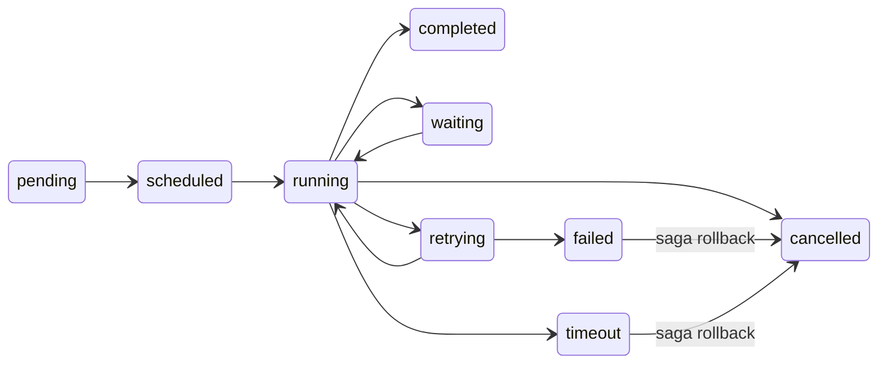

The **WorkflowState** is the single source of truth for a running workflow. Every node reads from it, writes to it, and the engine persists it after each step for crash recovery.

```typescript
import { createWorkflowState } from '@cycgraph/orchestrator';

const state = createWorkflowState({
  workflowId: graph.id,
  goal: 'Research and summarize quantum computing',
  constraints: ['Under 500 words'],
  maxExecutionTimeMs: 120_000,
});
```

## Schema reference

`WorkflowState` is a single flat object, grouped below by concern. The first six groups hold the run's own data: identity and input, control flow, retry and resilience, waiting state, cost, and memory. The last two hold engine-owned fields that the runner manages and agents never see. You set the run's data through [`createWorkflowState`](#createworkflowstate), and the runner populates and maintains everything else.

### Identity and input

Set when the run is created and fixed for its lifetime.

| Field | Type | Default | Description |
|-------|------|---------|-------------|
| `workflow_id` | `string` (UUID) | *required* | Graph definition this run belongs to. |
| `run_id` | `string` (UUID) | auto-generated | Unique identifier for this execution. |
| `goal` | `string` | *required* | High-level objective for the workflow. |
| `constraints` | `string[]` | `[]` | Rules the workflow must respect. |

### Control flow

Drive the run's lifecycle and which node executes next.

| Field | Type | Default | Description |
|-------|------|---------|-------------|
| `status` | `WorkflowStatus` | `'pending'` | Current lifecycle status. |
| `current_node` | `string` | — | Node currently being executed. |
| `iteration_count` | `number` | `0` | Total reducer dispatches so far (loop guard). |
| `max_iterations` | `number` | `50` | Hard cap: the run fails if exceeded. |
| `started_at` | `Date` | — | When `run()` was first invoked. |
| `max_execution_time_ms` | `number` | `3600000` (1h) | Wall-clock timeout for the entire run. |

### Retry and resilience

Track node-level retries and the compensating actions for saga rollback.

| Field | Type | Default | Description |
|-------|------|---------|-------------|
| `retry_count` | `number` | `0` | Retries on the current node so far. |
| `max_retries` | `number` | `3` | Maximum retries before the node fails permanently. |
| `last_error` | `string` | — | Error message from the most recent failure. |
| `compensation_stack` | `CompensationEntry[]` | `[]` | Stack of typed compensating actions for saga rollback. Each entry has `action_id` and `compensation_action: { type, payload }`. |

### Waiting (human-in-the-loop)

Populated while the run is paused in the `waiting` status.

| Field | Type | Default | Description |
|-------|------|---------|-------------|
| `waiting_for` | `WaitingReason` | — | Why the workflow is paused (e.g. `'human_approval'`). |
| `waiting_since` | `Date` | — | When the workflow entered the waiting state. |
| `waiting_timeout_at` | `Date` | — | Deadline after which the wait times out. |

### Cost and token tracking

Running totals, and the ceilings that fail the run when breached.

| Field | Type | Default | Description |
|-------|------|---------|-------------|
| `total_tokens_used` | `number` | `0` | Cumulative tokens consumed across all LLM calls. |
| `max_token_budget` | `number` | — | If set, the run fails when token usage exceeds this. |
| `total_cost_usd` | `number` | `0` | Cumulative estimated cost in USD. |
| `budget_usd` | `number` | — | Per-run cost budget (run fails when exceeded). |

### Memory and tracking

The shared blackboard, plus the execution-history bookkeeping the engine keeps.

| Field | Type | Default | Description |
|-------|------|---------|-------------|
| `memory` | `Record<string, unknown>` | `{}` | Shared key-value store. See [Memory](#memory) below. |
| `visited_nodes` | `string[]` | `[]` | Node IDs visited in execution order. |
| `supervisor_history` | `object[]` | `[]` | Routing decisions made by supervisor nodes (for debugging). |
| `created_at` | `Date` | now | When this run was created. |
| `updated_at` | `Date` | now | Last state mutation timestamp. |

### Engine-owned registries

These fields hold data the engine trusts and agents never see. They live beside `memory` rather than inside it, so state slicing excludes them structurally: no node's state view ever contains them, and no memory write can touch them. Reducers keep the two registries **append-only**.

| Field | Type | Default | Description |
|-------|------|---------|-------------|
| `taint_registry` | `TaintRegistry` | `{}` | Provenance of untrusted external data, keyed by memory key. See [Taint Tracking](/docs/concepts/taint-tracking/). |
| `lesson_provenance` | `LessonProvenanceRegistry` | `{}` | Which retrieved facts entered which node's prompt (eval-gated learning evidence). Read with `getInjectedFactIds(finalState)`. |
| `pending_approval` | `unknown` | — | Review payload for the active human-in-the-loop pause. |
| `policy_approvals` | `Record<string, boolean>` | `{}` | Security-policy approvals granted by a human, keyed by node id. |
| `subgraph_checkpoints` | `Record<string, unknown>` | `{}` | Paused child-run checkpoints for subgraph nodes awaiting a nested approval. |
| `subgraph_stack` | `string[]` | `[]` | Ancestor graph ids in a child run (subgraph cycle/depth detection). |
| `swarm_handoff_count` | `number` | `0` | Swarm peer-handoff counter (bounds `maxHandoffs`). |

The `_`-prefixed key namespace remains the *wire format* inside action payloads: executors emit new taint or provenance entries under `_taint_registry` / `_lesson_provenance`, and reducers route them to these fields. Any unknown `_`-prefixed key in a memory update is dropped fail-closed and recorded in `memory_drops` with reason `reserved_key`.

### Persistence bookkeeping

| Field | Type | Default | Description |
|-------|------|---------|-------------|
| `state_schema_version` | `number` | `2` | Schema version of this state shape. Loaded snapshots pass through `hydrateWorkflowState()`, which migrates older versions forward (v1 snapshots have their `memory._*` system keys lifted into the fields above) and refuses snapshots from a newer engine. |
| `_last_event_sequence_id` | `number` | — | Event-log high-water mark at the moment the snapshot was persisted. Resume logic uses it to decide whether a logged action's effects are already inside the snapshot (crash-window idempotency). |

These fields are managed by the runner, so don't set them by hand. All temporal fields use coercing schemas (`z.coerce.date()`), so states loaded from JSON/jsonb storage hydrate back to real `Date` objects.

**Refs:**
- [`createWorkflowState`](#createworkflowstate): Build state from camelCase authoring input.
- [`hydrateWorkflowState`](#hydrateworkflowstate): Parse and migrate a persisted snapshot at a load boundary.
- [Lesson provenance readers](#lesson-provenance-readers): `getInjectedFactIds`, `getLessonProvenance`.
- [WorkflowState](#workflowstate): The full runtime state shape.

## Status lifecycle

The `status` field moves through a fixed set of transitions over a run's life. The terminal states (`completed`, `failed`, `cancelled`, `timeout`) are final: a transition guard **enforces** that a terminal run can never return to an active status, so a stray `set_status` (or a replayed `_init` on a recovered run) can't resurrect a dead run. The one terminal-to-terminal move allowed is saga rollback, which moves a `failed` or `timeout` run to `cancelled` after its compensations run.



The guard is exposed as `canTransitionStatus(from, to)`, `isTerminalStatus(status)`, and `TERMINAL_STATUSES` from `@cycgraph/orchestrator` if you need to check legality yourself.

**Refs:**
- [Status guards](#status-guards): `canTransitionStatus`, `isTerminalStatus`, `TERMINAL_STATUSES`.
- [WorkflowStatus](#workflowstatus) / [WaitingReason](#waitingreason): The status and waiting enums.

## Memory

The `memory` object is the primary data exchange between nodes. It's an arbitrary key-value store, so you define the keys based on your workflow's needs. Agents write to it via their text output, which the orchestrator automatically routes to the node's write key. For agents that need to write structured data to multiple keys, the `save_to_memory` tool can be declared explicitly. Agents read from memory via their filtered state view (controlled by `read_keys` on the node).

- **Use descriptive keys.** `research_notes` is better than `data` or `result`.
- **Reference, don't store.** Avoid large blobs in memory; store them externally and keep a reference.
- **Keep it flat.** Deeply nested objects are harder to debug.

### Memory layers

| Layer | Scope | Persistence | Purpose |
|-------|-------|-------------|---------|
| **Graph State** | Shared across all nodes | Persisted after every step | Source of truth: goal, results, artifacts |
| **Thread Context** | Local to a single agent | Ephemeral | Raw LLM conversation for the current agent |

**Graph State** is the `memory` object. It's persisted after every node execution, enabling crash recovery and time-travel debugging.

**Thread Context** is the raw LLM conversation history within a single agent execution. Each agent has its own thread, so agents don't see each other's raw messages. The orchestrator automatically captures the agent's text output and routes it to the appropriate write key, and the thread is discarded.

## Action types

Actions dispatched to the reducer use a discriminated union type `ActionTypeSchema`. Valid action types are:

| Action Type | Purpose |
|-------------|---------|
| `update_memory` | Write key-value pairs to the memory object |
| `set_status` | Transition the workflow status |
| `goto_node` | Override the next node in the graph |
| `handoff` | Transfer control to another agent/workflow |
| `request_human_input` | Pause for human-in-the-loop approval |
| `resume_from_human` | Inject human response and resume |
| `merge_parallel_results` | Combine results from parallel node execution |

Invalid action types are rejected at parse time via Zod validation. Internal engine actions (prefixed with `_`, such as `_fail`, `_init`, `_budget_exceeded`) bypass this validation and are reserved for the engine.

**Refs:**
- [Action](#action): The reducer action shape and its type union.

## Taint tracking

Data entering the system from external tools (web search, file reads) is flagged as **tainted**. Taint propagates automatically: if a node reads tainted data and writes to state, the output key inherits the taint flag. This lets downstream nodes make trust decisions about their inputs.

**Refs:**
- [TaintMetadata](#taintmetadata): Provenance of the untrusted data behind a memory key.

## API

### `createWorkflowState`

Build a valid `WorkflowState` from camelCase authoring input. Only `workflowId` and `goal` are required. Every runtime-managed field (`runId`, `createdAt`, `status`, `iterationCount`, and the rest) is filled from schema defaults. The returned object is the snake_case runtime [`WorkflowState`](#workflowstate).

```typescript
createWorkflowState(input: WorkflowStateConfig): WorkflowState
```

##### Options

The input is a [`WorkflowStateConfig`](#workflowstateconfig). The common fields:

| Parameter | Type | Default | Description |
|--------|------|---------|-------------|
| `workflowId` | `string` (UUID) | required | Graph definition this run belongs to. |
| `goal` | `string` | required | High-level objective for the run. |
| `constraints` | `string[]` | `[]` | Rules the run must respect. |
| `maxExecutionTimeMs` | `number` | `3600000` | Wall-clock timeout for the whole run. |
| `maxTokenBudget` | `number` | — | Token ceiling. The run fails when usage exceeds it. |
| `budgetUsd` | `number` | — | Cost ceiling in USD. |
| `memory` | `Record<string, unknown>` | `{}` | Seed values for the blackboard. |

Every [Schema reference](#schema-reference) field has a camelCase authoring counterpart here.

### `hydrateWorkflowState`

Parse a persisted state at a load boundary. Persisted snapshots round-trip through JSON/jsonb, which turns every `Date` into a string, so a comparison like `new Date() >= waiting_timeout_at` silently never fires. Every path that loads state from storage (checkpoints, snapshots, recovery) must pass it through this function. It runs any pending schema migrations, then parses with `WorkflowStateSchema`, coercing temporal fields back to `Date`.

```typescript
hydrateWorkflowState(raw: unknown): WorkflowState
```

It throws a `ZodError` when the state is invalid after migration, so a corrupt snapshot never silently enters the execution loop.

### Status guards

Check status-transition legality without running the reducer. `canTransitionStatus` returns `false` for any move out of a terminal status, with one exception: the saga-rollback move from `failed` or `timeout` to `cancelled`.

```typescript
canTransitionStatus(from: WorkflowStatus, to: WorkflowStatus): boolean
isTerminalStatus(status: WorkflowStatus): boolean
TERMINAL_STATUSES: ReadonlySet<WorkflowStatus>
```

### Lesson provenance readers

Read the append-only `lesson_provenance` registry after a run, for eval-gated learning.

```typescript
getInjectedFactIds(state: WorkflowState): string[]
getLessonProvenance(state: WorkflowState): LessonProvenanceEntry[]
```

`getInjectedFactIds` returns the deduplicated fact IDs injected into prompts during the run, in deterministic order. This is the value to pass as `fact_ids` when recording the run's outcome. `getLessonProvenance` returns the individual [`LessonProvenanceEntry`](#lessonprovenanceentry) records.

### `CURRENT_STATE_SCHEMA_VERSION`

The schema version this engine build writes, currently `2`. `hydrateWorkflowState` migrates older snapshots up to it and refuses snapshots from a newer engine.

```typescript
CURRENT_STATE_SCHEMA_VERSION: number
```

## Interfaces

### WorkflowState

The complete snake_case runtime state, persisted after every reducer dispatch. Each field is documented in the [Schema reference](#schema-reference) above. Build it with [`createWorkflowState`](#createworkflowstate) rather than by hand.

### WorkflowStateConfig

The camelCase authoring shape accepted by [`createWorkflowState`](#createworkflowstate). It is the `WorkflowState` field set with camelCase keys, with only `workflowId` and `goal` required. The constructor remaps it to the snake_case runtime shape.

### WorkflowStatus

The lifecycle status enum. See [Status lifecycle](#status-lifecycle) for the legal transitions.

| Group | Values |
|-------|--------|
| Initial | `'pending'`, `'scheduled'` |
| Active | `'running'`, `'waiting'`, `'retrying'` |
| Terminal | `'completed'`, `'failed'`, `'cancelled'`, `'timeout'` |

### WaitingReason

Why a workflow sits in the `waiting` status.

| Value | Meaning |
|-------|---------|
| `'human_approval'` | Human-in-the-loop review. |
| `'external_event'` | Waiting for a webhook or callback. |
| `'scheduled_time'` | Cron or scheduled execution. |
| `'rate_limit'` | API rate limiting. |
| `'resource_limit'` | System resource constraints. |

### Action

A reducer action: a discriminated payload keyed by [action type](#action-types), plus identity and observability metadata.

| Field | Type | Description |
|-------|------|-------------|
| `id` | `string` (UUID) | Unique action identifier. |
| `type` | [`ActionType`](#action-types) | Which action this is. |
| `payload` | type-specific | Validated against the schema for `type`. |
| `idempotency_key` | `string` | Deduplication key that prevents re-execution on retry or resume. |
| `compensation` | `{ type, payload }` | Optional compensating action for saga rollback. |
| `metadata` | `object` | Observability metadata: `node_id`, `timestamp`, `attempt`, and optional `duration_ms`, `model`, `token_usage`. |

`ActionType` is the string union of the seven public action types listed under [Action types](#action-types). Internal engine actions (prefixed `_`) form a separate `InternalActionType` union reserved for the engine.

### CompensationEntry

One frame of the `compensation_stack`, pushed by nodes with `requires_compensation` and drained LIFO on saga rollback.

| Field | Type | Description |
|-------|------|-------------|
| `action_id` | `string` | The forward action this compensates. |
| `compensation_action` | `{ type: string, payload: Record<string, unknown> }` | The compensating action to dispatch on rollback. |

### TaintMetadata

Provenance of the untrusted data behind one memory key. Keyed by memory key inside `TaintRegistry`. See [Taint Tracking](/docs/concepts/taint-tracking/) for the propagation model.

| Field | Type | Description |
|-------|------|-------------|
| `source` | `'mcp_tool'` \| `'tool_node'` \| `'agent_response'` \| `'derived'` \| `'retrieval'` | Origin of the data. |
| `tool_name` | `string?` | Tool that produced it, for tool sources. |
| `server_id` | `string?` | MCP server that provided the tool, for `'mcp_tool'`. |
| `agent_id` | `string?` | Agent that produced it, for `'agent_response'`. |
| `created_at` | `string` | ISO 8601 timestamp. |

`TaintRegistry` is `Record<string, TaintMetadata>`, keyed by memory key.

### LessonProvenanceEntry

One record of which retrieved facts entered a node's prompt. Accumulated append-only into `lesson_provenance` and read with [`getInjectedFactIds`](#lesson-provenance-readers).

| Field | Type | Description |
|-------|------|-------------|
| `node_id` | `string` | Node whose prompt received the facts. |
| `agent_id` | `string?` | Agent that ran the node. |
| `fact_ids` | `string[]` | Retrieved fact IDs injected into the prompt. |
| `retrieved_at` | `string` | ISO 8601 timestamp. |

`LessonProvenanceRegistry` is `Record<string, LessonProvenanceEntry>`, keyed by a per-entry UUID.

## Next steps

- [Agents](/docs/concepts/agents/): how agents read and write state
- [Nodes](/docs/concepts/nodes/): node types and configuration
