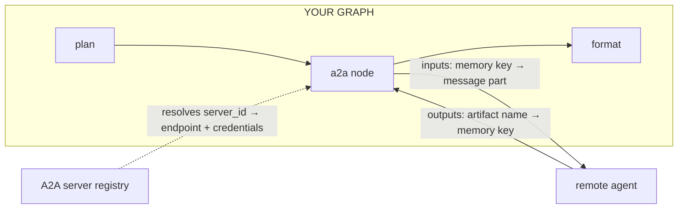

The **A2A** pattern delegates a step to an agent you do not run. An `a2a` node sends work to a remote agent over the [Agent2Agent protocol](https://a2a-protocol.org) and maps the result back into workflow memory, so a graph can reach a service another team owns, or one published by another company, as a single step.

It is the sibling of [Subgraph](/docs/patterns/subgraph/). Both delegate a unit of work to something opaque and map memory across a boundary with the same `inputs` and `outputs` convention. The difference is what the boundary can promise: a subgraph child runs on your engine, so it inherits your budget and capability ceiling. A remote agent runs on someone else's infrastructure, so it inherits neither. That is why they are separate node types rather than one with a flag.



## What the boundary guarantees

| | Guarantee |
|---|---|
| **Taint** | Everything the remote agent returns is recorded as external data. Downstream taint gates see it. |
| **Budget** | Not enforced. A remote agent reports no tokens or cost, so a per-node cap could never fire. `maxWaitMs` and the failure policy are the bounds that apply. |
| **Retries** | A task that ends `rejected` or `auth-required` is not retried. The agent decided, or the credential cannot change mid-run. |
| **Pauses** | A task that stops at `input-required` pauses the workflow through the same human-in-the-loop machinery an approval node uses, and the answer resumes the same remote task. |

Because budget stops at the network, treat an `a2a` node as an external call you are choosing to make, not as work the engine can meter for you.

## Registering a server

Endpoints live in a registry, never in the graph. A graph names a `server_id`; it cannot name a host. That is what keeps an LLM-authored graph from pointing the engine at an arbitrary URL.

```typescript
import { InMemoryA2AServerRegistry } from '@cycgraph/orchestrator';

const registry = new InMemoryA2AServerRegistry();

await registry.saveServer({
  id: 'research-service',
  name: 'Research Service',
  agentCardUrl: 'https://agents.example.com/.well-known/agent-card.json',
  auth: { type: 'bearer', tokenEnv: 'RESEARCH_SERVICE_TOKEN' },
});
```

Credentials are named environment variables, never literal values. A registry row holds no secret, so a database dump or a `listServers()` response cannot leak one. Agent Card URLs are SSRF-guarded: private, loopback, and metadata hosts are refused.

## Using it in a graph

`a2a()` takes the server id and the node's placement. The mappings read the same way they do on a subgraph.

```typescript
import { a2a, graph, run } from '@cycgraph/orchestrator';
import { createA2AClient } from '@cycgraph/a2a';

const briefing = graph({
  name: 'briefing',
  nodes: [
    a2a('research-service', {
      id: 'research',
      reads: ['topic'],
      inputs: { topic: 'query' },       // memory key → message part
      outputs: { report: 'findings' },  // artifact name → memory key
    }),
  ],
});

const { findings } = await run(briefing, {
  goal: 'Research the topic.',
  memory: { topic: 'solid-state batteries' },
}, {
  runner: { a2aRegistry: registry, a2aClient: createA2AClient() },
});
```

The `outputs` mapping is the write grant, exactly as it is on a subgraph node. A key it names needs no `writes` entry.

## The client is a separate package

The orchestrator defines the `A2AClient` port and carries no protocol dependency. [`@cycgraph/a2a`](https://www.npmjs.com/package/@cycgraph/a2a) implements that port on the official SDK:

```bash
npm install @cycgraph/a2a
```

Supplying your own implementation of the port is enough to swap transports or test without a network.

## Publishing your own graph

A graph's declared interface projects to an Agent Card, so others can discover it the same way:

```typescript
import { toAgentCard, agentCardFidelity } from '@cycgraph/orchestrator';

const card = toAgentCard(briefing, { endpoint: 'https://you.example.com/a2a' });
const fidelity = agentCardFidelity(briefing);
```

The projection is lossy in one direction. A card advertises MIME types, not per-key schemas, so it expresses less than a declared graph interface guarantees. `agentCardFidelity()` reports what could not be expressed, so you can decide whether that matters before publishing.

## When to use it

Reach for A2A when the work belongs to someone else: another team's service, a vendor's agent, or a capability you do not want to run. Reach for [Subgraph](/docs/patterns/subgraph/) when you own the child graph and want budget, capability ceilings, and taint to carry through unbroken.
