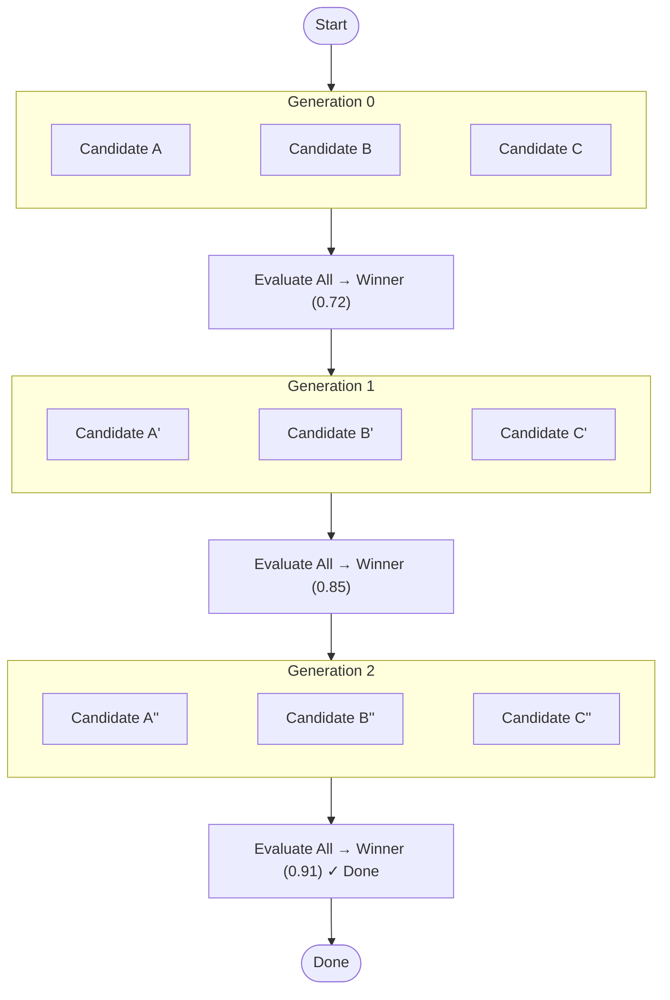

The **Evolution** pattern — inspired by Darwin Gödel Machines — runs multiple candidate solutions in parallel, scores each with a fitness evaluator, selects the best, and breeds the next generation using the winner's output as context.

The loop continues across multiple generations until a fitness threshold is met or a stagnation condition is reached. The LLM itself acts as the mutation operator: each candidate receives the winning parent in its prompt alongside a temperature that decreases generation by generation, producing controlled variation that converges over time.

## How it works



Each generation follows a strict loop:
1. N candidates run in parallel (fan-out).
2. Each candidate receives the previous generation's winner injected into its prompt.
3. A fitness evaluator agent scores each candidate on a 0–1 scale.
4. The highest-scoring candidate becomes the parent for the next generation.
5. Temperature decreases linearly (moving from broad exploration to focused exploitation).
6. Execution halts when the fitness threshold is met, stagnation is detected, or max generations are reached.

## When to use this pattern

- **Creative problem solving**: When there are many wildly different valid approaches and you want to explore the landscape simultaneously.
- **Prompt optimization**: Allowing an LLM to rewrite its own prompt instructions iteratively to find the highest-performing variant.
- **Out-of-the-box solutions**: Finding non-obvious solutions where a single, sequential self-annealing agent might get stuck in a local maximum.

*(Note: Evolution is resource intensive. If you only need to iteratively refine a single output until it hits a quality bar, use [Self-Annealing](/docs/patterns/self-annealing/) instead.)*

## Implementation example

The pattern requires you to pair a "candidate" generator agent with an "evaluator" agent within an `evolution` node.

### 1. The Agents

Register the candidate agent that will generate variations, and the evaluator agent that will score their fitness.

```typescript
import { InMemoryAgentRegistry } from '@cycgraph/orchestrator';

const registry = new InMemoryAgentRegistry();

const WRITER_ID = registry.register({
  name: 'Candidate Writer',
  model: 'claude-sonnet-4-6',
  provider: 'anthropic',
  systemPrompt: [
    'You are a creative writer.',
    'Write a poem based on the prompt.',
    'If `_evolution_parent` is provided, use it as a starting point. The parent scored `_evolution_parent_fitness`—aim to do better.',
    'Current generation: `_evolution_generation`.',
  ].join(' '),
  // Temperature is overridden by the evolution node dynamically
  temperature: 1.0, 
  tools: [],
  permissions: { readKeys: ['prompt'], writeKeys: ['poem'] },
});

const EVALUATOR_ID = registry.register({
  name: 'Fitness Evaluator',
  model: 'claude-sonnet-4-6',
  provider: 'anthropic',
  systemPrompt: [
    'Evaluate the poem strictly on its metrical structure and emotional impact.',
    'Return a single number between 0.0 and 1.0 representing the quality score.',
  ].join(' '),
  temperature: 0.1,
  tools: [],
  permissions: { readKeys: ['poem'], writeKeys: ['score'] },
});
```

### 2. The Evolution Node

The `evolution` node type requires an `evolutionConfig` block that dictates the population size, selection strategy, and stopping conditions.

```typescript
import { createGraph } from '@cycgraph/orchestrator';

const graph = createGraph({
  name: 'Poem Evolution',
  nodes: [
    {
      id: 'evolve-poem',
      type: 'evolution',
      readKeys: ['*'],
      writeKeys: ['*'],
      evolutionConfig: {
        candidateAgentId: WRITER_ID,
        evaluatorAgentId: EVALUATOR_ID,
        populationSize: 5,         // Parallel candidates per generation
        maxGenerations: 10,        // Hard limit
        fitnessThreshold: 0.9,     // Early exit score
        stagnationGenerations: 3,  // Exit if no improvement
        selectionStrategy: 'rank', // Always select the top scorer
        initialTemperature: 1.0,   // Exploration (Generation 0)
        finalTemperature: 0.3,     // Exploitation (Final Generation)
      },
    },
  ],
  edges: [],
  startNode: 'evolve-poem',
  endNodes: ['evolve-poem'],
});
```

## Core concepts

### Prompt context injection

Each candidate receives the previous generation's winner automatically in its state view. Your candidate agent's system prompt must explicitly address these variables to "mutate" successfully:

> "If `_evolution_parent` is provided, use it as a starting point. The parent scored `_evolution_parent_fitness`—aim to do better. Current generation: `_evolution_generation`."

The evaluator's critique of the parent is also injected as `_evolution_parent_reasoning` — feed it to your candidate prompt so each generation fixes the *specific* gaps the judge named, rather than mutating blindly.

### Elitism

`eliteCount` (default `1`) carries the top N candidates of each generation forward **unchanged** — not re-generated, not re-scored. This guarantees the best-so-far can never be lost to a noisy generation, so `${nodeId}_fitness_history` is monotonic (it climbs or holds, never dips), and it saves the LLM calls those slots would have cost (each generation after the first issues `populationSize - eliteCount` candidate calls). Set `eliteCount: 0` to breed every candidate fresh instead.

### Cost considerations

Evolution executes many LLM calls. With a population size of 5 and max generations of 10, you trigger up to 50 candidate executions plus 50 evaluations — easily 100x the cost of a single-shot generation.

Both candidate generation **and** evaluator scoring run in parallel, bounded by `maxConcurrency` — a generation takes roughly one evaluation's wall-clock rather than scoring candidates one at a time.

Two safeguards keep this manageable:

- Set `errorStrategy: 'best_effort'` so a single API failure within a generation doesn't kill the entire run.
- Set a conservative `fitnessThreshold` and `stagnationGenerations` so the loop exits as soon as quality plateaus.

### Outputs

The node writes `${nodeId}_winner` (the best candidate's full output), `${nodeId}_winner_fitness`, `${nodeId}_winner_reasoning`, `${nodeId}_fitness_history`, and `${nodeId}_population`. Note that `_population` holds per-candidate fitness **summaries** (`index`, `fitness`, `reasoning`, `tokens_used`) — not every candidate's full output — to keep state and checkpoints small. The winning output is available in full under `_winner`.
