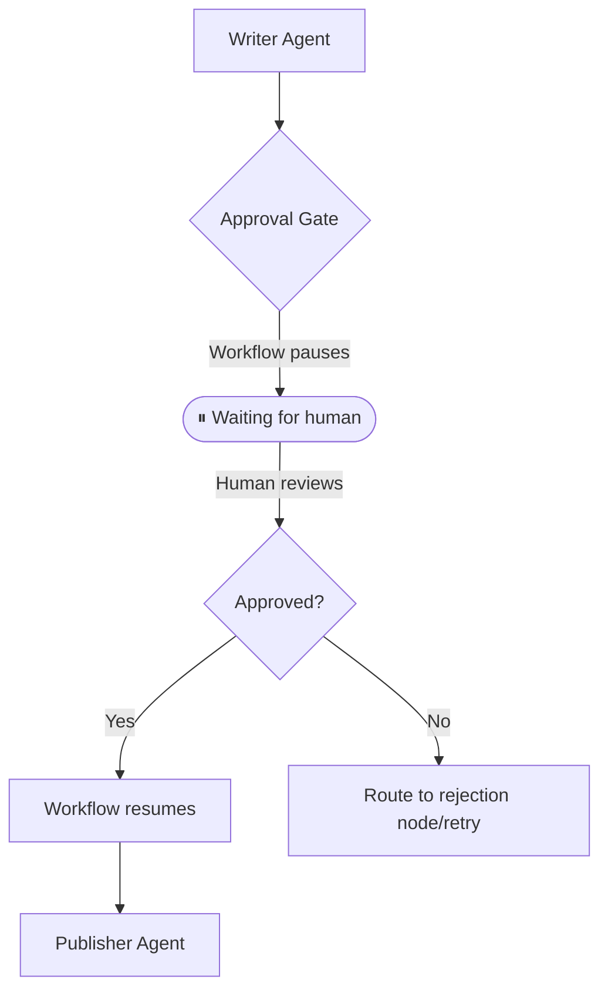

The **Human-in-the-Loop (HITL)** pattern allows workflows to pause mid-execution, wait for human input or approval, and resume exactly where they left off without losing state or context.

## How it works



1. **Execution**: A workflow proceeds normally until it hits a node of type `approval`.
2. **Pause**: The orchestrator completely halts execution, persists the current state to the database, and emits a `workflow:waiting` event.
3. **Review**: The system waits. Human operators can take seconds or days to review the data via a UI or ChatOps integration.
4. **Resume**: An API call is made back to the orchestrator supplying the human's decision (e.g., approved/rejected) and optional feedback.
5. **Continuation**: The workflow wakes up, injects the human's response into the state memory, and traverses the next edge.

## When to use this pattern

- **High-stakes actions**: an agent proposes a production deployment, financial transaction, or email blast, but a human must sign off before execution.
- **Content publication**: a writer agent produces a draft, and a human editor reviews and approves before publishing.
- **Compliance and auditing**: automated analysis that requires a mandatory human compliance review before proceeding.
- **Iterative feedback**: a human provides specific, nuanced feedback during the pause, which is fed back to the agent for revision (a HITL + [Self-Annealing](/docs/patterns/self-annealing/) hybrid).

## Implementation example

This example demonstrates a classic approval gate: A Writer agent drafts an article, execution pauses for a human to review the draft, and then upon approval, a Publisher agent finalizes it.

See the [full runnable code](https://github.com/wmcmahan/cycgraph/tree/main/packages/orchestrator/examples/human-in-the-loop/human-in-the-loop.ts).

### 1. The Approval Node

Instead of managing complex pausing logic in code, you simply declare an `approval` node in your graph.

```typescript
import { approval, graph, node } from '@cycgraph/orchestrator';

const write = node({ id: 'write', agent: writer, writes: 'draft' });

const review = approval({
  id: 'review',
  reads: [write.writes],
  prompt: 'Please review the draft before publication.',
  reviewKeys: [write.writes],
  timeoutMs: 300_000,
});

const publish = node({ id: 'publish', agent: publisher, reads: [write.writes] });

const workflow = graph({
  name: 'Human-in-the-Loop',
  nodes: [write, review, publish],
  edges: [
    { from: write, to: review },
    { from: review, to: publish },
  ],
});
```

### 2. The Initial Run

When you execute the workflow, it will automatically pause when it reaches the `review` node.

```typescript
const runner1 = new GraphRunner(graph, initialState, {
  persistState: async (s) => persistence.saveWorkflowSnapshot(s),
});

const pausedState = await runner1.run();

if (pausedState.status === 'waiting') {
  const pending = pausedState.pending_approval;
  console.log(pending.prompt_message);
  console.log(pending.review_data.draft);
}
```

### 3. Resuming the Workflow

Later, when your user clicks "Approve" or "Reject" in your UI, you instantiate a new `GraphRunner` with the persisted state, apply their response, and run it again.

```typescript
const stateFromDB = await persistence.loadLatestWorkflowState(runId);

const runner2 = new GraphRunner(graph, stateFromDB, {
  persistState: async (s) => persistence.saveWorkflowSnapshot(s),
});

runner2.applyHumanResponse({
  decision: 'approved',
  data: 'Looks great, but make the headline punchier.',
});
const finalState = await runner2.run();
```

When the workflow resumes:
- The human's `decision` string is saved to state memory under `human_decision`.
- The human's `data` string is saved to state memory under `human_response`.
- The downstream agents (like the Publisher) can read these fields to incorporate the feedback into their final output.

## Approval gate timeouts

When `timeoutMs` is set on an approval node, the engine sets `waiting_timeout_at` on the workflow state to the current time plus the timeout duration. This creates a hard deadline for human response.

If the workflow is resumed after the deadline has expired, the engine transitions the workflow to `timeout` status immediately with a `WorkflowTimeoutError`. The human's response is discarded and execution does not continue. This prevents workflows from waiting indefinitely for human approval that may never come.

```typescript
{
approval({
  id: 'review',
  prompt: 'Approve deployment to production?',
  reviewKeys: ['deployment_plan'],
  timeoutMs: 600_000,
})
```

If no human responds within 10 minutes and a resume is attempted after that window, the workflow fails with `WorkflowTimeoutError`. To handle timeouts gracefully, check `state.status === 'timeout'` in your application code and trigger appropriate fallback logic.

## Worker-based HITL

When using the [WorkflowWorker](/docs/concepts/distributed-execution/) for distributed execution, HITL is handled without blocking any worker:

1. The API enqueues a `{ type: 'start' }` job
2. A worker runs the workflow until it hits an approval node → returns `status: 'waiting'`
3. The worker calls `queue.release(jobId)`, which transitions the job to `paused` status and frees the slot immediately without blocking. The paused job is **not** re-claimable by `dequeue`, so the worker won't re-execute the approval gate.
4. Later, the API acks the original paused job (cleanup) and enqueues a `{ type: 'resume', human_response: { decision: 'approved' } }` job
5. A worker (same or different) picks up the resume job, recovers via event log, applies the response, and continues

```typescript
import { InMemoryWorkflowQueue } from '@cycgraph/orchestrator';

const queue = new InMemoryWorkflowQueue();

await queue.enqueue({
  type: 'start',
  run_id: runId,
  graph_id: graph.id,
  initial_state: { goal: 'Write an article' },
});

await queue.ack(startJobId);
await queue.enqueue({
  type: 'resume',
  run_id: runId,
  graph_id: graph.id,
  human_response: { decision: 'approved', data: 'Looks great!' },
});
```

The key distinction: `release` (not `nack`) transitions the job to `paused` status without counting it as a failure. Paused jobs are not re-claimable by `dequeue`, which prevents the worker from re-executing the approval gate in a loop while awaiting a human response. A separate `resume` job carries the human's response.
