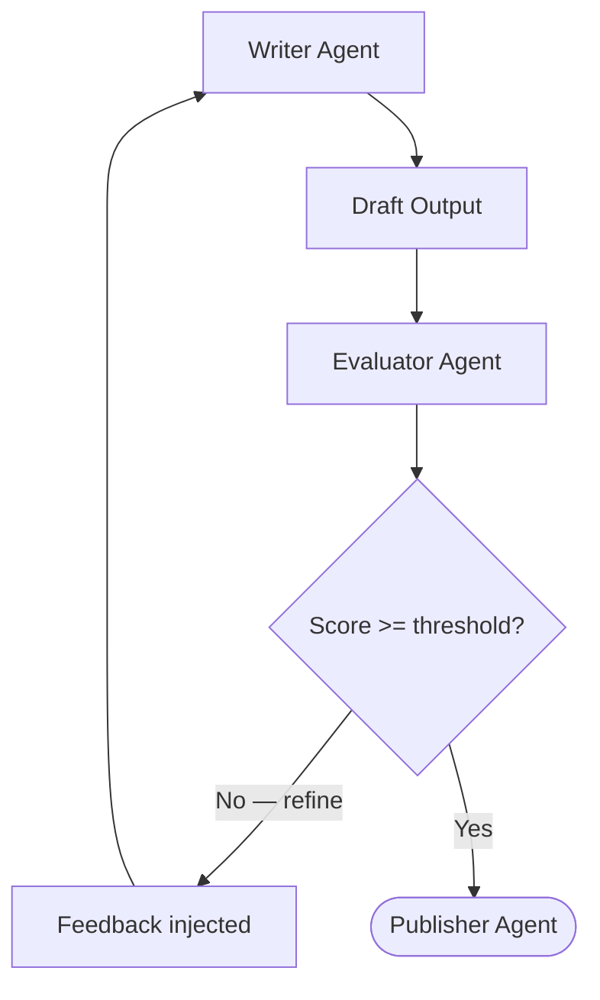

The **Self-Annealing (Evaluator-Optimizer)** pattern runs a single agent through a continuous loop of generation and evaluation until the output meets a strict quality threshold. 

Unlike [Evolution](/docs/patterns/evolution/), there is no "population" of candidates — just one piece of work that gets refined, iteration by iteration, steadily improving its score.

## How it works



1. A **Writer** agent produces an initial draft based on the goal.
2. An **Evaluator** agent (often using a smarter, stricter model or prompt) scores the draft against a rubric and generates actionable feedback and specific suggestions.
3. If the score is below the required threshold, the feedback is injected back into the Writer's state. The Writer revises its previous output.
4. This cycle repeats until the threshold is met or a safety limit (max iterations) is reached.
5. Once the threshold is met, control moves forward (e.g. to a Publisher node).

## When to use this pattern

- **Code generation & review**: An agent writes code, and an evaluator agent runs static analysis or reviews the logic. If bugs are found, the generator tries again.
- **Content refinement**: Writing, editing, and translation where the output must meet a strict brand voice or formatting standard.
- **Data extraction validation**: Extracting unstructured data into strict JSON, where an evaluator checks for missing fields or hallucinations and forces a retry.
- **Any task where one output must meet a rigid quality bar.** If you want to explore multiple distinct creative approaches simultaneously, use [Evolution](/docs/patterns/evolution/) instead.

## Built-in temperature annealing (`annealingConfig`)

For the common case — refining a **single agent's** output by dropping its temperature each pass — the engine ships a built-in primitive. Attach an `annealingConfig` block to an `agent` node and the runner runs the generate → score → refine loop internally, with no extra nodes or edges to wire.

```typescript
{
  id: 'refine',
  type: 'agent',
  agentId: WRITER_ID,
  readKeys: ['goal', 'constraints'],
  writeKeys: ['draft'],
  annealingConfig: {
    // Option A: an evaluator agent scores each pass's memory updates
    // against the workflow goal.
    evaluatorAgentId: EVALUATOR_ID,
    // Option B: omit the evaluator and let the agent score itself — a
    // `save_to_memory('score', …)` write lands at `updates.score`
    // (add 'score' to the node's writeKeys):
    // scorePath: '$.updates.score',
    threshold: 0.8,                 // stop once the best score reaches this
    maxIterations: 5,               // hard cap on passes
    initialTemperature: 1.0,        // first pass — broad exploration
    finalTemperature: 0.2,          // last pass — focused refinement
    diminishingReturnsDelta: 0.02,  // stop early if a pass improves < this
  },
}
```

Each iteration runs the agent at a temperature interpolated linearly from `initialTemperature` down to `finalTemperature`, scores the result, and keeps the best-scoring attempt. With `evaluatorAgentId` set, an evaluator agent scores the pass's memory updates against the workflow goal; without it, the `scorePath` JSONPath is evaluated against the pass's action payload — agent memory writes land under `updates`, so a self-scoring agent that calls `save_to_memory('score', …)` pairs with `scorePath: '$.updates.score'` (the schema default `'$.score'` reads the payload root, above where memory writes land, so set `scorePath` explicitly when self-scoring).

The loop stops as soon as any one of these is met: the best score reaches `threshold`, an improving pass raises the best score by less than `diminishingReturnsDelta`, `maxIterations` passes complete, or accumulated spend crosses a node/workflow budget cap between iterations. The node injects `_annealing_iteration` and `_annealing_temperature` into the agent's state view on every pass — and, from the second pass on, `_annealing_feedback` carrying the previous best score — so the prompt can react to where it sits in the schedule.

| Field | Default | Description |
|-------|---------|-------------|
| `evaluatorAgentId` | — | Agent that scores each pass's memory updates against the goal. If unset, the score is extracted via `scorePath`. |
| `scorePath` | `'$.score'` | JSONPath evaluated against the pass's action payload when no evaluator is set. Memory writes land under `updates` — use `'$.updates.score'` to read a `save_to_memory('score', …)` write. |
| `threshold` | `0.8` | Quality score (0–1) that ends the loop. |
| `maxIterations` | `5` | Hard cap on refinement passes. |
| `initialTemperature` | `1.0` | Temperature for the first pass. |
| `finalTemperature` | `0.2` | Temperature the schedule converges toward. |
| `diminishingReturnsDelta` | `0.02` | Stop early if a pass improves the best score by less than this. |

Reach for `annealingConfig` when a single agent should refine its own output on a dropping-temperature schedule. Use the **manual conditional-edge loop** below when you need distinct producer and evaluator nodes, custom routing (e.g. escalating to a stronger model after repeated failures), or a Publisher / handoff step after the quality gate.

## Manual alternative: conditional-edge loop

When you want separate producer and evaluator nodes — or a Publisher step after the gate — wire the loop yourself with `conditional` edges. Here a Writer drafts content, an Evaluator scores it, and the loop repeats until the score hits `0.8` or higher, before passing the approved draft to a Publisher.

Two runnable examples demonstrate this explicit-edge shape: [`eval-loop`](https://github.com/wmcmahan/cycgraph/tree/main/packages/orchestrator/examples/eval-loop/eval-loop.ts) — the minimal three-node conditional cycle shown below — and [`prompt-builder`](https://github.com/wmcmahan/cycgraph/tree/main/packages/orchestrator/examples/prompt-builder/prompt-builder.ts), a fuller self-annealing workflow that refines a vague goal into a structured prompt before handing off to a supervisor.

### 1. The Agents

The pattern relies on pairing two complementing agents: one instructed to listen to feedback, and the other instructed to provide ruthless, structured feedback.

```typescript
import { InMemoryAgentRegistry } from '@cycgraph/orchestrator';

const registry = new InMemoryAgentRegistry();

const WRITER_ID = registry.register({
  name: 'Writer Agent',
  model: 'claude-sonnet-4-6',
  provider: 'anthropic',
  systemPrompt: [
    'You are a skilled writer.',
    'Your task: write a concise, engaging explanation of the given topic for a general audience.',
    'If memory.feedback and memory.suggestions are present, you are revising a previous draft — use that feedback to improve.',
    'If no feedback exists, write from scratch.',
  ].join(' '),
  temperature: 0.7,
  tools: [],
  permissions: {
    readKeys: ['goal', 'constraints', 'feedback', 'suggestions', 'draft'],
    writeKeys: ['draft'],
  },
});

const EVALUATOR_ID = registry.register({
  name: 'Evaluator Agent',
  model: 'claude-sonnet-4-6',
  provider: 'anthropic',
  systemPrompt: [
    'You are a writing evaluator.',
    'Read the draft and score it on clarity, accuracy, engagement, and conciseness.',
    'You MUST call save_to_memory THREE times:',
    '1. key "score" — a single number between 0 and 1 (e.g. 0.72).',
    '2. key "feedback" — a brief paragraph explaining what works and what does not.',
    '3. key "suggestions" — a bullet list of specific improvements.',
    'A draft that meets all constraints should score 0.8 or above.',
  ].join(' '),
  // Keep temperature low for deterministic evaluating
  temperature: 0.3,
  tools: [],
  permissions: {
    readKeys: ['goal', 'constraints', 'draft'],
    writeKeys: ['score', 'feedback', 'suggestions'],
  },
});
```

### 2. The Routing Logic

The magic happens in the graph edges. By using `conditional` edges based on the `memory.score` value produced by the Evaluator, we can dynamically loop backward or break out of the cycle.

```typescript
import { createGraph } from '@cycgraph/orchestrator';

const graph = createGraph({
  name: 'Eval Loop',
  description: 'Cyclic write-evaluate-revise loop with conditional quality gate',
  nodes: [
    {
      id: 'writer',
      type: 'agent',
      agentId: WRITER_ID,
      readKeys: ['goal', 'constraints', 'feedback', 'suggestions', 'draft'],
      writeKeys: ['draft'],
    },
    {
      id: 'evaluator',
      type: 'agent',
      agentId: EVALUATOR_ID,
      readKeys: ['goal', 'constraints', 'draft'],
      writeKeys: ['score', 'feedback', 'suggestions'],
    },
    // ... define 'publisher' node ...
  ],
  edges: [
    // writer always goes to evaluator
    {
      id: 'writer-to-evaluator',
      source: 'writer',
      target: 'evaluator',
      condition: { type: 'always' },
    },
    // Loop back: evaluator → writer when score < 0.8
    {
      id: 'evaluator-to-writer',
      source: 'evaluator',
      target: 'writer',
      condition: { type: 'conditional', condition: 'number(memory.score) < 0.8' },
    },
    // Quality gate: evaluator → publisher when score >= 0.8
    {
      id: 'evaluator-to-publisher',
      source: 'evaluator',
      target: 'publisher',
      condition: { type: 'conditional', condition: 'number(memory.score) >= 0.8' },
    },
  ],
  startNode: 'writer',
  endNodes: ['publisher'],
});
```

## Core concepts

### Breaking infinite loops

Because LLMs can get stuck failing to fix a problem, the Self-Annealing loop needs a safety valve. 

Pass a `maxIterations` limit when creating the initial `WorkflowState` object (e.g. `maxIterations: 20`). The state automatically tracks the `iteration_count` across the entire workflow. If execution exceeds this limit, the orchestrator halts the run and transitions the workflow to `failed` to prevent runaway API costs.
