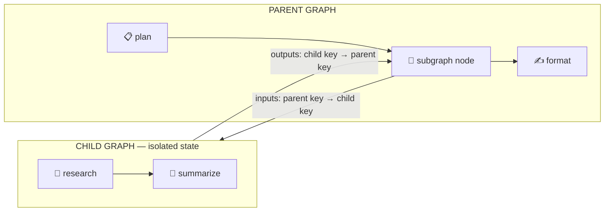

The **Subgraph** pattern is how graphs compose. A `subgraph` node embeds an entire child graph in a parent topology and runs it as a single step. The child is a reusable block: build a research pipeline once, then snap it into any workflow that needs research. The same mechanism is how you extend a graph you did not write, because you wrap it rather than reach into it, and it is how you install a graph someone else published as a bundle.

The child runs in a fresh, isolated `WorkflowState`. Memory crosses the boundary only through two explicit mappings, so the parent and child never share a blackboard. That isolation is not a limitation. It is what makes a graph a dependable building block: the child's internal node ids, memory keys, and topology are its own business, and the parent depends only on the mapped inputs and outputs.

## How it works



1. The parent reaches the subgraph node. The runner resolves the child graph by id through `loadGraph`.
2. A fresh child state is created. Only keys named in the input mapping are copied in, under the child's key names.
3. The child runs to completion on its own `GraphRunner`, with its own iteration cap and the parent's remaining budget.
4. Keys named in the output mapping are copied back to the parent. Everything else in the child's memory stays behind.

Taint metadata travels with mapped values in both directions, so untrusted data stays flagged across the boundary. Budgets are shared: the child spends from the parent's remaining token and cost budget, and its usage rolls back up. A child that pauses at a human approval gate pauses the parent, and resumes from the same checkpoint.

### Grants on a subgraph node

The two mappings are not symmetric in what they authorize.

`outputs` **is** the write grant. Its parent-side keys are written by the subgraph executor copying child memory out, and the mapping that names them is the declaration, exactly as a verifier's `result_key` is. A subgraph node needs no `writes` entry for a key its `outputs` already names. Declaring one anyway is harmless.

`reads` is still required, and deliberately so. It controls what the node can SEE of parent memory, which is the confidentiality boundary rather than a destination the author already chose. An input mapping that names a parent key the node cannot read simply seeds nothing, and the child then fails its own required-input check at the boundary if that key was declared required.

## Composing with the facade

`subgraph()` is the connect primitive. Pass a `graph()` value and its placement, and `run()` wires everything: the child resolves automatically, and its agents and inline tools register into the run scope, grandchildren included.

```typescript
import { agent, node, subgraph, graph, run } from '@cycgraph/orchestrator';

const summarize = node({
  id: 'summarize',
  agent: agent({ model: 'claude-sonnet-4-6', instructions: 'Summarize the findings.' }),
  reads: ['goal_in'],
  writes: 'summary',
});

const research = graph({ name: 'research-block', nodes: [summarize], edges: [] });

const pipeline = graph({
  name: 'briefing',
  nodes: [
    subgraph(research, {
      id: 'research',
      reads: ['topic'],
      inputs:  { topic: 'goal_in' },     // parent key → child key
      outputs: { summary: 'findings' },  // child key → parent key
    }),
    node({
      id: 'format',
      agent: agent({ model: 'claude-sonnet-4-6', instructions: 'Turn findings into a brief.' }),
      reads: ['findings'],
      writes: 'brief',
    }),
  ],
  edges: [{ from: 'research', to: 'format' }],
});

const { brief } = await run(pipeline, { goal: 'brief me', memory: { topic: 'solid-state batteries' } });
```

One child graph reused at several subgraph nodes registers once. Two distinct children sharing an id fail at compile time.

## Declaring an interface

A graph can declare its public signature: the memory keys it expects seeded and the keys it produces, each with a schema. This turns the subgraph boundary into a typed call. You author the schemas as Zod on the graph, and they serialize to JSON Schema on the wire.

```typescript
import { z } from 'zod';

const research = graph({
  name: 'research-block',
  nodes: [summarize],
  edges: [],
  inputs:  { goal_in: z.string() },
  outputs: { summary: z.string(), sources: z.array(z.string()) },
});
```

The interface is checked at two points:

- **At compile time**, `subgraph()` validates the mapping against the declared interface. Mapping into a key the graph does not declare, or leaving a required input unmapped, is a hard `GraphSpecError`. The manifest is the type signature; the mapping is the call, and a call against an undeclared key does not compile.
- **At runtime**, values crossing the boundary are validated against the schemas in both directions. A malformed value is caught at the seam with a `SubgraphInterfaceError`, not three nodes deep inside the child. This fires on every path, including a child resolved by id that never saw the compile-time check.

Declaring an interface is optional. A graph without one composes exactly as before, with no validation. Declare one when the graph is a contract other graphs depend on.

## Extending a graph you did not write

Wrap it. Call the graph as a subgraph and add your own nodes around it:

```typescript
const enriched = graph({
  name: 'research-plus-verify',
  nodes: [
    subgraph(thirdPartyResearch, {
      id: 'research',
      inputs: { topic: 'goal_in' },
      outputs: { report: 'raw_report' },
      writes: 'raw_report',
    }),
    node({ id: 'verify', agent: factChecker, reads: ['raw_report'], writes: 'verified_report' }),
  ],
  edges: [{ from: 'research', to: 'verify' }],
});
```

Wrapping composes around the child as a black box. You depend on its mapped inputs and outputs, never on its internal node ids, so the child can change its internals without breaking you. Do not try to patch another graph's nodes or edges. The mapping boundary is the contract.

## Referencing a graph by id

A string id stands in for a graph resolved elsewhere, such as one stored in Postgres:

```typescript
subgraph('acme/research', { id: 'research', inputs: { /* … */ }, outputs: { /* … */ } })
```

The caller supplies resolution through `loadGraph` on the runner options. Agent registration follows what you compose in scope, not what the loader returns: a child resolved by id must reference agents that already resolve in the run scope, through your registry or persistence. To ship a graph that carries its own agents, package it as a bundle instead.

```typescript
await run(pipeline, input, {
  runner: { loadGraph: (id) => graphStore.load(id) },
});
```

## Packaging a graph as a bundle

A serialized graph is not self-contained. It references agents, tools, MCP servers, and models by id or name, and those definitions do not travel with it. A **bundle** is the portable artifact that closes the gap. It carries everything that is data and can travel, and its manifest declares everything the host must supply.

```typescript
import { bundle } from '@cycgraph/orchestrator';

const artifact = bundle(research, {
  version: '1.0.0',
  source: 'npm:@acme/research-graph',
});

// JSON.stringify(artifact) is the complete distribution artifact.
```

`bundle()` assembles a `GraphBundle`:

| Field | Contents |
|-------|----------|
| `manifest` | Identity, the declared interface, provenance `source`, and the `requires` contract |
| `graph` | The entry graph, pure JSON |
| `agents` | Agent definitions the composition references, in wire form |
| `graphs` | The transitive child-graph closure |

The dividing line is deliberate. The bundle carries data. The manifest's `requires` block declares what the host must provide but the bundle must not carry:

| Travels in the bundle | Declared in `requires`, supplied by the host |
|-----------------------|----------------------------------------------|
| Agent definitions (model, prompt, structured tool references) | Custom tool implementations, because they are code |
| The child-graph closure | MCP servers, because they carry credentials |
| The declared interface | Provider API keys, derived from the declared models |

Implementations never travel. A published graph declares that it needs a tool named `web_search` with a given argument schema, and the consumer supplies a `web_search` implementation they trust. A third-party graph never ships executable tool code that runs against your data.

## Installing a bundle

Validate a bundle arriving from an untrusted source with `parseBundle`, then drop it into a composition exactly like any child graph. `subgraph()` accepts a bundle directly.

```typescript
import { parseBundle, subgraph, graph, run } from '@cycgraph/orchestrator';
import researchBundle from '@acme/research-graph'; // default-exports a GraphBundle

const research = parseBundle(researchBundle);

const pipeline = graph({
  name: 'briefing',
  nodes: [
    subgraph(research, {
      id: 'research',
      inputs:  { topic: 'goal_in' },
      outputs: { summary: 'findings' },
    }),
  ],
});

await run(pipeline, { goal: 'brief me', memory: { topic: 'solid-state batteries' } });
```

Mappings validate against the bundle's declared interface at compile time, values are schema-checked at the boundary at runtime, and `run()` registers the bundle's agents and resolves its child graphs automatically. There is no separate wiring step.

### Preflight the requirements

Before running, check what a bundle needs against what you can provide. `checkRequirements` reports exactly what is missing, so a graph that cannot run fails at install time with a clear list rather than deep in execution.

```typescript
import { checkRequirements } from '@cycgraph/orchestrator';

const { ok, missingTools, missingMcpServers, unknownModels } =
  await checkRequirements(research, {
    tools: [webSearch],
    mcpServers: serverRegistry,
    providers: createProviderRegistry(),
  });
```

`ok` reflects the hard requirements, missing tools and MCP servers. `unknownModels` is advisory, because the engine treats model lists as advisory rather than an allowlist. Pass a `GraphBundle` to check its manifest, or a plain `Graph` to compute the requirements from the composition closure.

## Trust: the capability ceiling

The manifest's `requires` is not documentation. When you embed a bundle, it becomes an enforced ceiling: **a graph cannot use more than it declared.** The child runs against exactly the tools and MCP servers its manifest listed, not the parent's full surface. Enforcement is fail-closed at three layers:

- **At load**, `parseBundle` rejects a bundle whose visible usage exceeds its manifest with a `BundleIntegrityError`. A node source or bundled agent that reaches for an undeclared tool, server, or model fails before anything runs.
- **At startup**, the runner's wiring check rejects a child graph whose nodes reference beyond the ceiling.
- **At resolution**, the tool-resolution choke point throws a `CapabilityViolationError` for an out-of-ceiling source arriving any other way, including a tool on an agent config resolved from the registry at runtime. An invoked parent agent gains nothing, because its tools still resolve under the child's ceiling.

Nesting can never escape a cap. A child with no declared ceiling inherits its parent's, and a bundle nested inside a bundle is capped by the intersection of both manifests. Combined with the preflight, this completes an app-permissions model: `checkRequirements` shows a human exactly what a bundle asks for, and enforcement guarantees the runtime surface matches the reviewed declaration.

Provenance rides the manifest. `source` records where a bundle is distributed from, such as an npm package name. For npm distribution, integrity already rides the consumer's lockfile, so `source` records that linkage in the artifact. Cryptographic signatures are deferred until a distribution path emerges that does not inherit npm's guarantees.

## Guarantees and limits

| Concern | Behavior |
|---------|----------|
| State | Child gets a fresh `WorkflowState`; only mapped keys cross |
| Interface | Mappings validated at compile time; boundary values validated at runtime when a schema is declared |
| Taint | Carried across the boundary in both directions |
| Budget | Child inherits the parent's remaining tokens and cost; usage rolls up |
| Capability | A bundle child runs under its manifest's `requires` as an enforced ceiling; nesting caps by intersection |
| Human-in-the-loop | Child pause propagates to the parent; resume restores the child checkpoint |
| Cycles | `A → B → A` nesting throws immediately via the subgraph stack |
| Depth | Nesting is capped at 32 levels |
| Iterations | Per-child cap, `maxIterations`, default 50 |

## When to use this pattern

- **Reusable building blocks.** A pipeline several workflows need, built once and embedded everywhere.
- **Extending a graph you did not write.** Wrap it and add nodes around the boundary.
- **Distributing a graph.** Package it as a bundle so it carries its agents and declares its needs, and consumers install it with an enforced capability ceiling.
- **Team boundaries.** One team owns the child graph and its contract; consumers depend only on the mappings.
- **Keeping big workflows legible.** A 40-node workflow reads better as four blocks of ten.

## Related

- [Nodes reference](/docs/concepts/nodes/#subgraphconfig) for the full `SubgraphConfig` field table
- [Graphs](/docs/concepts/graphs/) for topology and authoring
- [Taint Tracking](/docs/concepts/taint-tracking/) for how untrusted data stays flagged across boundaries
