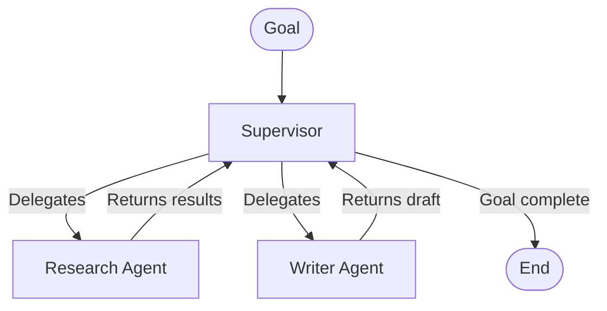

The **Supervisor** pattern introduces an LLM as the "brain" of your workflow, capable of making dynamic routing decisions on the fly. 

Unlike traditional static workflows where every step is hardcoded, the Supervisor pattern lets the orchestrator act iteratively. It delegates subtasks, reviews the results, and decides what needs to happen next until the overarching goal is fully achieved.

## How it works



1. **Initial Goal**: The workflow receives an open-ended goal (e.g., "Write a comprehensive report").
2. **First Routing Decision**: The Supervisor assigns the first step to the most appropriate specialist node in its `managedNodes` list (e.g., `research`).
3. **Execution & Return**: The `research` node executes, and control returns directly to the Supervisor via a cyclic return edge.
4. **Subsequent Routing**: The Supervisor reviews the new state of the memory, decides what is missing, and delegates again (e.g., to `write`).
5. **Completion**: Once the goal is met, the Supervisor routes the final execution, terminating the graph.

## Implementation example

This example demonstrates a supervisor routing between three specialists: a researcher, a writer, and an editor. See the [full runnable code](https://github.com/wmcmahan/cycgraph/tree/main/packages/orchestrator/examples/supervisor-routing/supervisor-routing.ts).

### 1. The Supervisor brain

The agent powering the supervisor should be instructed to act as a manager. It evaluates the current state and identifies the single best next worker to delegate to.

```typescript
import { agent, supervisor } from '@cycgraph/orchestrator';

const brain = agent({
  model: 'claude-sonnet-4-6',
  instructions: [
    `You are a project supervisor coordinating a team of specialists to produce a high-quality article.
    You have three team members: "research" (gathers facts), "write" (produces drafts), and "edit" (polishes prose).
    Review the current state and decide which specialist should work next.
    Typical flow: research → write → edit, but you may loop back if quality is insufficient.
    When the final_draft is polished and ready, route to "__done__" to complete the workflow.`,
  ],
  temperature: 0.3,
});
```

### 2. The Supervisor node

Each specialist is an `agent()` capability placed at a `node()`. The `supervisor` node type requires a `supervisorConfig` block listing which nodes it is permitted to route work to. Pass the node values themselves in `managedNodes`.

```typescript
import { agent, node } from '@cycgraph/orchestrator';

const researcher = agent({
  model: 'claude-sonnet-4-6', 
  instructions: 'Gather facts on the topic and save concise research notes.' 
});

const writer = agent({
  model: 'claude-sonnet-4-6', 
  instructions: 'Turn the research notes into a full draft.' 
});

const editor = agent({
  model: 'claude-sonnet-4-6', 
  instructions: 'Polish the draft into a publishable final_draft.' 
});

const research = node({
  id: 'research',
  agent: researcher,
  writes: 'research_notes'
});

const write = node({
  id: 'write',
  agent: writer,
  reads: [research.writes],
  writes: 'draft'
});

const edit = node({
  id: 'edit',
  agent: editor,
  reads: [write.writes],
  writes: 'final_draft'
});

const lead = supervisor(brain, {
  id: 'supervisor',
  manages: [research, write, edit],
  maxIterations: 10,
});
```

The supervisor declares no grants at all. They derive from its role. Its routing (`handoff`) and completion (`set_status`) permissions are implied by the `supervisor` node type, and its reads derive from its team: with no declared `reads`, it sees `goal`, `constraints`, and everything its `manages` set writes (here `research_notes`, `draft`, and `final_draft`), nothing else. That keeps routing informed while staying least-privilege, tainted memory outside the team's outputs never reaches the routing prompt. Declare `reads` explicitly only when the supervisor needs more or less than its team's work.

### 3. The Cyclic edges

Supervisors require a **hub-and-spoke topology**. You must define unconditional edges from the supervisor to every managed node, and from every managed node securely back to the supervisor.

```typescript
import { graph } from '@cycgraph/orchestrator';

const workflow = graph({
  name: 'Supervisor Routing',
  nodes: [supervisor, research, write, edit],
  edges: [
    // Supervisor → specialists (outbound)
    { from: supervisor, to: research },
    { from: supervisor, to: write },
    { from: supervisor, to: edit },

    // Specialists → supervisor (cyclic return)
    { from: research, to: supervisor },
    { from: write, to: supervisor },
    { from: edit, to: supervisor },
  ],
  startNode: supervisor,
  endNodes: [],
});
```

## Nested delegation

Because Supervisors are just nodes in a graph, they can be configured to manage *other* Supervisors. This allows for hierarchical delegation. A "Product Director" supervisor, for instance, delegates high-level milestones to "Engineering Manager" and "Marketing Manager" supervisors, who each manage their own team of specialist worker agents.
