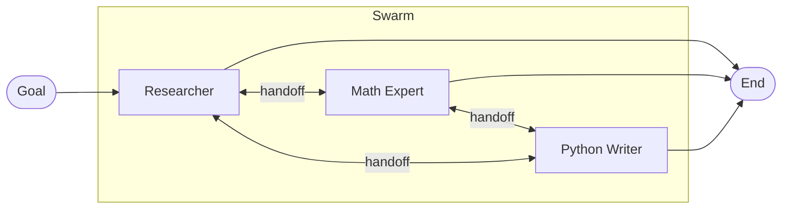

The **Swarm** pattern lets a network of specialized agents collaborate by handing control off to one another based on which peer is best suited for the next step.

Unlike the [Supervisor](/docs/patterns/supervisor/) pattern, where a central manager dictates routing, Swarm operates horizontally. Each agent decides whether to continue working or hand off to a peer. The orchestrator validates handoffs against the agent's declared `peerNodes` and enforces a `maxHandoffs` circuit breaker to prevent infinite delegation loops.

## How it works



1. **Entry.** The workflow enters at one peer, whichever node is the graph's `start_node`.
2. **Peer evaluation.** The active agent reads its goal alongside a `swarm` object (peer nodes, handoff budget) that the orchestrator injects into the `## Task Context` section of its prompt, so it knows who else is available.
3. **Handoff.** When the agent decides another peer is better suited, it writes `peer_delegation: { peer_node_id, reason }` to memory via `save_to_memory` (so `peer_delegation` must be in its write keys). The orchestrator validates the target is in `peerNodes`, then dispatches a `handoff` action that routes execution to that peer. The agent's other memory updates are preserved across the handoff.
4. **Continuation or completion.** If the agent does not delegate, normal graph edges run. The workflow ends when execution reaches an `end_node` without a pending handoff.

## When to use this pattern

- **Highly diverse toolsets.** Many specialized tools such as UI interactions, database queries, and code execution would overwhelm a single LLM's context. Split them across specialists, one per domain.
- **Unpredictable execution order.** Problems where the next best step depends on prior results, not a fixed pipeline.
- **Autonomous troubleshooting.** A "Triage" agent hands off to "Database Config", which realizes it's actually an infrastructure issue and hands off to "DevOps".

## Implementation example

A swarm node is just an `agent` node with `swarmConfig` attached. There is no separate `swarm` node type. Each peer is its own `agent` node, and each declares its own `swarmConfig` listing the *other* peers it can delegate to.

### 1. The specialist agents

```typescript
import { agent } from '@cycgraph/orchestrator';

const researchExpert = agent({
  model: 'claude-sonnet-4-6',
  instructions: [
    'You specialize in fetching information and summarizing facts.',
    'When the goal requires calculation, hand off to the Math Expert by saving',
    '`peer_delegation: { peer_node_id: "math_wiz", reason: "..." }` to memory.',
    'When code execution is needed, hand off to the Python Writer.',
  ].join(' '),
  temperature: 0.3,
  tools: [{ mcp: 'web-search' }],
});

const mathExpert = agent({
  model: 'claude-sonnet-4-6',
  instructions:
    'You specialize in arithmetic and logic. Receive data, calculate the result, and hand off to the Python Writer if scripting is needed.',
  temperature: 0.0,
  tools: [{ mcp: 'calculator' }],
});

const pythonWriter = agent({
  model: 'claude-sonnet-4-6',
  instructions:
    'You write and execute Python scripts to process data. You do not search the web.',
  temperature: 0.1,
  tools: [{ mcp: 'code-sandbox' }],
});
```

### 2. The swarm graph

Each peer is a standard `agent` node with `swarmConfig` listing the other peers it can hand off to. Edges define what happens when no handoff is requested, typically a default forward path or a route to a terminal node.

```typescript
import { node, graph } from '@cycgraph/orchestrator';

const researcher = node({
  id: 'researcher',
  agent: researchExpert,
  swarmConfig: {
    peerNodes: ['math_wiz', 'python_dev'],
    maxHandoffs: 10,
    handoffMode: 'agent_choice',
  },
  reads: ['*'],
  writes: ['*'],
});

const mathWiz = node({
  id: 'math_wiz',
  agent: mathExpert,
  swarmConfig: {
    peerNodes: ['researcher', 'python_dev'],
    maxHandoffs: 10,
    handoffMode: 'agent_choice',
  },
  reads: ['*'],
  writes: ['*'],
});

const pythonDev = node({
  id: 'python_dev',
  agent: pythonWriter,
  swarmConfig: {
    peerNodes: ['researcher', 'math_wiz'],
    maxHandoffs: 10,
    handoffMode: 'agent_choice',
  },
  reads: ['*'],
  writes: ['*'],
});

const workflow = graph({
  name: 'Data Analysis Swarm',
  description: 'Peer-to-peer agents collaborating on data questions.',
  nodes: [researcher, mathWiz, pythonDev],
  edges: [
    { from: researcher, to: pythonDev },
    { from: mathWiz, to: pythonDev },
  ],
  startNode: researcher,
  endNodes: [pythonDev],
});
```

Every peer here declares `reads: ['*']` and `writes: ['*']`. A swarm is the one pattern where that is the honest grant: any peer may pick up the work at any point, so none of them has a fixed set of upstream keys to name. `validateGraph` still warns, because the wildcard defeats state slicing. Narrow it whenever the peers do have distinct working sets, and reach for a [Supervisor](/docs/patterns/supervisor/) instead if routing turns out to be centralized after all.

## Core concepts

### Handoff via `peer_delegation`

A swarm-mode agent hands off by writing a `peer_delegation` object to memory (via `save_to_memory`, so the key must be in its write keys):

```ts
{
  peer_node_id: 'math_wiz',     // must be in this node's swarmConfig.peerNodes
  reason: 'Numerical breakdown required',
  context?: unknown,             // optional — passed through to the peer
}
```

The orchestrator consumes this key, validates `peer_node_id`, and emits a `handoff` action that re-routes execution. The agent's other memory updates are preserved across the handoff.

If the agent attempts to hand off to a node not in `peerNodes`, the runner throws `NodeConfigError`. The permission to emit handoff actions is implied by the swarm config itself, so no `writes` entry is needed for it.

### Visibility into peers

Before each call, the orchestrator injects a `swarm` object into the `## Task Context` section of the agent's prompt so it can see who's available and how much budget is left:

```ts
{
  peer_nodes: ['math_wiz', 'python_dev'],
  max_handoffs: 10,
  handoff_count: 2,
}
```

Agents can reference this in their reasoning to decide whether further handoff is warranted.

### Max handoffs (circuit breaker)

Swarms can derail into infinite ping-pong if two agents keep handing the same problem back. `maxHandoffs` halts further delegation once the state's `swarm_handoff_count` reaches the limit. After that, any `peer_delegation` requests are silently dropped and the agent's other memory updates flow through normal graph edges.
