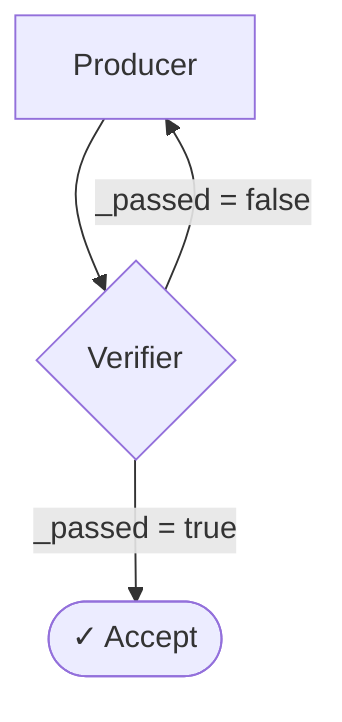

The **Verifier** pattern is the quality gate of a workflow. It inspects a value already in `WorkflowState.memory`, decides whether it `passed`, and lets downstream edges branch on the result — accept the work, loop back to redo it, or escalate.

It is the building block for self-correcting loops: pair a producer node with a verifier, route failures back to the producer, and the graph keeps refining until the check passes.

## How it works



1. A producer node writes a value to a memory key.
2. The `verifier` node evaluates that key against its configured check.
3. It writes a structured `VerificationResult` plus a flat `_passed` boolean to memory.
4. **By default the verifier always succeeds** — downstream edges route on the `_passed` key (explicit-edge routing). Set `throwOnFail: true` to instead throw on failure and trigger the node's `failurePolicy` retry.

### Variants

The `verifierConfig` is a discriminated union on `type`:

| Variant | Check | Cost |
|---------|-------|------|
| `llm_judge` | An evaluator agent scores `targetKey` (0–1); passes when the score ≥ `passThreshold`. | One LLM call |
| `expression` | A [filtrex](https://github.com/m93a/filtrex) expression over `{ memory, goal }`; passes when truthy. | Free, deterministic |
| `jsonpath` | Extracts a value via JSONPath, then applies a deterministic assertion (`gt`, `equals`, `matches`, `exists`, …). | Free, deterministic |

## Implementation example

**LLM-as-judge** — score a draft for quality and loop back if it falls short:

```typescript
{
  id: 'check_quality',
  type: 'verifier',
  readKeys: ['draft'],
  writeKeys: ['quality_verification', 'quality_verification_passed'],
  verifierConfig: {
    type: 'llm_judge',
    targetKey: 'draft',
    evaluatorAgentId: CRITIC_ID,
    passThreshold: 0.8,
    evaluationCriteria: 'Score for factual accuracy and clarity.',
    resultKey: 'quality_verification',
  },
}
```

Then route on the boolean the verifier writes:

```typescript
edges: [
  { from: 'check_quality', to: 'publish', when: 'quality_verification_passed' },
  { from: 'check_quality', to: 'draft' }, // otherwise, redo
]
```

**Deterministic checks** — no LLM call, free and instant:

```typescript
// Expression: the draft must be substantial
verifierConfig: {
  type: 'expression',
  expression: 'length(memory.draft) > 280',
}

// JSONPath assertion: every line item must be positive
verifierConfig: {
  type: 'jsonpath',
  targetKey: 'extracted_invoice',
  path: '$.line_items[*].amount',
  assertion: { op: 'gt', value: 0 },
}
```

## Outputs

The node writes two keys, both of which must appear in `writeKeys`:

- `{resultKey}` (defaults to `{nodeId}_verification`) — the structured `VerificationResult`: `{ type, passed, reasoning, score?, threshold?, extracted_value?, evaluated_at }`.
- `{resultKey}_passed` — a flat boolean, for ergonomic edge conditions.

## When to use it

- **Self-correcting loops** — gate a producer and route failures back for another pass.
- **Cheap pre-checks** before an expensive step — use a free `expression`/`jsonpath` verifier to fail fast.
- **Structured-output validation** — assert on extracted JSON with `jsonpath`.

The verifier *checks* a single value against a standard. To aggregate multiple independent answers instead, see [Voting / Consensus](/docs/patterns/voting/); to iteratively improve a value, see [Self-Annealing](/docs/patterns/self-annealing/) and [Evolution](/docs/patterns/evolution/).
