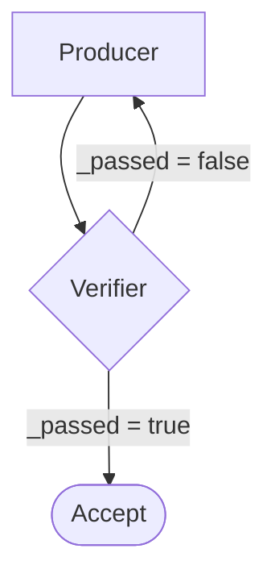

The **Verifier** pattern is the quality gate of a workflow. It inspects a value already in `WorkflowState.memory`, decides whether it `passed`, and lets downstream edges branch on the result: accept the work, loop back to redo it, or escalate.

It is the building block for self-correcting loops: pair a producer node with a verifier, route failures back to the producer, and the graph keeps refining until the check passes.

## How it works


```mermaid
flowchart TB
    Draft["Producer"] --> Verify{"Verifier"}
    Verify --> |"_passed = true"| Done(["Accept"])
    Verify --> |"_passed = false"| Draft
```

1. A producer node writes a value to a memory key.
2. The `verifier` node evaluates that key against its configured check.
3. It writes a structured `VerificationResult` plus a flat `_passed` boolean to memory.
4. **By default the verifier always succeeds**, so downstream edges route on the `_passed` key (explicit-edge routing). Set `throwOnFail: true` to instead throw on failure and trigger the node's `failurePolicy` retry.

### Variants

Three variants, one per function on the `verifier` namespace:

| Variant | Check | Cost |
|---------|-------|------|
| `verifier.llmJudge` | An evaluator agent scores `target` (0–1); passes when the score ≥ `threshold`. | One LLM call |
| `verifier.expression` | A [filtrex](https://github.com/m93a/filtrex) expression over `{ memory, goal }`; passes when truthy. | Free, deterministic |
| `verifier.jsonPath` | Extracts a value via JSONPath, then applies a deterministic assertion (`gt`, `equals`, `matches`, `exists`, …). | Free, deterministic |

## Implementation example

**LLM-as-judge.** Score a draft for quality and loop back if it falls short:

```typescript
const write = node({ id: 'draft', agent: writer, writes: 'draft' });

const check = verifier.llmJudge(critic, {
  id: 'check_quality',
  reads: [write.writes],
  target: write.writes,
  threshold: 0.8,
  criteria: 'Score for factual accuracy and clarity.',
  resultKey: 'quality_verification',
});
```

Then route on the boolean the verifier writes. `check.passed` is that key, so the
`when` expression cannot drift from the `resultKey` above:

```typescript
edges: [
  { from: check, to: publish, when: check.passed },
  { from: check, to: write },  // otherwise, redo
]
```

**Deterministic checks.** No LLM call, free and instant:

```typescript
verifier.expression('length(memory.draft) > 280', {
  id: 'check_length',
  reads: [write.writes],
})

verifier.jsonPath(extract.writes, {
  id: 'check_amounts',
  reads: [extract.writes],
  path: '$.line_items[*].amount',
  assertion: { op: 'gt', value: 0 },
})
```

## Outputs

The node writes two keys. Both are implied write grants, so neither needs to appear in `writes`:

- `{resultKey}` (defaults to `{nodeId}_verification`) is the structured `VerificationResult`: `{ type, passed, reasoning, score?, threshold?, extracted_value?, evaluated_at }`.
- `{resultKey}_passed` is a flat boolean, for ergonomic edge conditions.

The node value carries both key names, as `.verification` and `.passed`. Reach for those in downstream `reads` and `when` expressions rather than retyping the derived name.

## When to use it

- **Self-correcting loops**: gate a producer and route failures back for another pass.
- **Cheap pre-checks** before an expensive step: use a free `expression`/`jsonpath` verifier to fail fast.
- **Structured-output validation**: assert on extracted JSON with `jsonpath`.

The verifier *checks* a single value against a standard. To aggregate multiple independent answers instead, see [Voting / Consensus](/docs/patterns/voting/); to iteratively improve a value, see [Self-Annealing](/docs/patterns/self-annealing/) and [Evolution](/docs/patterns/evolution/).
