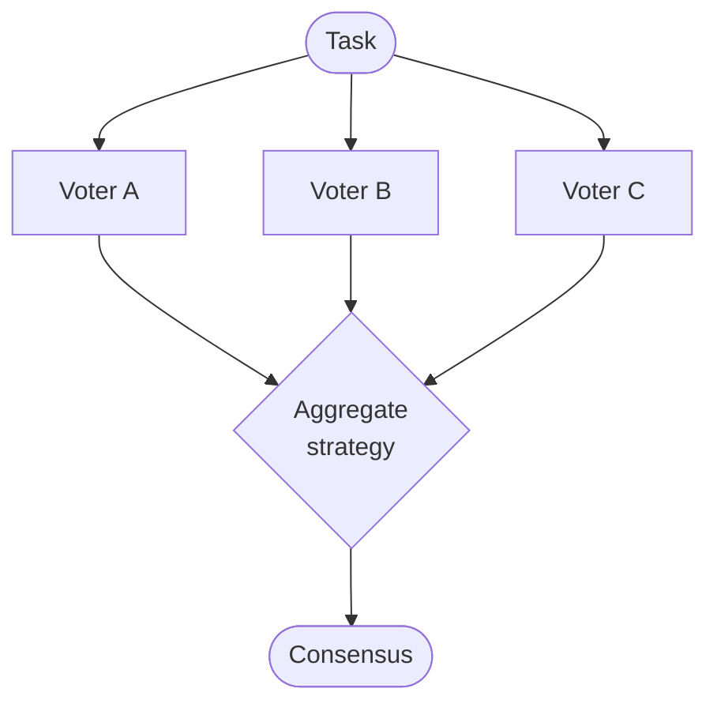

The **Voting / Consensus** pattern runs several agents on the *same* task in parallel, then aggregates their independent answers into one result. It trades extra inference cost for reliability: instead of trusting a single model call, you sample many and let a strategy decide the winner.

This is the classic remedy for high-variance tasks — classification, extraction, judgement calls — where any one sample might be wrong but the majority is usually right.

## How it works



1. **Fan out**: every agent in `voterAgentIds` runs the task in parallel, each writing its answer to `voteKey`.
2. **Collect**: the node gathers each voter's payload (votes are compared by a canonical, order-independent serialization, so structurally-equal answers count as equal).
3. **Aggregate**: the chosen `strategy` reduces the votes to a single consensus.
4. **Write**: the result is written back to memory for downstream nodes.

### Strategies

| Strategy | How the winner is chosen |
|----------|--------------------------|
| `majority_vote` (default) | The answer returned by the most voters wins. |
| `weighted_vote` | Votes are summed using per-agent `weights`; highest total wins. |
| `llm_judge` | A `judgeAgentId` reviews all votes and decides the consensus. |

## Implementation example

The `voting` node type requires a `votingConfig` block listing the voters and the aggregation strategy.

```typescript
{
  id: 'classify',
  type: 'voting',
  readKeys: ['ticket_text'],
  writeKeys: ['classify_consensus', 'classify_votes'],
  votingConfig: {
    voterAgentIds: [CLASSIFIER_A, CLASSIFIER_B, CLASSIFIER_C],
    strategy: 'majority_vote',
    voteKey: 'category',
    quorum: 2,
  },
}
```

For a `weighted_vote`, supply `weights` keyed by agent ID; for `llm_judge`, supply a `judgeAgentId`:

```typescript
votingConfig: {
  voterAgentIds: [JUNIOR, SENIOR, STAFF],
  strategy: 'weighted_vote',
  voteKey: 'verdict',
  weights: { [JUNIOR]: 1, [SENIOR]: 2, [STAFF]: 3 },
}
```

:::note
Each voter is an independent agent run. A `memoryQuery` declared on the voting node propagates to every voter, so they all see the same retrieved memory. Use `taskTimeoutMs` to guard against a single hung voter stalling the round.
:::

## Outputs

The node writes two keys into `WorkflowState.memory`:

- `{nodeId}_consensus` — the aggregated answer.
- `{nodeId}_votes` — the full array of individual votes (for auditing and traceability).

Both must be declared in the node's `writeKeys`.

## When to use it

- **High-stakes classification or extraction** where a single sample is too risky.
- **LLM-as-judge disagreements** — let several judges vote rather than trusting one.
- **Reducing variance** on tasks where the same prompt yields different answers across runs.

For *iteratively improving* a single answer rather than sampling many, reach for [Evolution](/docs/patterns/evolution/) or [Self-Annealing](/docs/patterns/self-annealing/) instead. To *check* an answer against a standard rather than vote on it, see [Verifier](/docs/patterns/verifier/).
