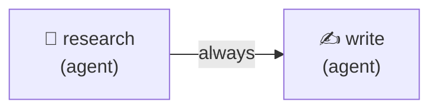

# Counterfactual Replay

Take a run that already happened, change one thing about it, and re-run only the part that the change could affect. Then say precisely what became different.

This example records a two-node run, forks it with a different writer prompt, and then sweeps three variants against the same recording.

## Why this is possible

The engine keeps a gap-validated event log of every state transition so a crashed run can be rebuilt by folding those events through the same reducers that produced them. Point that machinery at a question instead of at a crash and you get counterfactuals: replay the log up to a chosen node, change something, and let the rest run for real.

The consequence worth internalizing is that **the replayed part is free**. It makes no model calls, because the stored actions already carry what the agents said. In this example the research node never runs again, no matter how many times you fork.

## Graph



## What the example does

**1. Records a run.** `runRecorded()` rather than `run()`. The plain `run()` returns final memory and nothing else, and defaults to no event log, so a run made with it cannot be forked afterwards. `runRecorded()` wires a log, turns auto-compaction off so the whole log stays addressable, saves the graph so the run row resolves back to it, and hands you `{ runId, memory, state, eventLog, persistence }`.

**2. Forks it once.** `at: { beforeNode: 'write' }` replays everything up to the writer and then runs the writer live under a different system prompt. The research notes in the variant are byte-identical to the original, because that node was replayed rather than re-executed.

**3. Sweeps three variants.** `forkEach` runs one fork per named variant, all from the same run at the same point, so the only thing separating them is the change.

## Running it

```bash
# Against a local Ollama model — no API key, no cost
CYCGRAPH_MODEL=qwen2.5:7b npx tsx examples/counterfactual-replay/counterfactual-replay.ts

# Against a hosted model
ANTHROPIC_API_KEY=sk-ant-... npx tsx examples/counterfactual-replay/counterfactual-replay.ts
```

Four model calls total: two for the base run, one for the single fork, three for the sweep — minus the two the fork and sweep skip by replaying the research node. The research prompt is answered once and reused six times.

## Expected output

The original draft, the counterfactual draft, and a report of what changed:

```
fork 8f3a2c… of 41d0be… at seq 6 (before 'write' execution 1, iteration 1)
  change    prompt of 'write'
  status    completed
  path      research → write
  cost      $0.0021 incurred, +412 tokens
  memory    ~draft (+180B)
```

Then the sweep's ranking:

```
sweep of 41d0be… — 3 variant(s)
  terse  completed      $0.0018      research → write
  child  completed      $0.0024      research → write
  cold   completed      $0.0021      research → write
  total  $0.0063 incurred
```

`cost` is what the tail actually spent. The prefix's cost is inherited into the variant's totals for fidelity but excluded from `incurred`, because a fork that replays two nodes did not pay for them again. Against a local Ollama model every figure reads `$0.0000`, since local models carry no pricing — the token deltas are still real.

## Addressing a fork point

`{ beforeNode: 'write' }` is one of several forms. The rest:

| Form | Meaning |
| --- | --- |
| `'start'` | Re-run the whole graph under the change |
| `'failure'` | Before the node that failed. The default on a failed run |
| `{ beforeNode, occurrence }` | The node re-executes. `occurrence` matters in loops |
| `{ afterNode }` | The node's output is kept; only what follows changes |
| `{ beforeIteration }` | A loop boundary |
| `{ sequence }` | A raw event sequence |
| `{ beforeFirstWriteOf }` | Before the node that first wrote a memory key |
| `{ beforeFirstReadOf }` | Before the node whose retrieval injected a given fact |
| `{ version }` | A persisted state snapshot (`source: 'snapshot'`) |

`forkPoints(events)` lists what a particular run makes addressable. An unresolvable address reports the candidates rather than failing vaguely.

## Changes

`change.*` targets **node ids**, never agent ids — agent ids are auto-generated UUIDs nobody holds, while node ids are the names you wrote. For a node carrying several agents, add a dotted role: `change.model('review.judge', …)`, `change.model('vote.voters[2]', …)`.

An agent change is scoped to the node that names it. Overriding the writer's model here would leave any other node sharing that agent untouched.

| Call | Effect |
| --- | --- |
| `change.model(target, model)` | Swap the model |
| `change.prompt(target, text)` | Replace the system prompt |
| `change.temperature(target, t)` | Resample at a different temperature |
| `change.memory({ set, delete })` | Patch the forked state |
| `change.config(nodeId, patch)` | Patch node config |
| `change.route(from, to)` | Force a routing decision |
| `change.output(nodeId, memory)` | Substitute a node's output |
| `change.tool(nodeId, result)` | Substitute a tool result |
| `change.humanResponse(decision)` | Answer approval gates instead of pausing |

Pass one, or an array to combine them. A change can also be a function of the resolved fork point, which is how you avoid typing a node name you would have to look up:

```ts
await fork(base, {
  at: 'failure',
  change: (at) => change.model(at.node!, 'claude-opus-5'),
});
```

Passing the `runRecorded()` result rather than a run id is the short form: `fork` reads the run id, the event log, the persistence provider, and the run-scoped agent registry off it. That registry matters most — `graph()` builds it per run from inline `agent()` definitions, so it exists nowhere else, and a fork that cannot reach it fails to resolve the agents. A bare run id works too, with those handles passed explicitly.

Two changes that write the same thing are refused rather than silently resolved, because in a sweep matrix that is nearly always a copy-paste error.

## Combining versus isolating

`fork()` with several changes tells you whether the bundle works. `forkEach()` tells you which change mattered. They answer different questions, and only one of them is what you want at a time:

```ts
// One fork, three changes. "Did my fix work?"
await fork(runId, { change: [a, b, c], … });

// Four forks, isolated. "Which of these moved the needle?"
await forkEach(runId, { variants: { a, b, c, all: [a, b, c] }, … });
```

A combined fork's diff cannot attribute its delta among the changes, and it says so.

## Side effects

A forked tail re-runs real nodes. By default a `tool`, `a2a`, or `subgraph` node is served its recorded result when the base run executed it with the same inputs, and **blocked** otherwise — a counterfactual that re-sends an email is worse than one that stops. `policy.sideEffects` takes `'block'` to refuse outright, or `{ allow: ['nodeId'] }` to let a named node run for real.

Reflection nodes get their own treatment: the memory writer is wrapped so intended writes are captured and discarded. Without that, a fork measuring whether a lesson helped would write new lessons into the pool it is measuring.

## Caveats

**One sample is one draw.** A tail is not deterministic, so a single fork showing an improvement is an anecdote. `samples: n` runs the tail repeatedly and reports a distribution. A sweep ranked on single draws is ranking noise.

**Forkability has a boundary.** Auto-compaction deletes events behind the newest checkpoint at 1000 events by default, which puts early fork points out of reach on long runs. `runRecorded()` turns compaction off for exactly this reason. For a production run that was compacted, `source: 'snapshot'` forks from a persisted state snapshot instead, addressed by `{ version }`.

**Memoization is opt-in.** `policy: { memoize: true }` serves a tail node its recorded output when its inputs are unchanged, which on a wide graph skips the branches a change could not reach. It is off by default because "the tail runs live" is what a fork promises.
