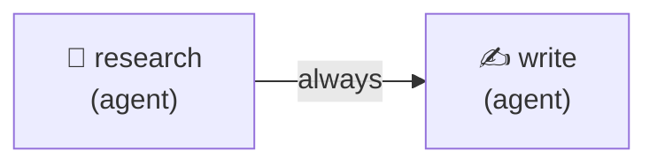
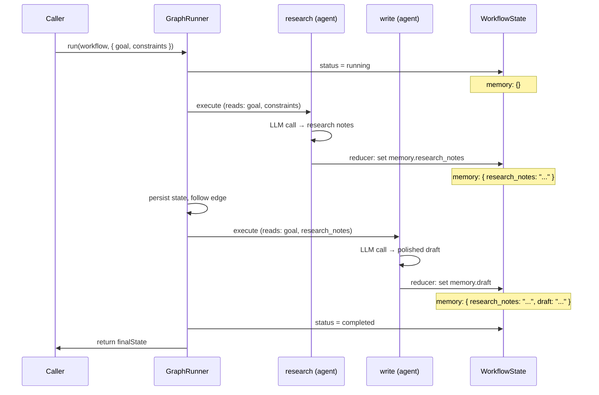
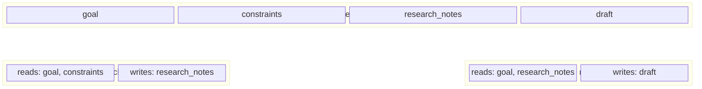

# Research & Write

A 2-node linear workflow where a Researcher agent gathers notes on a topic and a Writer agent produces a polished summary. The smallest useful graph, written entirely with the authoring facade: `agent()`, `node()`, `graph()`, and the one-call `run()`. Demonstrates agent-as-config, zero-trust state slicing, and symbolic key wiring (`reads: [research.writes]`).

## Graph



## Lifecycle & State



## State Slicing

Each node only sees the keys it declares — the engine enforces zero-trust boundaries:



## Run

```bash
cd packages/orchestrator
ANTHROPIC_API_KEY=sk-ant-... npx tsx examples/research-and-write/research-and-write.ts
```

Or locally against `ollama serve`, with no API key:

```bash
CYCGRAPH_MODEL=qwen2.5:7b npx tsx examples/research-and-write/research-and-write.ts
```

## Expected Output

```
═══ Research Notes ═══
• Transformers use self-attention to process sequences in parallel ...

═══ Final Draft ═══
Large language models are AI systems trained on vast amounts of text ...
```
