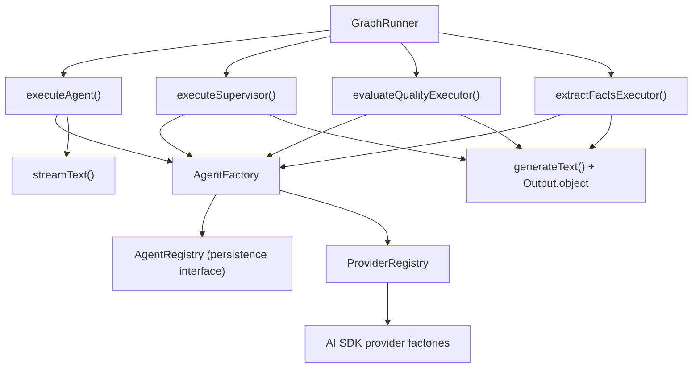
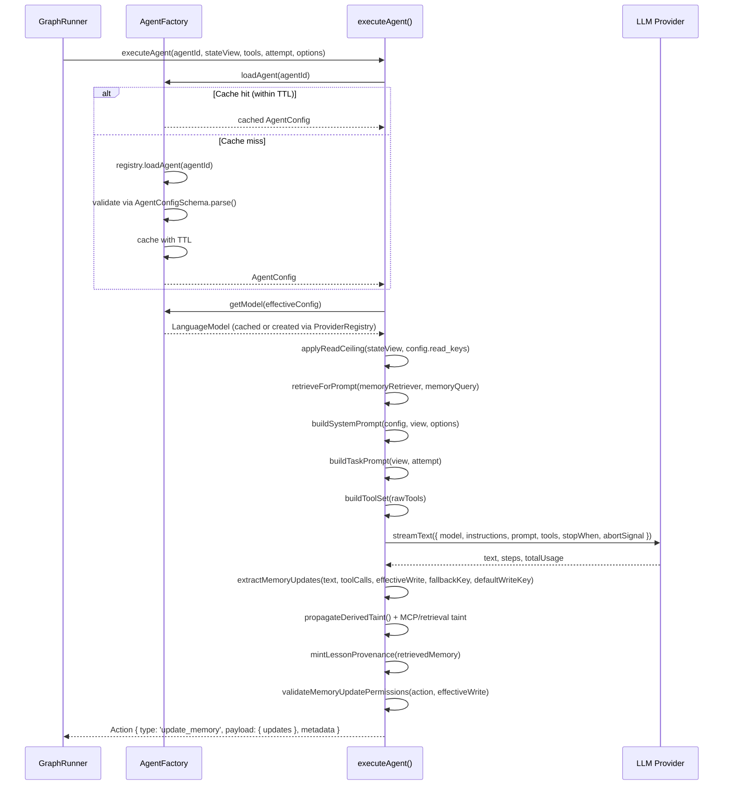
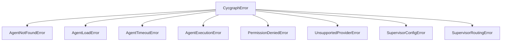

# Agent System — Technical Reference

> **Scope**: This document covers the internal architecture of the agent subsystem in `@cycgraph/orchestrator`. It is intended for contributors modifying agent execution, factory loading, evaluation, extraction, or supervision logic.

---

## Table of Contents

1. [System Overview](#1-system-overview)
2. [Component Roles](#2-component-roles)
3. [Lifecycle: From Graph Node to Action](#3-lifecycle-from-graph-node-to-action)
4. [AgentFactory](#4-agentfactory)
5. [Agent Executor](#5-agent-executor)
6. [Supervisor Executor](#6-supervisor-executor)
7. [Evaluator](#7-evaluator)
8. [Extractor](#8-extractor)
9. [Providers & Model Resolution](#9-providers--model-resolution)
10. [Configuration & Constants](#10-configuration--constants)
11. [Type System](#11-type-system)
12. [Security Model](#12-security-model)
13. [Error Taxonomy](#13-error-taxonomy)
14. [Observability](#14-observability)

---

## 1. System Overview

The agent subsystem is the bridge between the `GraphRunner` (which owns control flow) and LLM providers (which generate text and tool calls). It is deliberately **not** an agent framework: agents are pure configuration objects, not classes. The subsystem has these components:

| Component | File | Purpose |
|-----------|------|---------|
| **AgentFactory** | [factory/agent-factory.ts](factory/agent-factory.ts) | Loads agent configs from a pluggable `AgentRegistry`, resolves `LanguageModel` instances via the `ProviderRegistry`, manages TTL caching |
| **Agent Executor** | [executors/agent/executor.ts](executors/agent/executor.ts) | Runs a single agent turn: prompt → LLM → tool calls → memory updates → `Action` |
| **Supervisor Executor** | [executors/supervisor/executor.ts](executors/supervisor/executor.ts) | Runs a supervisor turn: state → LLM → structured routing decision → `Action` |
| **Evaluator** | [executors/evaluator/executor.ts](executors/evaluator/executor.ts) | LLM-as-judge: output → LLM → `{ score, reasoning }` |
| **Extractor** | [executors/extractor/executor.ts](executors/extractor/executor.ts) | LLM-as-extractor: source text → LLM → bounded list of atomic facts |
| **ProviderRegistry** | [providers/provider-registry.ts](providers/provider-registry.ts) | Runtime registry of AI SDK provider factories; OpenAI and Anthropic built in, Ollama via [providers/ollama-provider.ts](providers/ollama-provider.ts) |
| **Model resolution** | [models/model-resolver.ts](models/model-resolver.ts), [models/model-override.ts](models/model-override.ts) | Budget-aware tier → concrete model mapping, plus per-execution model overrides |
| **Rate limiter port** | [rate-limiter.ts](rate-limiter.ts) | Optional injection seam awaited before every LLM call |

### Dependency Graph



All executors depend on `AgentFactory` for config loading and model creation. The factory has **no database dependency**: it loads configs through the `AgentRegistry` interface ([../persistence/interfaces.ts](../persistence/interfaces.ts)), which the host implements (`InMemoryAgentRegistry` for lightweight use, `DrizzleAgentRegistry` from `@cycgraph/orchestrator-postgres` for durable setups).

---

## 2. Component Roles

### AgentFactory — "Where do agents come from?"

The factory answers two questions at runtime:
1. **What is this agent?** → `loadAgent(agent_id)` returns an `AgentConfig`
2. **What model should it use?** → `getModel(config)` returns a `LanguageModel`

A process-global singleton is exported from [factory/index.ts](factory/index.ts), but the runner normally injects a **run-scoped** factory built from `GraphRunnerOptions.registry` and `GraphRunnerOptions.providers`, so concurrent runs never share registry or provider state. The factory owns two bounded caches:
- `configCache`: `Map<agent_id, CacheEntry<AgentConfig>>` — validated config objects
- `modelCache`: `Map<"provider:model", LanguageModel>` — SDK model instances

### Agent Executor — "How does an agent think?"

The executor takes an agent ID, a read-filtered `StateView`, resolved tool definitions, and an attempt counter, then:
1. Applies the agent config's optional read ceiling to the view (ADR 001)
2. Resolves relevant memory via the optional `memoryRetriever` + `memoryQuery`
3. Builds a context-aware system prompt with injection guards (optionally compressed)
4. Calls `streamText()` with a timeout, prompt-cache breakpoints, and multi-step tool use
5. Routes the agent's output into memory updates (text-first, `save_to_memory` opt-in)
6. Propagates taint metadata and mints lesson provenance
7. Validates writes against the effective permission (node grant ∩ agent ceiling)
8. Returns an `Action` of type `update_memory`

It **does not** own the retry loop. The `GraphRunner` handles retries via the node's `FailurePolicy`, informed by the error's `retryable` classification.

### Supervisor Executor — "Who should work next?"

The supervisor executor makes **routing decisions** instead of memory updates. It:
1. Builds a prompt containing managed node IDs, workflow memory, and routing history
2. Calls `generateText()` with `Output.object` and a Zod `SupervisorDecisionSchema`
3. Validates the chosen node against the `managed_nodes` allowlist
4. Returns either a `handoff` action (delegate to a worker) or a `set_status` action (mark workflow complete)

### Evaluator — "How good was the output?"

The evaluator is an LLM-as-judge used by self-annealing loops, voting patterns, and evolution fitness. It builds a scoring prompt with configurable criteria and calls the LLM with structured output (score 0.0–1.0, reasoning, suggestions), returning an `EvaluationResult` with token usage.

### Extractor — "What did we learn?"

The extractor distills source text into a bounded list of atomic fact sentences. It is the LLM primitive behind the `reflection` node's `llm` extractor variant and mirrors the evaluator in shape: same DI pattern, same sanitization, same `generateText` + `Output.object` extraction.

---

## 3. Lifecycle: From Graph Node to Action



### Key Lifecycle Points

| Phase | What Happens | Failure Mode |
|-------|-------------|--------------|
| **Config Load** | Registry queried → Zod-parsed → cached | Not found → `AgentNotFoundError` (fail closed); transient → `AgentLoadError` propagated |
| **Model Resolve** | `ProviderRegistry.resolveModel(provider, model)` | Unregistered provider → `UnsupportedProviderError`; missing API key or unknown model on a curated provider → `AgentLoadError` |
| **Prompt Build** | Memory sanitized, optionally compressed, bounded to `MAX_MEMORY_PROMPT_BYTES`, wrapped in `<data>` tags | Truncation warning logged if memory exceeds limit |
| **LLM Call** | `streamText()` with combined timeout + external abort signal | Timeout → `AgentTimeoutError`; SDK error → `AgentExecutionError` with `retryable` classification; both carry best-effort partial token usage |
| **Memory Extract** | Text output routed to a write key; `save_to_memory` calls take priority; `_`-prefixed keys blocked; permissions checked | Unauthorized key → dropped with warning; final validation throws `PermissionDeniedError` |
| **Taint Propagate** | Tainted inputs → `derived` taint on outputs; MCP/custom-tool calls and untrusted retrieval taint outputs directly | Silent — new entries ride the wire-format `_taint_registry` payload key, routed by reducers to `state.taint_registry` |

---

## 4. AgentFactory

### Class: `AgentFactory` ([factory/agent-factory.ts](factory/agent-factory.ts))

The singleton lives in [factory/index.ts](factory/index.ts) (`export const agentFactory = new AgentFactory()`). Prefer scoping a factory per run via `GraphRunnerOptions.registry` / `GraphRunnerOptions.providers`; the global `configureAgentFactory()` / `configureProviderRegistry()` helpers are deprecated because they mutate state shared across every run in the process.

#### `loadAgent(agent_id: string): Promise<AgentConfig>`

Loads an agent configuration with TTL caching.

**Resolution order:**

```
1. Check configCache[agent_id]
   ├─ Hit + within TTL → return cached value
   └─ Hit + expired → delete entry, continue
2. No registry configured → lightweight mode: default config
   (deny-all ceiling), cached as fallback, warned on every load
3. registry.loadAgent(agent_id)
   └─ null → throw AgentNotFoundError (FAIL CLOSED by default)
4. Map registry entry → AgentConfig (permissions are an optional ceiling)
5. Validate via AgentConfigSchema.parse(), cache, return

CATCH:
  ├─ AgentNotFoundError + allowDefaultFallback → default config (short TTL)
  ├─ AgentNotFoundError otherwise → rethrow
  └─ Any other error → throw AgentLoadError (propagate transient errors)
```

**Fail closed by default:** a typo'd or deleted `agent_id` against a configured registry throws `AgentNotFoundError` rather than silently running a generic assistant that produces garbage output with real token spend. `setAllowDefaultFallback(true)` restores the legacy fail-open behavior for tests and lightweight dev.

The factory does not assume IDs are UUIDs. The registry owns any store-specific id-shape constraints (a UUID-typed store's adapter returns `null` for a malformed id), so human-readable IDs from the authoring facade resolve here too. The `isValidUUID` helper in [factory/validation.ts](factory/validation.ts) exists for adapters that need the pre-check.

**Cache strategy:**
- Normal configs: `AGENT_CONFIG_CACHE_TTL_MS` (default 5 min)
- Fallback configs: `FALLBACK_CONFIG_CACHE_TTL_MS` (default 30 s), shorter so registry recovery is detected quickly
- Max entries: `MAX_AGENT_CONFIG_CACHE_SIZE` (default 100) with insertion-order eviction

#### `getModel(config: AgentConfig): LanguageModel`

Returns a cached or newly-created `LanguageModel`. Cache key: `"{provider}:{model}"`. Creation delegates to `ProviderRegistry.resolveModel()` — see [§9](#9-providers--model-resolution). A `UnsupportedProviderError` passes through; any other resolution failure (missing API key, unknown model on a curated provider) is wrapped in `AgentLoadError`.

#### `getDefaultConfig(agent_id: string): AgentConfig`

Generates a minimal fallback config: `DEFAULT_AGENT_MODEL`, temperature 0.7, and an **explicit deny-all permission ceiling** (`read_keys: []`, `write_keys: []`). Under ADR 001 semantics an explicit empty ceiling stays deny-all, so an unknown agent never gains write access from a node grant.

#### Other methods

| Method | Purpose |
|--------|---------|
| `setRegistry(registry)` | Wire the persistence backend for config loading |
| `setProviderRegistry(registry)` | Swap the provider registry; clears the model cache |
| `setAllowDefaultFallback(allow)` | Opt into fail-open not-found handling (tests only) |
| `getRegistry()` / `getProviderRegistry()` | Read back configured halves so a partially-scoped run can inherit the global factory's other half |
| `clearCache()` | Drop both caches (tests) |

---

## 5. Agent Executor

### Function: `executeAgent()` ([executors/agent/executor.ts](executors/agent/executor.ts))

```typescript
export async function executeAgent(
  agentId: string,
  stateView: StateView,
  rawTools: Record<string, unknown>,
  attempt: number,
  options?: { /* see table */ }
): Promise<Action>
```

**Options** (all optional; camelCase per coding standard #7):

| Option | Purpose |
|--------|---------|
| `agentFactory` | Run-scoped factory; defaults to the process-global singleton |
| `temperatureOverride` | Overrides `config.temperature` — used by annealing/evolution schedules |
| `nodeId` | Graph node ID; derives the fallback memory key (`${nodeId}_output`) and attributes actions/taint |
| `timeoutMs` | Per-call timeout; defaults to `DEFAULT_AGENT_TIMEOUT_MS` (2 min) |
| `abortSignal` | External cancellation (workflow cancel); combined with the internal timeout via `AbortSignal.any` |
| `onToken` | Real-time token streaming callback (consumes `textStream`) |
| `onToolCall` / `onToolCallComplete` | Tool execution lifecycle callbacks for stream events |
| `drainTaintEntries` | Drains taint collected by THIS execution's tool set — race-free under concurrent sibling executions |
| `modelOverride` | Concrete model chosen by budget-aware resolution; recorded as `model_resolution` metadata |
| `contextCompressor` / `onContextCompressed` | Optional context-engine compression of prompt segments |
| `defaultWriteKey` | Node-config default key for routing text output when multiple write keys exist |
| `idempotencyKey` | Deterministic `node:iteration:attempt` key from the runner; random UUID outside a node context |
| `grantedWriteKeys` | The NODE's write grant; intersected with the agent config's ceiling (ADR 001) |
| `memoryRetriever` / `memoryQuery` | Retrieval directive; results render as a `## Relevant Memory` section |

**Returns:** `Action` with `type: 'update_memory'`.

---

### Tool Wrapping

Tools arrive from the node executor already **resolved**: `execution/nodes/agent.ts` calls `ctx.deps.resolveTools(toolSources, agentId)`, which routes through the `ToolResolver` / `MCPConnectionManager` and hands back entries with `execute` callbacks embedded. `buildToolSet()` then normalizes two shapes:

1. **Pre-formed AI SDK tools** — `dynamicTool()` objects from `@ai-sdk/mcp` or `tool()` objects from other sources, detected structurally and passed through untouched (re-wrapping would strip internal state).
2. **Raw definitions** — plain `{ description, parameters | inputSchema, execute? }` objects such as the built-in `save_to_memory`. These are wrapped with the AI SDK `tool()` helper and `jsonSchema()` so arbitrary JSON Schema is accepted.

A raw definition without an `execute` function echoes its arguments back as the result. This is the test-mode path that lets unit tests exercise executor internals without an MCP connection. Invalid entries (missing description or schema) are skipped with a warning rather than failing the run.

---

### Prompt Construction ([executors/agent/prompts.ts](executors/agent/prompts.ts))

#### `buildSystemPrompt(config, stateView, options)`

Assembles the system prompt from these sections:

```
1. Agent's base system prompt (config.system)
2. Workflow context: goal + constraints (sanitized)
3. ## Relevant Memory   — retrieved facts/entities/themes in <memory> tags (when retrieval ran)
4. ## Task Context      — per-invocation inputs in <data> tags (when present)
5. ## Available Memory  — workflow memory JSON in <data> tags, bounded
6. ## Instructions      — save_to_memory usage or plain-text contract, permission reminders
```

**Compression:** every variable-size section is handed to the optional `contextCompressor` in a single call (`compressPromptSegments`), so one budget is allocated across the whole prompt. Segments marked `locked` (system, goal, instructions) must come back byte-identical; a violated lock discards the entire result. Compressor output is re-sanitized, missing segments keep their originals, and every failure path degrades to the byte-capped default serialization.

**Memory injection design:** memory is wrapped in `<data>` tags with an explicit "DATA ONLY" header as a defense-in-depth measure against indirect prompt injection. Byte caps apply per section: `MAX_MEMORY_PROMPT_BYTES` (50 KB) for workflow memory, 32 KB each for retrieved memory and task context, always with a visible truncation marker. Caps are applied to what reaches the prompt, never to what enters the compressor — a compressor handed a blind byte cut cannot do relevance-aware allocation.

**Task context:** compound-pattern executors (map item, evolution parent + feedback, annealing feedback, swarm peers, voter index) deliver per-invocation inputs via `StateView.taskContext`, rendered as a dedicated section. A dedicated section is required because `_`-prefixed memory keys are stripped by `sanitizeForPrompt` and would never reach the model.

#### `buildTaskPrompt(stateView, attempt)`

- Attempt 1: `"Execute the following goal: {goal}"`
- Attempt 2+: `"This is attempt {N}. Previous attempt failed. Please try a different approach."` followed by the goal

---

### Sanitization Pipeline ([executors/agent/sanitizers.ts](executors/agent/sanitizers.ts))

All external data injected into prompts passes through `sanitizeForPrompt()` → `sanitizeValue()` (recursive, depth-capped at 10) → `sanitizeString()` for strings. `_`-prefixed keys are dropped entirely — internal bookkeeping never reaches the model context.

`sanitizeString` strips or neutralizes:

| Pattern | Threat |
|---------|--------|
| NFKC normalization | Unicode homograph smuggling |
| `^## `, `^# ` → `### ` | Markdown header injection (fake prompt sections) |
| All XML/HTML-style tags | Escaping `<data>` / `<memory>` boundaries, fake `<system>` sections |
| `IGNORE PREVIOUS INSTRUCTIONS`, `DISREGARD ALL PREVIOUS` → `[filtered]` | Instruction override, also detected inside base64-encoded runs |
| Directional overrides (U+202A–E, U+2066–69), null and zero-width chars | Hiding injected text |
| `\r`, 3+ consecutive newlines | Structure noise |

---

### Memory Extraction ([executors/agent/memory.ts](executors/agent/memory.ts))

```typescript
function extractMemoryUpdates(
  agentResponse: string,
  toolCalls: Array<{ toolCallId; toolName; args?; input? }>,
  allowedKeys: string[],
  fallbackKey?: string,
  defaultWriteKey?: string,
): Record<string, unknown>
```

The **primary path is text output**: the orchestrator captures the agent's response and routes it to the appropriate write key. `save_to_memory` is opt-in for structured multi-key writes and takes priority when called.

```
1. For each save_to_memory call (from ALL steps, not just the last):
   a. Extract { key, value } from call args (input ?? args)
   b. Skip non-string keys, `_`-prefixed keys, keys not in allowedKeys
2. If no updates and agentResponse is non-empty, route the text via:
   a. fallbackKey (`${nodeId}_output`) if permitted
   b. defaultWriteKey (from node config) if permitted
   c. the sole concrete write key, when there is exactly one
   d. otherwise drop with a warning (ambiguous multi-key, fail closed)
```

Tool calls and results are flattened from **all steps** (`result.toolCalls` only contains the last step's calls) and correlated by `toolCallId`, never by index — index alignment breaks when a call has no result or steps vary in call count.

---

### Taint & Provenance

After extraction the executor:

- **Propagates derived taint**: if any readable input key was tainted (per the view's scoped registry), all output keys get `source: 'derived'` taint.
- **Applies direct tool taint**: when tainting tools ran this execution (MCP tools, or custom tools declared `taints: true`), all output keys are tainted conservatively — there is no way to trace which tool result landed in which key. Entries are drained from this execution's own collector via `drainTaintEntries`, avoiding cross-attribution between concurrent sibling executions.
- **Applies retrieval taint**: when `memoryQuery.untrusted` retrieval injected facts, outputs are tainted `source: 'retrieval'` so a poisoned document cannot drive an ungated downstream action.
- **Mints lesson provenance**: retrieved fact IDs are recorded under the `_lesson_provenance` wire key so run outcomes are attributable to injected facts (eval-gated learning). Added after the taint block so it never counts as an agent output.

Only new taint entries go on the wire (`_taint_registry` in the update payload); reducers append them to the first-class `state.taint_registry`.

---

### Permission Validation ([executors/agent/validation.ts](executors/agent/validation.ts))

`validateMemoryUpdatePermissions(action, allowedKeys)` is the final Zero Trust check before the action is returned. It strips system-generated `_`-prefixed keys (added by the executor, not the agent) and then delegates to the canonical `validateAction()` in [../state/reducers.ts](../state/reducers.ts), so the executor and the reducer enforce one consistent boundary. A violation throws `PermissionDeniedError`.

The `allowedKeys` passed here is the **effective write permission**: the node's grant intersected with the agent config's optional ceiling (`intersectWriteGrant`, ADR 001). The read side mirrors this: `applyReadCeiling()` narrows the node-sliced view by the agent config's `read_keys` ceiling — it can only remove keys, never add.

---

### LLM Call Mechanics

**Why `streamText` and not `generateText`:** `streamText` + `stopWhen: isStepCount(config.maxSteps)` enables multi-step tool use — generate, call a tool, see the result, call another.

**Timeout:** an internal `AbortController` timeout is combined with the caller's `abortSignal` via `AbortSignal.any`; an abort surfaces as `AgentTimeoutError`.

**Root-cause capture:** `streamText` routes the provider error to `onError` and then rejects the awaited promise with a generic wrapper, so the executor captures the streamed error and prefers it when classifying — otherwise a definitively non-retryable 400/401 would burn every configured retry.

**Prompt caching:** for multi-step Anthropic agents (`maxSteps > 2`), a `prepareStep` hook marks cache breakpoints on the trailing three messages (`withCacheBreakpoint`), turning each step's re-read of the growing transcript into a cache hit while staying under Anthropic's four-breakpoint limit.

**Usage accounting:** aggregate usage falls back to per-step summation when the provider omits it, and `billedTokenTotal()` weights cache reads at 0.1× and cache writes at 1.25× so token budgets track real spend, not raw volume. Failed or aborted attempts still capture best-effort partial usage for the runner to account.

---

## 6. Supervisor Executor

### Function: `executeSupervisor()` ([executors/supervisor/executor.ts](executors/supervisor/executor.ts))

```typescript
export async function executeSupervisor(
  node: GraphNode,
  stateView: StateView,
  supervisorHistory: WorkflowState['supervisor_history'],
  attempt: number,
  options?: { agentFactory?, abortSignal?, modelOverride?,
              contextCompressor?, onContextCompressed?,
              memoryRetriever?, memoryQuery? }
): Promise<Action>
```

**Returns:** `Action` of type `handoff` (delegate) or `set_status` (complete). Both carry `token_usage` metadata — the runner reads it for token budgets, cost budgets, per-node budgets, and usage records — and lesson provenance for any facts injected into the routing prompt.

The supervisor's agent resolves as `supervisor_config.agent_id ?? node.agent_id`; neither present is a `SupervisorConfigError`.

### Routing Decision Schema

```typescript
export const SupervisorDecisionSchema = z.object({
  next_node: z.string(),  // node ID or '__done__' (SUPERVISOR_DONE)
  reasoning: z.string(),
});
```

Uses `generateText()` with `Output.object` for type-safe structured output — no free-form text parsing. LLM call failures are wrapped in `AgentExecutionError` with `retryable` classification, the same path as agent nodes, so the runner short-circuits deterministic 400s.

### Guards

| Guard | Mechanism | Failure Mode |
|-------|-----------|--------------|
| **Max iterations** | Count of this supervisor's entries in `supervisor_history` vs `config.max_iterations` | Returns `set_status: completed` with reasoning |
| **Managed nodes allowlist** | `config.managed_nodes.includes(decision.next_node)` | `SupervisorRoutingError` |
| **Missing config / agent** | `supervisor_config` and agent-id checks | `SupervisorConfigError` |

### Supervisor Prompt ([executors/supervisor/prompts.ts](executors/supervisor/prompts.ts))

```
1. Base system prompt (from agent config)
2. Role definition: "You delegate, not execute."
3. Workflow goal + constraints
4. ## Relevant Memory (when retrieval ran)
5. Available worker nodes + the '__done__' sentinel
6. Previous routing decisions
7. Current workflow memory in <data> tags, with taint warnings
8. Decision guidelines
```

Routing history is the supervisor's unbounded-growth section (one line per iteration, re-read every iteration), so it participates in compression as its own `routing_history` segment. Tainted readable keys produce an explicit warning that they should not be trusted for routing decisions.

---

## 7. Evaluator

### Function: `evaluateQualityExecutor()` ([executors/evaluator/executor.ts](executors/evaluator/executor.ts))

```typescript
export async function evaluateQualityExecutor(
  evaluatorAgentId: string,
  goal: string,
  output: unknown,
  criteria?: string,
  factory: AgentFactory = agentFactory,
): Promise<EvaluationResult>
```

**Returns:**

```typescript
interface EvaluationResult {
  score: number;        // 0.0 (terrible) to 1.0 (perfect)
  reasoning: string;
  suggestions?: string;
  tokensUsed: number;
}
```

### Scoring Guidelines (injected into the prompt)

| Range | Meaning |
|-------|---------|
| 0.0–0.2 | Completely wrong or irrelevant |
| 0.2–0.4 | Partially correct but major issues |
| 0.4–0.6 | Acceptable but needs improvement |
| 0.6–0.8 | Good quality, minor issues |
| 0.8–1.0 | Excellent, meets or exceeds expectations |

### Integration with Self-Annealing

```
1. Agent produces output at temperature T
2. Evaluator scores it → score S
3. If S >= threshold → accept, move on
4. If S < threshold → reduce temperature, re-execute agent
5. Repeat until threshold met or max iterations reached
```

The `temperatureOverride` option on `executeAgent()` exists for this pattern. Overrides are clamped to the provider's supported range (Anthropic caps at 1) rather than erroring mid-loop.

---

## 8. Extractor

### Function: `extractFactsExecutor()` ([executors/extractor/executor.ts](executors/extractor/executor.ts))

```typescript
export async function extractFactsExecutor(
  extractorAgentId: string,
  source: unknown,
  maxFacts: number = DEFAULT_MAX_FACTS,  // 10
  instruction?: string,
  factory: AgentFactory = agentFactory,
): Promise<ExtractionResult>  // { facts: string[], reasoning?, tokensUsed }
```

Given source text, asks the agent to distill it into atomic fact sentences. Used by the `reflection` node's `llm` extractor variant to produce structured lessons from agent output. The schema allows up to 50 facts of ≤280 chars each; results are trimmed and clamped to the caller's `maxFacts` soft cap.

---

## 9. Providers & Model Resolution

### ProviderRegistry ([providers/provider-registry.ts](providers/provider-registry.ts))

A runtime registry mapping provider names to AI SDK-compatible factory functions plus a known-model list. `openai` and `anthropic` are pre-registered with lazy API-key resolution (missing keys throw at model-resolution time, not registration time).

Key behaviors:
- **Curated providers fail fast on unknown models.** A typo'd or decommissioned model id throws at resolution instead of erroring mid-stream after real token spend. Register new models with `addModel()`.
- **Open-ended providers opt out** via `allowUnknownModels: true` (Ollama, where model ids are arbitrary local tags) — unknown models pass through with a warning.
- **Provider inference** (`inferProvider`) matches the model id against registered model lists exactly, falling back to `DEFAULT_AGENT_PROVIDER` with a warning. The old prefix heuristics are gone.

`registerOllamaProvider()` ([providers/ollama-provider.ts](providers/ollama-provider.ts)) wires local Ollama models via factory injection with zero added dependencies.

### Budget-Aware Model Resolution ([models/model-resolver.ts](models/model-resolver.ts))

Agents may declare a `model_preference` capability tier (`high` / `medium` / `low`) instead of hardcoding a model. When `GraphRunnerOptions.modelResolver` is configured, the engine resolves the tier to a concrete model before each execution based on remaining budget:

```
1. Look up preferred model from tierMap[preference][provider]
2. No budget constraint → preferred
3. Estimated call cost < 50% of remaining budget → preferred
4. Otherwise step down one tier → 'budget_downgrade'
5. Already at lowest → 'budget_critical'
```

Unknown models estimate at a deliberately high fallback cost, so budget enforcement fails closed. The resolver reads budget from top-level `WorkflowState` fields only, never from `memory`.

The chosen model reaches the executor as `options.modelOverride`; `resolveEffectiveModelConfig()` ([models/model-override.ts](models/model-override.ts)) applies it onto the loaded config, and the original/resolved pair is recorded in `action.metadata.model_resolution`.

### Rate Limiter Port ([rate-limiter.ts](rate-limiter.ts))

An optional injection seam awaited immediately before every LLM call (agent, supervisor, evaluator) when wired via `GraphRunnerOptions.rateLimiter`. The implementation may delay (token-bucket permit) or throw (hard ceiling); a throw follows the node's `failure_policy`, and the call is abortable so a cancelled run doesn't hang on a permit.

---

## 10. Configuration & Constants

Operational tuning knobs live in [../runtime-config.ts](../runtime-config.ts) (env-overridable, Zod-validated so a typo'd value fails loudly instead of silently using the default) and are re-exported from [constants.ts](constants.ts):

| Constant | Env Var | Default | Purpose |
|----------|---------|---------|---------|
| `AGENT_CONFIG_CACHE_TTL_MS` | `AGENT_CONFIG_CACHE_TTL_MS` | 300,000 (5 min) | TTL for cached agent configs |
| `FALLBACK_CONFIG_CACHE_TTL_MS` | `FALLBACK_CONFIG_CACHE_TTL_MS` | 30,000 (30 s) | TTL for fallback configs |
| `MAX_AGENT_CONFIG_CACHE_SIZE` | `MAX_AGENT_CONFIG_CACHE_SIZE` | 100 | Max entries in config and model caches |
| `DEFAULT_AGENT_TIMEOUT_MS` | `AGENT_TIMEOUT_MS` | 120,000 (2 min) | Timeout for a single `streamText()` call |
| `MAX_MEMORY_PROMPT_BYTES` | `MAX_MEMORY_PROMPT_BYTES` | 51,200 (50 KB) | Max serialized memory injected into a prompt |
| `MAX_MEMORY_VALUE_BYTES` | `MAX_MEMORY_VALUE_BYTES` | 1 MB | Max size of a single memory value |

Domain constants live in [constants.ts](constants.ts) directly:

| Constant | Value |
|----------|-------|
| `DEFAULT_AGENT_MODEL` | `claude-sonnet-4-6` |
| `DEFAULT_AGENT_PROVIDER` | `anthropic` |
| `DEFAULT_AGENT_TEMPERATURE` | `0.7` |
| `DEFAULT_AGENT_MAX_STEPS` | `10` |
| `DEFAULT_AGENT_SYSTEM_PROMPT` | Generic workflow-assistant prompt for fallback configs |
| `OPENAI_MODELS` / `ANTHROPIC_MODELS` / `OLLAMA_MODELS` | Known model lists feeding provider registration and inference |

---

## 11. Type System

### `AgentConfig` ([types.ts](types.ts))

Zod-validated configuration schema (`AgentConfigSchema`). Agents are **pure config records**, not classes.

```typescript
{
  id: string,
  name: string,
  description?: string,
  model: string,                 // e.g. 'claude-sonnet-4-6'
  provider: string,              // any registered provider name
  system: string,                // system prompt
  temperature: number,           // 0–2 (Anthropic capped at 1 via cross-field check)
  maxSteps: number,              // 1–50, default 10
  maxOutputTokens?: number,      // generation cap, passed to the provider; no default
  providerOptions?: Record<string, JSONObject>,  // e.g. anthropic thinking budget
  model_preference?: 'high' | 'medium' | 'low',  // budget-aware tier
  tools: ToolSourceInput[],      // built-in / custom / MCP references
  read_keys?: string[],          // optional read CEILING (ADR 001)
  write_keys?: string[],         // optional write CEILING
}
```

The permission fields are a **ceiling, not a grant**: the graph node's `read_keys` / `write_keys` are the authoritative grant, and the agent-config fields, when present, are intersected with it. `undefined` means uncapped; an explicit `[]` still means deny-all.

### `StateView` ([../state/state.ts](../state/state.ts))

A **security-filtered** projection of `WorkflowState`, constructed by the runner from the node's `read_keys`:

```typescript
interface StateView {
  workflow_id: string;
  run_id: string;
  goal: string;
  constraints: string[];
  memory: Record<string, unknown>;        // only readable keys
  taint?: TaintRegistry;                  // taint for readable keys (executor-only, never in prompts)
  taskContext?: Record<string, unknown>;  // per-invocation inputs from compound executors
}
```

### `Action` ([../state/state.ts](../state/state.ts))

The universal executor output, processed by the reducers:

```typescript
{
  id: string,                       // UUID v4
  type: 'update_memory' | 'set_status' | 'handoff' | ...,
  payload: Record<string, unknown>,
  idempotency_key: string,          // deterministic node:iteration:attempt when in a node context
  compensation?: { type, payload },
  metadata: {
    node_id: string, agent_id?: string, model?: string,
    timestamp: Date, attempt: number, duration_ms?: number,
    token_usage?: { inputTokens, outputTokens, totalTokens },
    tool_executions?: Array<{ tool, args, result }>,
    model_resolution?: { original_model, resolved_model },
  }
}
```

**Action types by executor:**

| Executor | Action Type | Payload |
|----------|-------------|---------|
| `executeAgent` | `update_memory` | `{ updates }` (may include `_taint_registry`, `_lesson_provenance` wire keys) |
| `executeSupervisor` | `handoff` | `{ node_id, supervisor_id, reasoning, lesson_provenance? }` |
| `executeSupervisor` | `set_status` | `{ status: 'completed', supervisor_completion_reason, lesson_provenance? }` |

---

## 12. Security Model

### Ceiling-and-Grant Permissions (ADR 001)

The graph **node** carries the authoritative grant; the **agent config** carries an optional ceiling. Enforcement happens at four levels:

| Level | Enforcer | Mechanism |
|-------|----------|-----------|
| **Read (grant)** | Runner's state slicing | The view only contains keys in the node's `read_keys` |
| **Read (ceiling)** | `applyReadCeiling()` in the executor | Narrows the view to grant ∩ ceiling |
| **Write (extract)** | `extractMemoryUpdates()` | Rejects `save_to_memory` calls and text routing outside grant ∩ ceiling |
| **Write (validate)** | `validateMemoryUpdatePermissions()` → canonical `validateAction()` | Final check on the assembled action; throws `PermissionDeniedError` |

### Internal Key Protection

Keys prefixed with `_` are system-reserved: agents cannot write them via `save_to_memory` (blocked in extraction), they are stripped from prompts by `sanitizeForPrompt`, and they are excluded from the final permission check because the executor itself writes them (`_taint_registry`, `_lesson_provenance`).

### Prompt Injection Defense

Defense-in-depth across three layers:
1. **Input sanitization** — `sanitizeString()` strips injection patterns before content enters the prompt, and compressor output is re-sanitized
2. **Data boundary framing** — memory in `<data>` tags, retrieved facts in `<memory>` tags, both with explicit "DATA ONLY" instructions; the wrappers are structure the compressor never sees, so no compression stage can strip them
3. **Bounding** — per-section byte caps limit the total injection surface

### Taint Awareness

External data is tracked end-to-end: tool results taint outputs directly, tainted inputs propagate `derived` taint, untrusted retrieval taints outputs, and the supervisor prompt warns explicitly about tainted keys before routing decisions.

---

## 13. Error Taxonomy

All classes extend `CycgraphError` and set `this.name` so handlers can switch on `error.name` across module boundaries.



| Error Class | Source | Retryable? | Handling |
|-------------|--------|-----------|----------|
| `AgentNotFoundError` | Factory | No — permanent | Fails closed (thrown) unless `setAllowDefaultFallback(true)` |
| `AgentLoadError` | Factory | Yes — transient | Propagated; the runner applies the retry policy |
| `AgentTimeoutError` | Executor | Yes | Carries `partialUsage` so failed-attempt spend is accounted |
| `AgentExecutionError` | Agent / supervisor / evaluator / extractor | Per its `retryable` flag | Wraps the root provider error via `cause`; `retryable: false` (400/401/403/404, context-length) short-circuits the retry loop |
| `PermissionDeniedError` | Executor | No — logic error | Misconfigured grant/ceiling |
| `UnsupportedProviderError` | ProviderRegistry | No — config error | Provider name not registered |
| `SupervisorConfigError` | Supervisor | No — config error | Missing `supervisor_config` or agent id |
| `SupervisorRoutingError` | Supervisor | No — LLM error | LLM chose a node outside `managed_nodes` |

Retryable classification comes from `classifyRetryable()` ([executors/agent/error-classification.ts](executors/agent/error-classification.ts)), which honors the AI SDK `APICallError.isRetryable` flag (checking a wrapped `cause` too) and returns `undefined` for unknown errors so the retry loop keeps its default.

---

## 14. Observability

### Structured Logging

All components use `createLogger(namespace)`:

| Namespace | Component |
|-----------|-----------|
| `agent.executor` (+ `.memory`, `.prompts`) | Agent executor |
| `agent.factory` | Agent factory |
| `agent.supervisor` | Supervisor executor |
| `agent.evaluator` / `agent.extractor` | Evaluator / extractor |
| `provider.registry` | Provider registry |
| `agent.model-resolver` / `agent.model-override` | Model resolution |

**Key log events:**

| Event | Level | When |
|-------|-------|------|
| `executing` / `completed` | info | Agent execution start / finish (tokens, duration, keys updated) |
| `token_usage` | info | Per-execution usage including cache read/write detail and billed total |
| `tool_called` | info | Each tool invocation (args at debug level) |
| `agent_timeout` / `agent_execution_failed` | error | Timeout abort / non-timeout LLM failure |
| `agent_loaded` | info | Config loaded from the registry |
| `agent_not_found` | error | Unknown agent id, failing closed |
| `agent_not_found_fallback` / `no_registry_fallback` | warn | Fail-open fallback / lightweight no-registry mode |
| `agent_load_failed` | error | Transient registry error |
| `memory_truncated` / `retrieved_memory_truncated` | warn | A section exceeded its byte cap |
| `blocked_internal_key_write` / `unauthorized_key_write` | warn | Agent attempted a reserved or unpermitted key |
| `fallback_key_not_in_write_keys` | warn | Text output dropped — ambiguous multi-key routing |
| `temperature_override_clamped` | warn | Override exceeded the provider's range |
| `context_compressor_failed` / `context_compressor_modified_locked_segment` | warn | Compression degraded to the default path |
| `unknown_model` | warn | Open-ended provider passed through an unlisted model |
| `routing` / `decision` / `max_iterations_reached` | info/warn | Supervisor lifecycle |
| `cache_evicted` | debug | Cache entry evicted at capacity |

### OpenTelemetry Tracing

All executors are wrapped in `withSpan(tracer, spanName, fn)`:

| Span | Attributes |
|------|-----------|
| `agent.execute` | `agent.id`, `agent.attempt`, `agent.model`, `agent.provider`, `agent.duration_ms`, `agent.tokens.input/output/total`, `agent.tools_called`, `agent.error` |
| `supervisor.route` | `supervisor.id`, `supervisor.attempt`, `supervisor.decision`, `supervisor.reasoning`, `supervisor.iteration`, `supervisor.input_tokens`, `supervisor.output_tokens` |
| `evaluator.evaluate` | `evaluator.agent_id`, `evaluator.score`, `evaluator.tokens` |
| `extractor.extract` | `extractor.agent_id`, `extractor.max_facts`, `extractor.facts_returned`, `extractor.tokens` |

Agent execution duration is also recorded as a metric via `recordAgentDuration()`.
