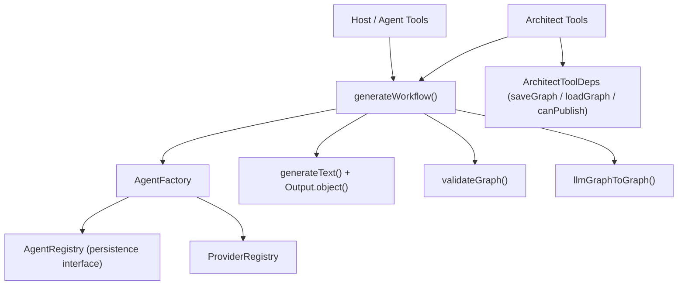
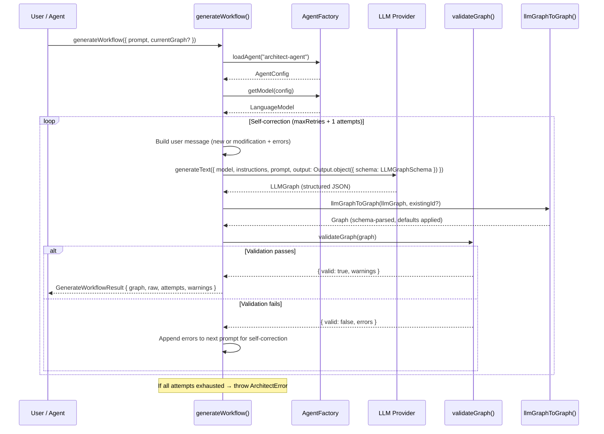
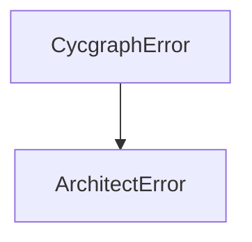

# Architect System — Technical Reference

> **Scope**: This document covers the internal architecture of the architect subsystem in `@cycgraph/orchestrator`. It is intended for contributors modifying workflow generation, architect tools, schema definitions, or the self-correction loop.

---

## Table of Contents

1. [System Overview](#1-system-overview)
2. [Component Roles](#2-component-roles)
3. [Lifecycle: From Prompt to Graph](#3-lifecycle-from-prompt-to-graph)
4. [generateWorkflow()](#4-generateworkflow)
5. [Schemas](#5-schemas)
6. [Prompt Engineering](#6-prompt-engineering)
7. [Conversion Utilities](#7-conversion-utilities)
8. [Architect Tools](#8-architect-tools)
9. [Graph Validation](#9-graph-validation)
10. [Type System](#10-type-system)
11. [Error Taxonomy](#11-error-taxonomy)
12. [Observability](#12-observability)

---

## 1. System Overview

The architect subsystem translates **natural language prompts** into **executable Graph definitions**. It is the bridge between a user's intent ("Create a research pipeline") and the structured `Graph` objects consumed by the `GraphRunner`. The subsystem enforces a **human-in-the-loop** design: generated graphs are never executed automatically, and publishing is gated secure-by-default.

| Component | File | Purpose |
|-----------|------|---------|
| **generateWorkflow** | [index.ts](index.ts) | Core generation loop: prompt → LLM → validation → self-correction → `Graph` |
| **Schemas** | [schemas.ts](schemas.ts) | Zod schemas defining the LLM's structured output format |
| **Prompts** | [prompts.ts](prompts.ts) | System prompt with graph design rules, examples, and modification guidelines |
| **Tool Definitions** | [tools.ts](tools.ts) | Built-in tools allowing agents to draft, publish, and fetch workflows |
| **Utilities** | [utils.ts](utils.ts) | Bidirectional converters between `Graph` and `LLMGraph` formats |
| **Errors** | [errors.ts](errors.ts) | `ArchitectError` class for generation failures |

### Dependency Graph



The architect reuses the **AgentFactory** from the agent subsystem for model configuration. It does not have its own factory: it loads a config for `architect-agent` (or a custom agent ID) through the same registry and cache. There is no database dependency; the factory loads through the pluggable `AgentRegistry` interface. In lightweight mode with no registry configured, the factory falls back to its default config, so the architect works out of the box with just an API key.

---

## 2. Component Roles

### generateWorkflow — "How are graphs born?"

The core function that orchestrates the full generation pipeline:
1. Loads an LLM model via `AgentFactory`
2. Constructs a context-aware prompt (new graph or modification of existing)
3. Calls `generateText()` with `Output.object()` for schema-constrained structured output
4. Validates the result with `validateGraph()` (referential integrity checks)
5. On validation failure, feeds errors back to the LLM for **self-correction**
6. Returns a validated `Graph` ready for human review

### Schemas — "What can the LLM output?"

Zod schemas that define the exact JSON shape the LLM must produce. The output is structurally constrained via the AI SDK's `Output.object({ schema })`, so the LLM cannot produce free-form text, only valid `LLMGraph` objects. The generation schema deliberately allows **fewer node types than the engine supports**: an LLM may not author an `a2a` node, because delegating to a remote agent is an operator decision.

### Prompts — "How does the LLM know graph rules?"

A comprehensive system prompt that teaches the LLM:
- Graph structural rules (nodes need IDs, edges must reference existing nodes)
- Workflow patterns (linear vs. supervisor-driven hierarchical)
- Least-privilege permissions (`read_keys` list only what a node needs; avoid `["*"]`)
- Naming conventions (kebab-case node IDs, sequential edge IDs)
- Modification mode behavior (preserve existing structure, output the complete graph)

### Architect Tools — "How do agents create workflows?"

Three built-in tools that allow other agents to autonomously manage workflows:
- `architect_draft_workflow` — Generate or modify a graph
- `architect_publish_workflow` — Save a graph to the registry (validated and gated)
- `architect_get_workflow` — Fetch a published graph by ID

### Utilities — "How do formats convert?"

Bidirectional converters between the runtime `Graph` type and the LLM-friendly `LLMGraph` type. The LLM never sees the system-generated `id`; conversion back to the runtime type goes through `GraphSchema.parse` so schema defaults are applied consistently.

---

## 3. Lifecycle: From Prompt to Graph



### Key Lifecycle Points

| Phase | What Happens | Failure Mode |
|-------|-------------|--------------|
| **Config Load** | `AgentFactory.loadAgent(architectAgentId)` loads model config | No registry → default config; configured registry without the agent → `AgentNotFoundError` (fail closed) |
| **Model Create** | `AgentFactory.getModel(config)` returns cached or new `LanguageModel` | Missing API key → `AgentLoadError`; unregistered provider → `UnsupportedProviderError` |
| **Prompt Build** | New graph prompt or modification prompt with existing graph snapshot | — |
| **LLM Call** | `generateText()` with `Output.object()` for structured output | SDK error caught → retry or `ArchitectError` |
| **Conversion** | `llmGraphToGraph()` runs `GraphSchema.parse` on the wire-format output | Zod parse error caught → retry loop |
| **Validation** | `validateGraph()` checks referential integrity, duplicates, reachability | Errors → self-correction loop |
| **Self-Correction** | Validation errors appended to next prompt | Max retries exceeded → `ArchitectError` |

---

## 4. generateWorkflow()

### Function: `generateWorkflow()` ([index.ts](index.ts))

```typescript
export async function generateWorkflow(
  options: GenerateWorkflowOptions
): Promise<GenerateWorkflowResult>
```

**Options** (camelCase per coding standard #7):

| Parameter | Type | Default | Purpose |
|-----------|------|---------|---------|
| `prompt` | `string` | *required* | Natural language description of the desired workflow |
| `currentGraph` | `Graph?` | `undefined` | Existing graph to modify (enables modification mode) |
| `architectAgentId` | `string?` | `"architect-agent"` | Agent ID whose model config to use for the LLM call |
| `maxRetries` | `number?` | `2` | Max self-correction attempts on validation failure |

**Returns: `GenerateWorkflowResult`**

| Field | Type | Purpose |
|-------|------|---------|
| `graph` | `Graph` | Validated Graph object, ready for human review |
| `raw` | `LLMGraph` | Raw LLM output before conversion (for debugging) |
| `attempts` | `number` | Number of generation attempts (1 = first try, 2+ = self-corrected) |
| `warnings` | `string[]` | Non-fatal warnings from graph validation |
| `is_modification` | `boolean` | Whether this was a modification of an existing graph |

### Self-Correction Loop

The self-correction mechanism is the architect's primary quality assurance strategy. Instead of simply failing on invalid output, validation errors are fed back to the LLM as additional context:

```
1. Attempt 1: LLM generates graph from prompt
   └─ Validation fails: "Edge 'e3': target node 'analyzer' not found"
2. Attempt 2: LLM sees original prompt + error message
   └─ LLM fixes the dangling edge reference
   └─ Validation passes → return result
```

**Algorithm:**

```
for attempt = 0 to maxRetries:
  1. Build user message:
     ├─ New graph: "Design a workflow graph for: {prompt}"
     └─ Modification: "Here is the EXISTING workflow graph:
                        {graphSnapshot}
                        The user wants to modify it: {prompt}
                        Output the COMPLETE modified graph."
  2. If previous attempt had errors:
     └─ Append: "Your previous output had validation errors. Fix them: {errors}"
  3. Call generateText({ model, output: Output.object({ schema: LLMGraphSchema }),
                         instructions, prompt, temperature: 0.3 })
  4. Convert LLM output → Graph via GraphSchema.parse
  5. Validate:
     ├─ Valid → return GenerateWorkflowResult
     └─ Invalid → store errors, continue loop

If all attempts exhausted → throw ArchitectError
```

Both validation failures and thrown LLM/parse errors feed the loop: a caught exception's message becomes the correction context for the next attempt.

### Modification Mode

When `currentGraph` is provided, the architect enters modification mode:

1. The existing graph is converted to an `LLMGraphSnapshot` via `graphToLLMSnapshot()`, stripping the runtime `id`
2. The snapshot is included in the user message so the LLM sees the full current structure
3. The LLM is instructed to output the **complete** modified graph (not a diff)
4. The original graph's `id` is preserved in the output via `llmGraphToGraph(llm, currentGraph.id)`

**Why full graph output instead of diffs:** Diffs are ambiguous and error-prone with LLMs. Outputting the complete graph ensures referential integrity can be validated end-to-end, and avoids the complexity of a merge algorithm.

### LLM Call Configuration

```typescript
const { output: llmGraph } = await generateText({
  model,                                             // From AgentFactory
  output: Output.object({ schema: LLMGraphSchema }), // Structured output
  instructions: ARCHITECT_SYSTEM_PROMPT,             // Graph design rules
  prompt: userMessage,                               // New or modification prompt
  temperature: 0.3,                                  // Low temp for deterministic structure
});
```

**Why `Output.object()` instead of `generateObject()`:** The AI SDK's `Output.object()` with `generateText()` provides schema-constrained structured output while maintaining access to the full `generateText` response shape.

**Why temperature 0.3:** Graph generation requires structural correctness (valid node references, proper edge wiring). A low temperature reduces creative variance in favor of consistent, well-formed output. This is intentionally lower than the agent executor's default of 0.7.

---

## 5. Schemas

### File: [schemas.ts](schemas.ts)

The schema hierarchy mirrors the `Graph` type but is simplified for LLM output: no UUIDs, sensible defaults for optional fields, and a deliberately restricted node-type list.

### `LLMGraphSchema`

The top-level schema given to the LLM via `Output.object()`:

```typescript
{
  name: string,           // "Research & Write"
  description: string,    // "A pipeline that researches a topic and writes a report"
  nodes: LLMGraphNodeSchema[],
  edges: LLMGraphEdgeSchema[],
  start_node: string,     // "research"
  end_nodes: string[],    // ["writer"] or [] for supervisor-driven
}
```

### `LLMGraphNodeSchema`

```typescript
{
  id: string,                              // "research", "writer", "supervisor"
  type: 'agent' | 'tool' | 'subgraph' | 'synthesizer' | 'router' |
        'supervisor' | 'map' | 'voting' | 'approval' | 'evolution' |
        'verifier' | 'reflection',
  agent_id?: string,                       // Required for agent nodes
  tools?: ToolSource[],                    // Overrides agent config tools when set
  tool_id?: string,                        // For tool nodes
  supervisor_config?: {
    agent_id?: string,                     // Optional — falls back to node.agent_id
    managed_nodes: string[],               // IDs of worker nodes
    max_iterations: number,                // 1–1000, default 10
  },
  read_keys: string[],                     // Default: [] (least privilege)
  write_keys: string[],                    // Default: []
  failure_policy: {
    max_retries: number,                   // Default: 3
    backoff_strategy: 'linear' | 'exponential' | 'fixed',  // Default: 'exponential'
    initial_backoff_ms: number,            // Default: 1000
    max_backoff_ms: number,                // Default: 60000
  },
  requires_compensation: boolean,          // Default: false
}
```

The type enum is a **subset of the engine's `NodeTypeSchema`**. Types like `a2a` and `swarm` exist in the engine but are excluded here: authoring them is an operator decision, not something a prompt should conjure. See [§7](#7-conversion-utilities) for how snapshots still represent them.

**Permission defaults are least-privilege:** `read_keys` defaults to `[]`, matching the engine's security model. The node sees only `goal` and `constraints` unless the LLM grants specific keys, and the schema description actively steers it away from `["*"]`. The failure policy defaults (`max_retries: 3`, exponential backoff) keep the LLM focused on graph structure rather than boilerplate.

### `LLMGraphEdgeSchema`

```typescript
{
  id: string,                              // "e1", "e2"
  source: string,                          // Source node ID
  target: string,                          // Target node ID
  condition: {
    type: 'always' | 'conditional',        // Default: 'always'
    condition?: string,                    // Expression (required for conditional edges)
  },
}
```

---

## 6. Prompt Engineering

### File: [prompts.ts](prompts.ts)

The `ARCHITECT_SYSTEM_PROMPT` is a static instruction set that teaches the LLM how to design valid workflow graphs.

### Prompt Structure

```
1. Role: "You are a Workflow Architect"
2. Structural Rules (9 rules):
   - Every graph needs nodes + valid edges
   - Edge references must be valid
   - Linear workflow pattern (agent nodes + "always" edges)
   - Supervisor workflow pattern (bidirectional edges, empty end_nodes,
     supervisor write_keys implied by node type)
   - Naming conventions (kebab-case IDs, sequential edge IDs)
   - Agent nodes need agent_id
   - write_keys for each node
   - Least-privilege read_keys: list only upstream keys the node consumes;
     goal/constraints are always available; avoid ["*"]
3. Modification Mode Rules:
   - Preserve existing structure unless explicitly asked to change
   - Output the COMPLETE graph
4. Example: Linear Workflow (2-node Research & Write)
5. Example: Supervisor Workflow (supervisor + 2 workers)
```

### Design Decisions

**Why two full examples in the prompt:** LLMs learn patterns from examples more reliably than from abstract rules. The two examples cover the two primary workflow patterns:
- **Linear:** Sequential node execution with `"always"` edge conditions
- **Supervisor:** Hierarchical routing with bidirectional edges and the `__done__` convention

Both examples model the least-privilege permission style: each node's `read_keys` lists exactly the upstream `write_keys` it consumes.

**Why the modification mode rules are explicit:** Without clear instructions to preserve existing nodes and output the complete graph, LLMs tend to generate partial graphs or drop existing nodes when modifying workflows.

---

## 7. Conversion Utilities

### File: [utils.ts](utils.ts)

Two functions handle the bidirectional conversion between the runtime `Graph` type and the LLM-friendly `LLMGraph` type.

### `llmGraphToGraph(llm: LLMGraph, existingId?: string): Graph`

Converts LLM output to a runtime `Graph` by feeding it through `GraphSchema.parse`. The architect's output is already snake_case wire format, so it is validated directly rather than going through the camelCase `createGraph` authoring entry. `existingId` is passed through in modification mode; otherwise the schema's own default mints a fresh UUID. Persistence-layer fields like `version`, `created_at`, and `updated_at` are **not** set here — those belong to the storage adapter, per the coding standards.

Node and edge fields are mapped explicitly (rather than by blind spread) so schema-defaulted sub-objects like `failure_policy` always arrive complete, and the narrower LLM edge-condition enum is cast onto the engine's union.

### `graphToLLMSnapshot(graph: Graph): LLMGraphSnapshot`

Converts a runtime `Graph` back to the LLM-facing format for modification mode, stripping the runtime `id`.

The return type is `LLMGraphSnapshot`, not `LLMGraph`: structurally the same shape, but with `node.type` widened to the engine's full `NodeType` union. The generation schema deliberately allows fewer types than the engine supports, yet a snapshot must still be able to **represent** a graph that contains, say, an `a2a` node. Narrowing here would make the architect silently drop such a node while modifying the graph around it.

**Why explicit field mapping instead of destructuring:** The `Graph` type may evolve to include additional fields. Explicit mapping ensures only the intended fields reach the LLM, preventing accidental leakage of internal metadata.

---

## 8. Architect Tools

### File: [tools.ts](tools.ts)

The architect tools allow other agents to autonomously create and manage workflows. They are declared as built-in tool names in the tool catalog ([../tools/builtin/index.ts](../tools/builtin/index.ts)), but resolve to **placeholders** there: their implementations need host dependencies (persistence, publish gates), so they are wired out-of-band via `initArchitectTools()` and dispatched through `executeArchitectTool()`.

### Tool Definitions

Each tool conforms to the locally-defined `ToolDefinition` interface (`description` + Zod `parameters`). The LLM-facing argument schemas use snake_case wire format, and each definition's schema must match its handler's validation schema — a mismatched key would be silently stripped by the handler's parse.

#### `architect_draft_workflow`

| Parameter | Type | Purpose |
|-----------|------|---------|
| `prompt` | `string` | Natural language description of the workflow to create or change to make |
| `current_graph` | `Record<string, unknown>?` | Optional existing graph JSON to modify |

**Returns:** `{ graph, is_modification, attempts, warnings }`, or `{ error, validation_errors }` when the supplied `current_graph` is not a valid `Graph`.

The handler validates `current_graph` with `GraphSchema.safeParse` **before** entering modification mode. A malformed object would crash `graphToLLMSnapshot` mid-call; surfacing the issues as a tool result lets the calling LLM fix or omit the graph instead. Valid input delegates to `generateWorkflow()`.

#### `architect_publish_workflow`

| Parameter | Type | Purpose |
|-----------|------|---------|
| `graph` | `Record<string, unknown>` | The complete graph JSON to publish |
| `overwrite` | `boolean` | Whether to overwrite an existing graph (default: `false`) |

**Returns:** `{ graph_id, name, status: 'published' | 'updated' }` on success, or `{ error, ... }` describing why publishing was refused.

**Guards, in order:**
1. **Schema validation** — `GraphSchema.safeParse`. Never persist an unvalidated graph: the tool accepts an arbitrary agent-constructed object, so a prompt-injected or buggy agent could otherwise publish an executable graph with wildcard `read_keys`, unbounded fan-out, or arbitrary tool wiring.
2. **Referential validation** — `validateGraph()` must pass with no errors.
3. **Existence check** — an existing graph with `overwrite: false` returns a descriptive error rather than throwing, so the calling agent can decide how to handle the conflict.
4. **Publish gate (secure-by-default)** — when `ArchitectToolDeps.canPublish` is configured it always decides; it may return `false` or a string reason to deny. When **no** gate is configured, publishing is **denied** unless the host explicitly set `allowUnguardedPublish: true`. This closes the confused-deputy path where a prompt-injected agent holding the tool publishes an executable graph on a host that never wired a gate.

#### `architect_get_workflow`

| Parameter | Type | Purpose |
|-----------|------|---------|
| `graph_id` | `string` | The ID of the graph to fetch |

**Returns:** `{ graph }` or `{ error, graph_id }` if not found.

### Dependency Injection: `ArchitectToolDeps`

The publish and get tools require persistence, but the orchestrator library does not own a database layer. Dependencies are injected at startup:

```typescript
export interface ArchitectToolDeps {
  saveGraph: (graph: Graph) => Promise<void>;
  loadGraph: (graphId: string) => Promise<Graph | null>;
  canPublish?: (graph: Graph) => Promise<boolean | string> | boolean | string;
  allowUnguardedPublish?: boolean;
}
```

**`initArchitectTools(deps)`** must be called once at application startup before agents can use `architect_publish_workflow` or `architect_get_workflow`. The `architect_draft_workflow` tool does **not** require initialization because it only calls `generateWorkflow()`.

**Why dependency injection instead of direct DB imports:** The orchestrator is a library consumed by multiple hosts (API server, CLI, tests). Each host may have a different persistence strategy. DI keeps the library host-agnostic. The interface maps directly onto `PersistenceProvider` methods but stays minimal to avoid coupling tools to the full persistence layer.

### Tool Execution Router

```typescript
export async function executeArchitectTool(
  toolName: string,
  args: Record<string, unknown>
): Promise<unknown>
```

A `switch` dispatcher that routes tool calls to the appropriate handler. An unknown tool name throws `ArchitectError`.

**Handler Pattern:**

Each handler (`handleDraftWorkflow`, `handlePublishWorkflow`, `handleGetWorkflow`) follows the same shape:
1. Validate `args` with the handler's Zod schema
2. Check initialization (`_deps !== null`) for persistence-dependent tools
3. Execute the operation
4. Return a structured result object, using `{ error }` for expected failure cases rather than throwing

**Why handlers return errors instead of throwing:** When an agent calls a tool that returns `{ error: "Graph not found" }`, the LLM can see the error and decide how to proceed (create the graph, try a different ID, fix validation issues). A thrown exception would terminate the tool call and lose this decision-making opportunity. Throwing is reserved for host misconfiguration (uninitialized deps, unknown tool name).

---

## 9. Graph Validation

### Integration: [graph-validator.ts](../graph/graph-validator.ts)

The architect delegates structural validation to `validateGraph()`, which is shared with other subsystems (including the publish tool and `createGraph`). Validation returns a `ValidationResult` containing errors (hard failures) and warnings (potential issues).

### Validation Checks (selection)

| Check | Severity | What It Catches |
|-------|----------|-----------------|
| Start node exists | Error | `start_node` references a non-existent node |
| End nodes exist | Error | `end_nodes` contains non-existent node IDs |
| Edge references valid | Error | Edge `source` or `target` references a non-existent node |
| No duplicate node/edge IDs | Error | Two nodes or edges with the same `id` |
| Per-type config present | Error | Agent node missing `agent_id`; tool node missing `tool_id`; supervisor / map / voting / approval / subgraph / a2a node missing its `*_config`, or the config referencing non-existent nodes |
| Supervisor agent resolvable | Error | Neither `node.agent_id` nor `supervisor_config.agent_id` set |
| Wildcard read_keys | Warning | `read_keys: ["*"]` defeats state slicing |
| No end nodes | Warning | Execution can only terminate via supervisor `__done__`, max iterations, or timeout |
| Self-referencing edge | Warning | Potential tight loop on a single node |
| Conditional edge without expression | Warning | Would always evaluate to false |
| All nodes reachable | Warning | Nodes unreachable from `start_node` |
| No dead-end nodes | Warning | Non-end nodes with no outgoing edges |
| Supervisor edges to workers | Warning | Supervisor has no edge to a managed node |
| Cycles without end nodes | Warning | Potential infinite loop |

**Why warnings don't block generation:** Many valid workflow patterns trigger warnings. A supervisor-driven graph always has cycles (supervisor → worker → supervisor). An isolated node might be intentional draft structure. Warnings are surfaced in the result for human review.

---

## 10. Type System

### `GenerateWorkflowOptions` ([index.ts](index.ts))

```typescript
interface GenerateWorkflowOptions {
  prompt: string;                    // Natural language description
  currentGraph?: Graph;              // Existing graph for modification mode
  architectAgentId?: string;         // Default: "architect-agent"
  maxRetries?: number;               // Default: 2
}
```

### `GenerateWorkflowResult` ([index.ts](index.ts))

```typescript
interface GenerateWorkflowResult {
  graph: Graph;                      // Validated, ready for human review
  raw: LLMGraph;                     // Raw LLM output (for debugging)
  attempts: number;                  // 1 = first try, 2+ = self-corrected
  warnings: string[];                // Non-fatal validation warnings
  is_modification: boolean;          // true if currentGraph was provided
}
```

### `LLMGraph` ([index.ts](index.ts), [utils.ts](utils.ts))

Inferred from `LLMGraphSchema` via `z.infer`. This is the LLM-facing graph format: no runtime ID, only the structural and logical fields the LLM needs to reason about.

### `LLMGraphSnapshot` ([utils.ts](utils.ts))

An `LLMGraph` with `node.type` widened to the engine's full `NodeType` union, so modification-mode snapshots can represent node types the LLM is not permitted to author.

### `ArchitectToolDeps` ([tools.ts](tools.ts))

Host-injected persistence and policy interface, described in [§8](#8-architect-tools).

### `ToolDefinition` ([tools.ts](tools.ts))

Defined locally in the tools module:

```typescript
interface ToolDefinition {
  description: string;
  parameters: z.ZodType;        // Zod schema for input validation
}
```

---

## 11. Error Taxonomy



| Error Class | Source | Retryable? | Handling |
|-------------|--------|-----------|----------|
| `ArchitectError` | `generateWorkflow()`, `executeArchitectTool()` | No | Thrown after all self-correction attempts fail (contains the last error message), on an unknown tool name, or on uninitialized tool deps |

**Why only one error class:** The architect has a single generation failure mode — exhausted retries. LLM call failures and validation errors are handled internally via the self-correction loop; expected tool-level failures (not found, denied, invalid input) are returned as `{ error }` results, not thrown.

**Errors from dependencies:**
- `AgentFactory` errors (`AgentNotFoundError`, `AgentLoadError`, `UnsupportedProviderError`) propagate through — they are not caught by the retry loop
- `validateGraph()` errors are **never thrown** — they're returned as `{ errors: string[] }` and fed back to the LLM

---

## 12. Observability

### Structured Logging

The architect uses `createLogger(namespace)`:

| Namespace | Component |
|-----------|-----------|
| `architect` | Core `generateWorkflow()` function |
| `architect.tools` | Tool definitions and execution handlers |

**Key log events:**

| Event | Level | When |
|-------|-------|------|
| `generation_started` | info | `generateWorkflow()` begins (truncated prompt, `is_modification` flag) |
| `llm_output_received` | info | LLM returns structured output (attempt number, graph name) |
| `validation_failed` | warn | Graph validation found errors (attempt number, error list) |
| `generation_attempt_failed` | warn | LLM call or conversion threw (attempt number, error message) |
| `generation_complete` | info | Valid graph produced (node/edge counts, attempt count, warning count) |
| `architect_tools_initialized` | info | `initArchitectTools()` called |
| `tool_draft` | info | `architect_draft_workflow` invoked (truncated prompt) |
| `tool_publish` | info | Graph published/updated (`graph_id`, `overwrite` flag) |
| `tool_publish_rejected_schema` | warn | Publish refused: graph failed `GraphSchema` validation |
| `tool_publish_rejected_referential` | warn | Publish refused: `validateGraph()` errors |
| `tool_publish_denied_by_gate` | warn | Publish refused by the host's `canPublish` gate |
| `tool_publish_denied_no_gate` | warn | Publish refused: no gate configured and `allowUnguardedPublish` not set |
