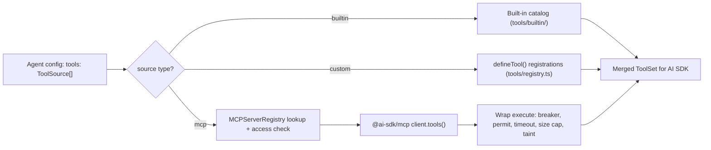

# MCP Tool Integration — Technical Reference

> **Scope**: This document covers the MCP (Model Context Protocol) tool integration layer in `@cycgraph/orchestrator`. It is intended for contributors modifying tool resolution, MCP connections, transport security, or schema conversion logic.

---

## Table of Contents

1. [System Overview](#1-system-overview)
2. [Connection Manager](#2-connection-manager)
3. [Transport Security](#3-transport-security)
4. [Resilience: Circuit Breakers, Concurrency Caps, Result Bounds](#4-resilience-circuit-breakers-concurrency-caps-result-bounds)
5. [JSON Schema Converter](#5-json-schema-converter)
6. [Default MCP Servers](#6-default-mcp-servers)
7. [Error Taxonomy](#7-error-taxonomy)

---

## 1. System Overview

The MCP module bridges agent tool declarations (`ToolSource[]`) with actual tool implementations. It uses the `@ai-sdk/mcp` SDK for native MCP client connections and tracks taint metadata for data provenance.

| Component | File | Purpose |
|-----------|------|---------|
| **Connection Manager** | [connection-manager.ts](connection-manager.ts) | Manages `@ai-sdk/mcp` client lifecycle, tool resolution, taint collection, access control, timeouts |
| **Transport Security** | [transport-security.ts](transport-security.ts) | Stdio env scrubbing and connect-time SSRF re-check for http/sse hosts |
| **Tool Circuit Breaker** | [tool-circuit-breaker.ts](tool-circuit-breaker.ts) | Per-`(server, tool)` breaker that fails fast during failure cascades |
| **Semaphore** | [semaphore.ts](semaphore.ts) | FIFO counting semaphore capping concurrent calls per server |
| **Schema Converter** | [json-schema-converter.ts](json-schema-converter.ts) | Converts JSON Schema to Zod with depth and breadth bounds |
| **Default Servers** | [default-servers.ts](default-servers.ts) | Pre-configured entries for common capabilities (`web-search`, `fetch`) |
| **Errors** | [errors.ts](errors.ts) | `MCPServerNotFoundError`, `MCPAccessDeniedError`, `ToolCircuitBreakerOpenError` |

`@ai-sdk/mcp` is an optional peer dependency, imported lazily so unit tests that only use built-in tools never load it.

### Tool Resolution Flow



`MCPConnectionManager` implements the `ToolResolver` interface ([../tools/resolver.ts](../tools/resolver.ts)) and handles `builtin` and `mcp` sources. `custom` sources are resolved by the composed resolution in [../tools/registry.ts](../tools/registry.ts), which chains the built-in catalog, `defineTool()` registrations, and one or more `ToolResolver` legs behind a single `ToolResolver` facade. A standalone manager that receives custom sources resolves what it can and leaves the rest.

### Two-Layer Trust Architecture

```
Agent Config (data layer)          MCP Server Registry (infra layer)
┌──────────────────────┐          ┌──────────────────────────────┐
│ tools: [              │          │ server: "web-search"          │
│   { type: "mcp",     │ ──ref──▶ │   transport: stdio/http/sse   │
│     server_id: "..." }│          │   allowed_agents: [...]       │
│ ]                     │          │   timeout_ms, tool_timeout_ms │
└──────────────────────┘          │   max_retries,                │
                                   │   max_concurrent_calls        │
                                   └──────────────────────────────┘
```

Agent configs reference servers only by ID. Transport details and secrets live in the trusted `MCPServerRegistry` ([../persistence/interfaces.ts](../persistence/interfaces.ts)): `saveServer` (camelCase authoring shape), `loadServer`, `listServers`, `deleteServer`. Entries are validated by `MCPServerEntrySchema` in [../tools/schema.ts](../tools/schema.ts), which owns the parse-time guards described in [§3](#3-transport-security).

---

## 2. Connection Manager

### Class: `MCPConnectionManager` ([connection-manager.ts](connection-manager.ts))

Create one per `GraphRunner.run()` invocation and call `closeAll()` when done.

```typescript
new MCPConnectionManager(registry: MCPServerRegistry, options?: {
  cache_ttl_ms?: number;                 // tool manifest TTL, default 300000; 0 disables
  default_tool_timeout_ms?: number;      // per-call timeout, default 30000; 0 disables
  tool_circuit_breaker?: ToolCircuitBreakerOptions | null;  // null disables breakers
  default_max_concurrent_calls?: number; // per-server cap, default 0 (unlimited)
})
```

### `resolveTools(sources, agentId?): Promise<Record<string, unknown>>`

Main entry point. Resolves `ToolSource` declarations into AI SDK tools with execute functions.

**Resolution pipeline:**

1. Built-in sources resolve synchronously from the shared catalog ([../tools/builtin/index.ts](../tools/builtin/index.ts)); raw definitions, wrapped later by the agent executor's `buildToolSet()`.
2. MCP sources resolve in parallel. For each one:
   - `checkAccess()` enforces `allowed_agents` and loads the server entry
   - `getToolsForServer()` returns the cached manifest or connects and calls `client.tools()`
   - The per-server timeout and semaphore are resolved from the entry
3. Without an explicit `tool_names` allowlist the agent receives **every** tool the server advertises, which is a privilege-creep risk if the server is later compromised or updated. The manager logs `mcp_tool_allowlist_absent` so this is an observable decision rather than a silent one. Allowlist names that the server does not advertise log `filtered_tool_not_found` and are skipped. Lookups use `hasOwnProperty`, so a `tool_names` entry of `"toString"` cannot match a prototype member.
4. Name collisions (across servers, or with built-ins) are detected and colliding tools are namespaced as `serverId__toolName`. Non-colliding tools keep their bare names.
5. Each MCP tool's `execute` is wrapped (never mutated) with the breaker check, concurrency permit, timeout, result-size cap, and taint recording described below.
6. A fresh per-resolution taint collector is registered against the returned toolset object in a `WeakMap`, so collectors are garbage-collected with their tools.

### Access Control

When `MCPServerEntry.allowed_agents` is a non-empty list, only listed agent IDs may use the server; violations throw `MCPAccessDeniedError`. A missing or empty list means unrestricted access.

### Connection Lifecycle

- **Lazy**: clients are created on first use for a server, not at startup.
- **Deduplication**: concurrent calls for the same server share one pending connection promise, preventing stampedes.
- **Reuse**: clients are cached for the lifetime of the manager.
- **Retry with backoff**: failed connections retry up to `max_retries` (default 2) with exponential backoff of 1s, 2s, 4s, capped at 10s.
- **Reconnect**: `reconnect(serverId)` closes the client and invalidates its tool cache, forcing a fresh connection on next use.
- **Cleanup**: `closeAll()` closes all clients via `Promise.allSettled` and clears the client, pending, and tool caches. Close errors are logged, never thrown.

### Tool Manifest Caching

Manifests from `client.tools()` are cached per server for `cache_ttl_ms` (default 5 minutes, 0 disables), avoiding redundant round-trips when the same workflow resolves tools repeatedly. The cache is cleared by `closeAll()` and per-server by `reconnect()`.

### Per-Tool Execution Timeouts

Each call is bounded by `MCPServerEntry.tool_timeout_ms`, falling back to `default_tool_timeout_ms` (default 30s, 0 disables). The wrapper races the call against an `AbortController`-backed timeout; a timeout surfaces as a normal tool error to the LLM.

### Taint Tracking

Tool results are **not** wrapped in a `{ result, taint }` envelope. The wrapper returns the raw (size-capped) result and records a `TaintMetadata` entry keyed `serverId:toolName` into two places: the per-resolution collector and a process-wide fallback accumulator.

```typescript
{ source: 'mcp_tool', tool_name, server_id, created_at }  // ISO timestamp
```

Taint is recorded on the **error path too**: a throwing server still delivers attacker-influencable text (its error message) into the LLM context, so it taints exactly like a successful result. Otherwise `strict_taint` and security-policy gates would never fire on injection smuggled through a tool error. Built-in tools are not tainted.

### `drainTaintEntries(tools?): Map<string, TaintMetadata>`

The agent executor drains taint after each execution. Passing the exact toolset object returned by the paired `resolveTools()` call drains only that execution's collector, which is what makes concurrent sibling executions (voting, evolution, map) race-free. Calling with no argument drains the process-wide accumulator, the legacy behavior.

---

## 3. Transport Security

Guards live at two layers. Parse-time guards are on `MCPServerEntrySchema` in [../tools/schema.ts](../tools/schema.ts); connect-time guards are in [transport-security.ts](transport-security.ts) and applied by the connection manager's `buildTransport()`.

### Stdio

- **Command allowlist (parse time)**: stdio commands are restricted to `npx`, `node`, `python3`, `python`, `uvx`, re-validated on every registry read and write.
- **Hosted lockdown**: when `isStdioMcpDisabled()` reports the `MCP_STDIO_DISABLED` flag, `buildTransport()` refuses to spawn a stdio process even if a stdio row slipped past schema validation, for example one persisted before the flag was set.
- **Env scrubbing (connect time)**: `scrubStdioEnv()` strips code-injection env vars from registry-supplied `env` maps before spawning. The allowlist constrains only the binary, not what it loads, so vars like `NODE_OPTIONS`, `LD_PRELOAD`, `PYTHONSTARTUP`, and every `DYLD_*` name are dropped case-insensitively and logged as `mcp_stdio_env_scrubbed`. On a hosted multi-tenant worker this is the difference between a registry write and cross-tenant RCE.
- The spawned env always sets `npm_config_loglevel: 'silent'` so npm install/fund/audit output cannot corrupt the JSON-RPC stdio stream.

### HTTP / SSE

- **Literal-hostname SSRF guard (parse time)**: the schema rejects URLs whose hostname is private, loopback, link-local, or a cloud metadata address (`isPrivateOrLoopbackHost`).
- **Connect-time SSRF re-check**: `assertHostResolvesPublic()` resolves the host via DNS (5s timeout, fail closed on resolution failure) and rejects the connection if **any** returned address is private or loopback. This defeats the common rebinding case where a public name statically resolves to a private IP. A TTL-0 fast-flip attacker with a window between this lookup and the SDK's own connect is a documented residual; pair with network egress policy.
- Both layers honor the `CYCGRAPH_ALLOW_PRIVATE_MCP_URLS=true` operator escape hatch for development.

---

## 4. Resilience: Circuit Breakers, Concurrency Caps, Result Bounds

### Per-Tool Circuit Breaker ([tool-circuit-breaker.ts](tool-circuit-breaker.ts))

A breaker is tracked per `(serverId, toolName)` pair, so one misbehaving tool on a multi-tool server does not take healthy siblings down with it. The state machine mirrors the node-level breaker in [../execution/engine/circuit-breaker.ts](../execution/engine/circuit-breaker.ts):

```
CLOSED ──(failure_count ≥ failure_threshold)──▶ OPEN
  ▲                                                │
  │                                       (cooldown elapsed)
  │                                                ▼
  └──────(success_count ≥ success_threshold)── HALF_OPEN
                                                   │
                         (any failure)──▶ OPEN ◀──┘
```

Defaults: 5 consecutive failures open the breaker, 30s cooldown, 2 half-open successes close it. Tunable via `MCPConnectionManagerOptions.tool_circuit_breaker`; pass `null` to disable breakers entirely (connection-level retry still applies). The check runs **before** acquiring a concurrency permit so a tripped breaker fails fast without occupying a slot, throwing `ToolCircuitBreakerOpenError` with `retryAfterMs`. The agent executor surfaces it to the LLM as a normal tool-call failure. `getToolCircuitMetrics()` returns a per-tool snapshot for metrics endpoints and tests.

### Per-Server Concurrency Cap ([semaphore.ts](semaphore.ts))

`MCPServerEntry.max_concurrent_calls`, falling back to `default_max_concurrent_calls` (default 0, unlimited), bounds in-flight calls per server with a FIFO counting semaphore. This protects a server from wide fan-out where evolution, voting, or map candidates all hit it at once. The permit is held for the full call including the timeout window. Semaphores are created lazily; the unlimited path stays allocation-free.

### Result Size Bound

Every MCP result is capped at 10 MB serialized (`MAX_RESULT_BYTES`). An oversized or unserializable result is replaced with a small error marker surfaced to the LLM as a tool failure. Without the cap, a malicious server returning a multi-GB payload would be held in worker memory, fed into the LLM context, and copied into the event log — an OOM that can take out co-tenant runs.

### Tracing

Each call runs inside an `mcp.tool.call` span carrying `mcp.server_id` and `mcp.tool_name`, spanned per server so time spent queueing behind a slow server is separable from the call itself.

---

## 5. JSON Schema Converter

### Function: `jsonSchemaToZod()` ([json-schema-converter.ts](json-schema-converter.ts))

Converts JSON Schema objects to Zod schemas. MCP tools themselves no longer need it — `client.tools()` returns pre-formed AI SDK tools, and the agent executor wraps raw built-in definitions with the SDK's `jsonSchema()` helper directly. The production consumer today is boundary contract validation in [../execution/nodes/boundary.ts](../execution/nodes/boundary.ts), which validates subgraph and a2a input/output mappings against declared schemas.

| JSON Schema Type | Zod Type | Notes |
|-----------------|----------|-------|
| `object` | `z.object({...})` | Recursively converts properties; respects `required`; applies `.describe()` |
| `string` | `z.string()` | `enum` → `z.enum()` |
| `number` / `integer` | `z.number()` | |
| `boolean` | `z.boolean()` | |
| `array` | `z.array(itemSchema)` | Falls back to `z.array(z.any())` without `items` |
| Unknown | `z.any()` | Graceful fallback with `unsupported_schema_type` warning |

Conversion never throws. Because input schemas can come from an untrusted server manifest, recursion is bounded to depth 32 and objects to 1000 properties; past either cap the converter degrades to `z.any()` with a warning rather than allowing unbounded recursion or allocation.

---

## 6. Default MCP Servers

### Module: [default-servers.ts](default-servers.ts)

Pre-configured entries for common capabilities, registered via `registerDefaultMCPServers()`. Exported individually (`WEB_SEARCH_SERVER`, `FETCH_SERVER`) and as `DEFAULT_MCP_SERVERS`.

| Server ID | Package | Transport | Command | Requires |
|-----------|---------|-----------|---------|----------|
| `web-search` | `@modelcontextprotocol/server-brave-search` | stdio | `npx --silent -y @modelcontextprotocol/server-brave-search` | `BRAVE_API_KEY` |
| `fetch` | `mcp-server-fetch` (Python/PyPI) | stdio | `uvx mcp-server-fetch` | `uvx` from the `uv` package manager |

The `--silent` flag on npx, together with the manager's `npm_config_loglevel` injection, keeps npm chatter off stdout where it would corrupt the JSON-RPC transport.

### `registerDefaultMCPServers(registry, options?): Promise<string[]>`

Registers the default entries into any `MCPServerRegistry` and returns the IDs registered.

| Option | Type | Description |
|--------|------|-------------|
| `only` | `string[]` | Register only these server IDs |
| `exclude` | `string[]` | Skip these server IDs, applied after `only` |
| `allowedAgents` | `string[]` | Set `allowed_agents` on all registered servers |
| `braveApiKey` | `string` | Brave key for `web-search`; falls back to `process.env.BRAVE_API_KEY` |

The Brave key is injected into the transport env at **registration** time, not at module load. A load-time snapshot would silently miss env vars set after import, the classic dotenv-ordering footgun. Registering `web-search` with no key available logs a warning; tool calls will fail at runtime until one is provided.

---

## 7. Error Taxonomy

All classes extend `CycgraphError` and set `this.name` for cross-module `error.name` checks.

| Error Class | Thrown By | When |
|-------------|----------|------|
| `MCPServerNotFoundError` | Connection manager | Tool source references a server ID missing from the registry |
| `MCPAccessDeniedError` | Connection manager | Agent not in the server's non-empty `allowed_agents` list |
| `ToolCircuitBreakerOpenError` | Breaker check inside the execute wrapper | Breaker is open and the cooldown has not elapsed; carries `serverId`, `toolName`, `retryAfterMs` |

Connection failures after retries propagate the last underlying error. Tool timeouts and the stdio-disabled lockdown throw plain `Error`s that surface to the LLM as tool-call failures.
